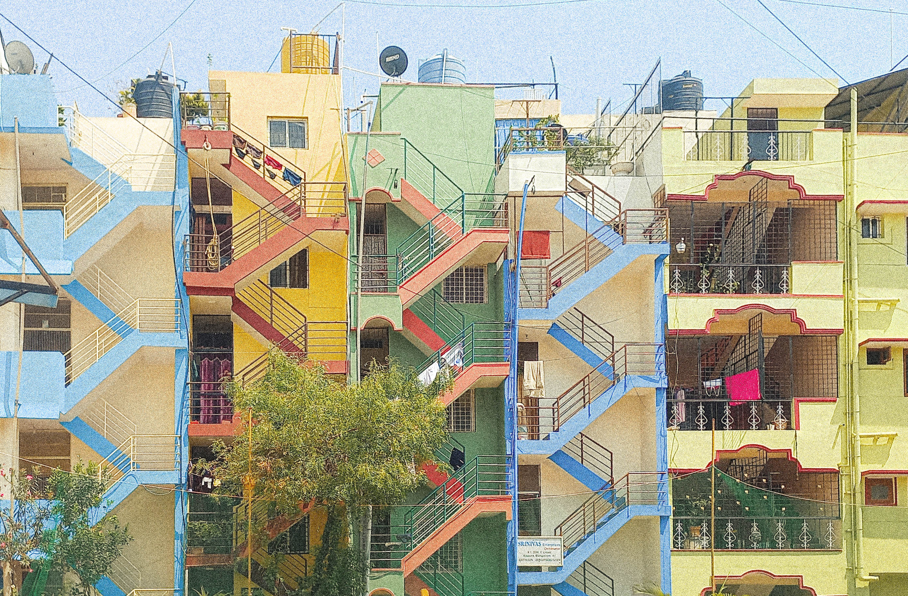

# (PART) Getting Started {.unnumbered}

# Introduction {#intro}

Walking in a city is an experience that most people take for granted. The ease of mobility on foot, especially in urban areas, has long been overshadowed by the convenience and speed provided by personal vehicles or public transportation systems. Until recently, I was also among those who overlooked and underappreciated its importance. Although I have been aware of the issues with poor infrastructure in cities in India, I never fully grasped the severity of the problem, nor did I connect the individual inconveniences I experienced to a larger systemic issue. Admittedly, this lack of awareness could be viewed as naive or shortsighted, but it is what it is.

However, in 2021, my perspective changed when I stumbled upon an Instagram account called "bengawalk" run by **Pravar Chaudhary**. Through this account, Pravar documented his observations of the streets and people of Bangalore, highlighting a range of issues and interactions that occur on a daily basis. Whether it was a simple post about wayfinding, accompanied by a single hashtag or a video of person crossing a busy street despite being next to a footbridge, to a more complex analysis of traffic congestion and flyovers, the account provided me with a new lens through which to view the city and its challenges.

As a designer and a person interested in using data to understand problems, this appealed to me as one of the most tangible, omnipresent topic that I had *never* fully paid attention to. From there, I have read through countless documents on urban mobility, walkability, transport and streets; admittedly one of the best rabbit-holes I've fallen into. The data-storytelling enthusiast in me always wants to find ways to mould information into a spreadsheet I can import into R or a shapefile I can visualize in QGIS, which is what I did with this too.

The more I've engaged with walkability and urban mobility, though, I've realized that quantitative data is often not enough to describe something as complex as streets and transport, or the people who use them. In my research on street usage and accessibiilty in Ejipura, Bangalore, several new insights came up through qualitative analyses that I would have completely missed if I was focusing on large numbers. I was also lucky enough to work with people more experienced than I was who brought with them different, unique ways to analyze urban environments.

This book is a distillation of things I learnt along the way.

Through qualitative analysis, community engagement, and data-driven approaches such as those discussed here, we can try to gain a deeper understanding of our streets and how they impact individuals from all walks of life.

The methodologies presented in this book are just a starting point - there is still much work to be done!

# Project background {#pb}

This book is the product of my first-hand experience working in the Ejipura ward in Bangalore. At the start of my thesis, I was excited to experiment with QGIS and OpenStreetMap data to create visualizations of Bangalore's roads, streets and bus stops. However, my guide, Lakshmi, encouraged me to take a step back and consider what I was missing. I realized that while analyzing large-scale data was relatively easy, it was important to also consider smaller neighborhoods and the unique factors that contribute to walkability.

{width="14cm"}

That's when I decided to use Ejipura as my lab and started exploring what makes a place walkable beyond *conventional* ideas of walkability. Over the next few weeks, I fell in love with the neighborhood's tightly wound lanes, bustling shops, and vibrant buildings. Despite the language barrier, the residents were eager to contribute to my research, and I learned to use their insights to conduct detailed descriptive analyses of the neighborhood. As I delved deeper, I also realized that the issues affecting walkability were complex and intertwined with social identities, accessibility to public transport, and differing impacts on various groups of people. Rather than trying to assign a numerical value to the walkability of the neighborhood, I found more satisfaction in understanding and analyzing the complex factors at play. The rest is covered in the next few dozen pages.
