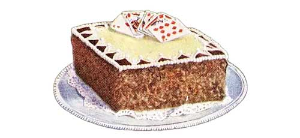

# Scope

There are some things to keep in mind while using this book, so that you make the most of it.

## What This Is & Isn't

This cookbook **will**:

1.  Demonstrate how to combine methods for better understanding walkability.
2.  Present real-life case studies to illustrate how this information can be practically used.
3.  Provide resources for urban planning professionals, academics, and anyone interested in the field to conduct their own research.
4.  Provide a framework for assessing walkability and encourages readers to draw their own conclusions based on their research and analysis

But we **won't**:

1.  Aim to provide an exhaustive list of measures or a comprehensive review of research.
2.  Claim to offer a one-size-fits-all solution for assessing walkability.
3.  Provide technical guidance on every aspect of GIS and data analysis, only practical techniques and code snippets.
4.  Aim to be prescriptive or offer definitive answers on what makes a city or street walkable

## Who is this for? {.no-border}

```{=html}
<style>
.inline-figure {
    border: none !important;

  overflow-x: visible !important;
}
</style>
```
{.people .no-border width="640" height="200"}

This book is a valuable resource for a wide range of professionals, academics, and individuals interested in the field of urban planning, design, and development. Specifically, it may be of interest to:

1.  For urban planners and designers, this book offers valuable insights on how to assess walkability in cities and neighborhoods.

2.  For community advocates, this book provides a framework for promoting walkable neighborhoods and understanding the factors that make them successful.

3.  If you're a researcher, academic, or student in urban planning, public health, or related fields, this book is a great resource for gaining a comprehensive understanding of walkability and its impact on the people that use them.

This book isn't a dry, technical manual. It's full of real-life case studies and practical techniques that can be used to make cities more walkable. So whether you're a professional or just someone who loves taking a stroll, this book is for you.

## How to Read This Book

```{=html}
<style>
.inline-figure {
    border: none !important;

  overflow-x: visible !important;
}
</style>
```
{.people .no-border style="margin:0 auto; display:block;"}

I really like the idea of **eat cake first** [@leon; @cetinkaya-rundel2018], which means at the heart of this book's approach is the belief that it's best to dive in and get started with the task at hand, even if that means adopting a "good enough" approach initially.

There may be more complex or nuanced workflows available, and we'll be sure to point those out as well. Our goal is to provide you with the quickest and most straightforward path to achieving your desired outcome. So, go ahead and eat the cake first, but know that we'll also provide options for those who want to explore more advanced approaches.
