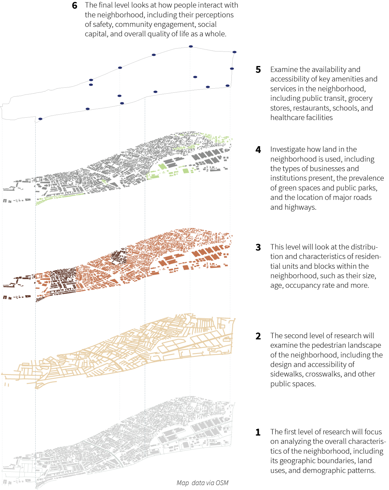

# Types of Analysis

When assessing the walkability of a neighborhood or a city, it is important to use both quantitative and qualitative analyses.

Quantitative analysis is done with metrics are **objective, measurable characteristics** of a place that can be quantified using numerical data. Examples of quantitative metrics include sidewalk coverage, street connectivity, and pedestrian counts. These metrics are important because **they provide a standardized way of evaluating walkability** and can be used to compare the walkability of different areas.

Qualitative analysis, on the other hand, is done with metrics are **subjective characteristics** of a place that are difficult to measure using numerical data. Examples of qualitative metrics include the aesthetic quality of the environment, social perceptions of safety, and the presence of cultural amenities. These metrics are important because **they capture aspects of the pedestrian experience that are not easily quantifiable**, such as the perceived safety of a neighbourhood or that walking can foster.

By using both quantitative and qualitative metrics in walkability assessments, we can develop a more comprehensive understanding of the walking environment. This book will introduce case-studies to show how these methods can be combined.

## Levels of Analysis {#levels}

To fully understand the walkability of an area, it is essential to examine the neighbourhood at multiple levels and look beyond just the physical environment, such as sidewalks and green spaces, to consider the social interactions and dynamics that shape the experience of walking. For example, we may find that even within a single community, there are divisions based on socioeconomic status or other factors, which could impact the level of access and resources available to different groups of residents and affect their ability to walk and enjoy the neighbourhood.

This approach recognizes that the physical layout of the neighbourhood is just one aspect of what makes it walkable and by looking at the neighbourhood as the sum of its various parts and expanding our understanding of the walking experience, we can gain a more holistic view of the factors contributing to walkability.

In the case of Ejipura, I wanted to see how these various levels could be explored. Figure \@ref(fig:levels) describes this approach. This book describes how to engage in some methods of analysis of each of these levels.

{width="15cm"}
