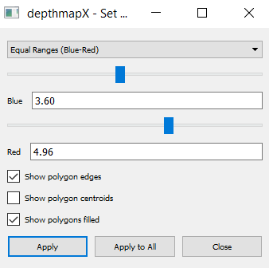
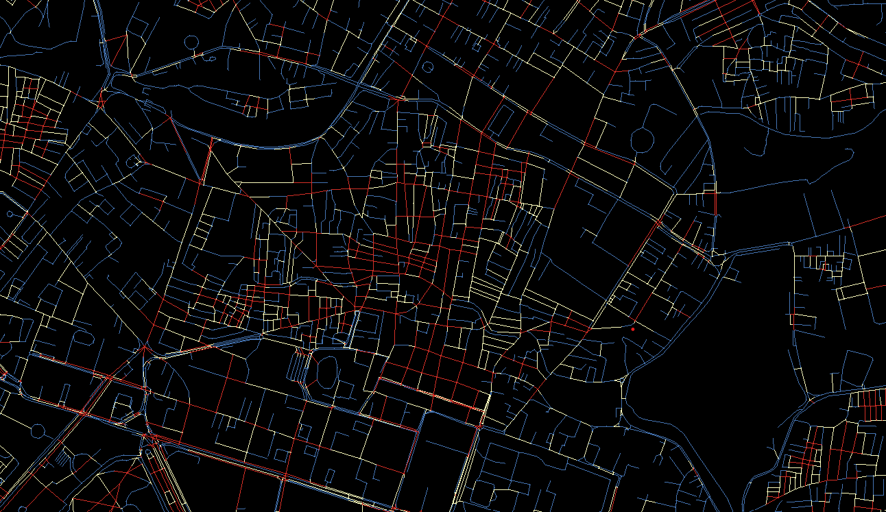

# Assessment of Physical Environment {#physical-environment}

In Section \@ref(site-assessment), we looked at how we can use some secondary data to surface important insights about how these roads are used. Let us now look at how we can use other parts of the physical environment to measure walkability through easily available data. Table \@ref(tab:physical-indicators) shows some indicators and how they can help you understand how walkable an area is. There are many more that other studies have collated [\@knapskogExploringWaysMeasuring2019a], but I will be going over these because the data to analyze these is easily accessibly through OpenStreetMaps and hence should work for most cities.

\renewcommand{\arraystretch}{2}

```{r physical-indicators}
library(knitr)

table <- data.frame(
  "I want to find out..." = c("If it is easy to move within a specific place", " ", "If it is easy to move from one place to another", " "),
  "Quantitative Measure" = c("Permeability", "Intersection Density", "Connectedness", "Integration"),
  "Good Walkability" = c("Easy to move around", "High Density", "Well connected", "Easy to get to"),
  "Poor Walkability" = c("Hard to move around", "Low Density", "Poorly Connected", "Harder to get to")
)

kable(table, format="latex", booktabs = TRUE, col.names = c(
  "I want to find out...",
  "Quantitative Measure",
  "Good Walkability",
  "Poor Walkability"
), caption = "Indicators that can be readily analysed"
) %>%
  kableExtra::kable_styling(latex_options = "striped") %>% 
  kableExtra::column_spec(1, width = "10em", bold = T) 

```

These measures have been divided into two; those that tell you about the walkability of a **bounded region** and those that help describe how much a place allows **movement to other places** within it. As Table \@ref(tab:physical-indicators) shows, there is more than one indicator that you can use to answer these questions and for the most comprehensive understanding, it is better to use these **together**.

## Measuring Permeability {#block-sizes}

*Permeability* refers to how easy or difficult it is for people to move through a specific location. It is mainly concerned with the physical features of the space, such as the design of the streets, buildings, sidewalks, and public spaces. A high permeability space is easy to navigate, with multiple entrances and exits, clear paths, and few barriers. On the other hand, a low permeability space is harder to navigate, with limited access points, narrow pathways, and obstacles that make it challenging for people to move through.

A method for calculating permeability was developed by @pafkaPermeabilityInterfaceCatchment2017 through two measures - Area-weighted average Perimeter ($AwaP$) and Interface Catchment ($IC$). By using their associated QGIS plugins, performing this analysis is a trivial task (the section below is distilled from their [video](https://vimeo.com/574850313) on the topic).

We'll focus on $AwaP$ in this chapter.

You'll need the following before you get started:

1\. The $AwaP$ plugin for QGIS, which can be downloaded from the plugins manager (search for 'AwaP') or [through the online repository](https://plugins.qgis.org/plugins/awap/).

2\. A city block map for your area of interest. Appendix \@ref(create-blocks) describes how to do this with a road network layer from OpenStreetMaps.

### Calculating $AwaP$ in QGIS

This section assumes you have your city block map ready. You will not need anything else. For this example, I'll select Bangalore's central business district area (covering MG Road, Majestic and others).

{width="14cm"}

#### Step 1. Create a Grid {.unnumbered}

Go to `Plugins` \> `AwaP` to bring up the dialogue box to get started. Since we have a large area, we'll visualise this as a choropleth map. Begin by selecting `Multiple Polygons` in the `Boundary layer options` and clicking the button that says `Create a polygon grid` to bring up the grid dialogue box:

{width="14cm"}

I like to choose hexagons are my grid shape. Why? There are [some advantages](https://www.esri.com/about/newsroom/insider/thematic-mapping-with-hexagons/) of using hexagons to map things because they tessellate better and more organically than a rectangle, but it is also a stylistic choice; I like how the look.

For `Grid Extent`, set your extent as you wish (If you're coming from just creating your city block map from Section \@ref(create-blocks), you can use your base layer to keep things simple).

I set the `Horizontal Spacing` to $400 m$, which is what the hexagon would measure from one edge to the other one across. This is up to your needs, but $400$ is something I prefer as studies consider this a distance that is comfortably walked [@duncanValidationWalkScores2013].

```{=tex}
\notebox{
If you cannot see units in meters, you might have to change your project CRS to a UTM zone. I am using `EPSG:24377`
}
```
#### Step 2. Configure settings {.unnumbered}

Once your grid has been made, return to the $AwaP$ dialogue box, which should still be open. Here, you can:

1.  Choose the **amount of area of the grid a block should occupy** to be considered as a part of that grid. The default value is okay for most cases.
2.  Choose to remove **dead-ends** (cul-de-sacs) from the analysis, as they imply that there's no way to 'permeate' past that point anyway (this might be discriminatory to ghosts).

But the most important setting here is the `Apply custom style categories` dropdown. You must set it to **by AwaP** so that only a single layer with all the values is output.

Click run.

You should get something like Figure \@ref(fig:permeable).

{width="14cm"}

If you see coloured hexagons, your analysis has been successful. But we can't understand anything by just looking at this, so head over to the `Layer Properties` and in the `Layer Rendering` section of the `Symbology` tab, change the blend mode to something that allows the city block map also to show through. Changing mine to `Overlay` gives me the map shown in Figure \@ref(fig:blended-map). 

{width="14cm"}


If you zoom out, you can see how different areas compare.


### Understanding the map

By adding context of the underlying layout, the map becomes easier to read and more useful.

The colors on the map are correlated with the size of the blocks that they are over. Red areas on the map tend to have larger blocks, which can make it challenging to navigate around the area or find shortcuts. Large blocks can limit the number of streets or intersections available, which can result in longer travel times and limited options for getting from one place to another. In contrast, green areas on the map feature smaller blocks, which tend to have more intersections and roads. Even if these areas do not have sidewalks, there are typically multiple ways to get from one place to another, making it easier to navigate and explore.

If you need even more resolution for your specific area, you can adjust the size of the grid blocks on the map. This will provide a more detailed view of the area. Can you make one for your site now?

\clearpage

## Measuring Connectivity {#measuring-connectivity}

In Section \@ref(components-ssa), we explored two components of space syntax analysis (SSA); choice and integration. SSA also allows you to measure the connectivity of regions within the network.

\tipbox {

Connectivity measures how many other spaces are directly connected to a given space in a system. For example, in a street network, connectivity measures the number of streets intersecting with a particular street or node, affecting how easily people can move between different city areas. Higher connectivity generally means more direct routes between spaces, making movement more efficient and promoting social interaction.

}

You can follow the steps in Section \@ref(using-depthmapx) to process your street network and find the `Connectivity` layer in DepthmapX. Using the CBD region as an example, we get shades of yellow, blue and orange, as shown in figure \@ref(fig:connectivity-one).

{width="14cm"}

What do these colours mean? We can understand the warmer regions as being more connected to each other, making it very easy to travel within those spaces [@dettlaffSpaceSyntaxAnalysis]. This results from the number of connections, or intersections, each street has to its directly neighbouring streets. Long roads, such as highways, do not provide ways for people to get off them if necessary.

We can make this even easier to see if I tweak the colours. Do this by going to `View` \> `Color Range` and opening the colours dialogue box. It gives you multiple default gradients to choose from, and by tweaking the sliders a little, you can increase or decrease how prominently each colour appears.

{width="8cm"}

I prefer to have my reds stick out a lot more as it helps me find spatial 'islands' separate from each other but well-connected within themselves, as shown in Figure \@ref(connectivity-two).

{width="14cm"}

Immediately, we can see that clusters are emerging from the map. These high intersection density regions are more inviting to walk in, and chances are, this is where you'd find the most pedestrians. Can you make your map to visualize this metric?

## Measuring Integration
