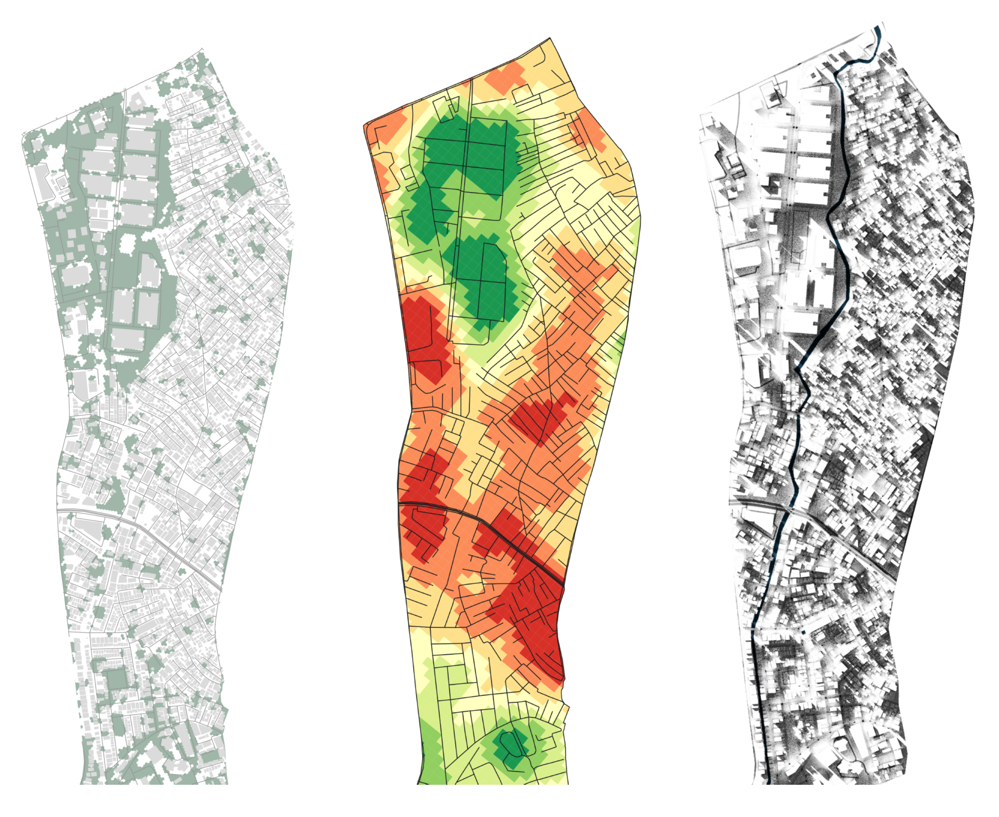
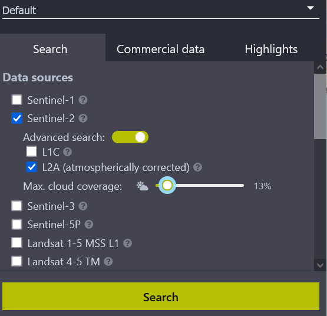
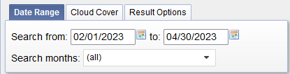
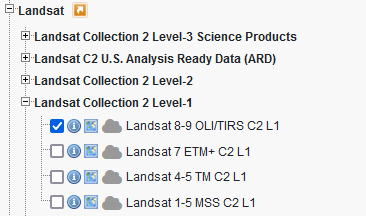
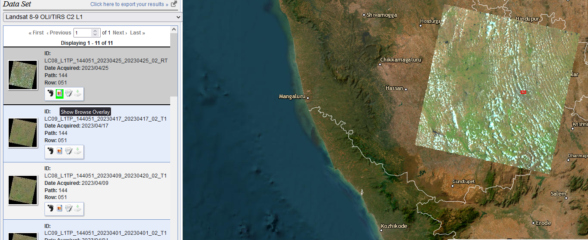
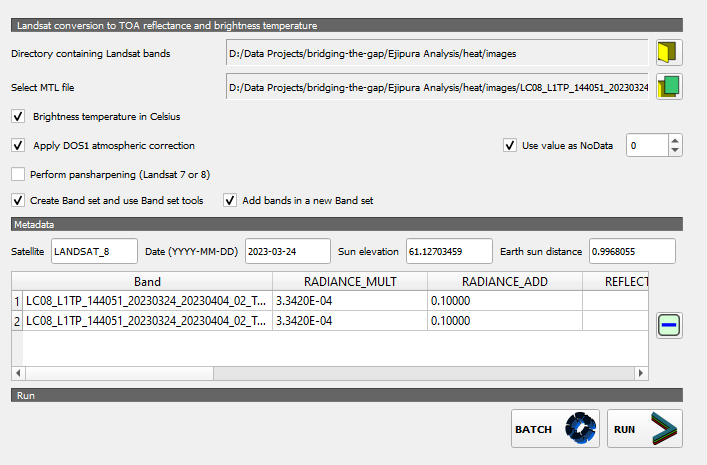
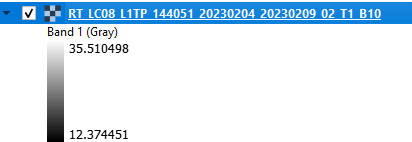
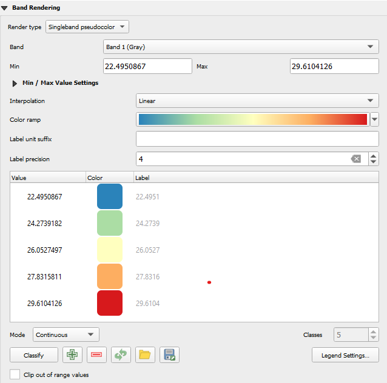
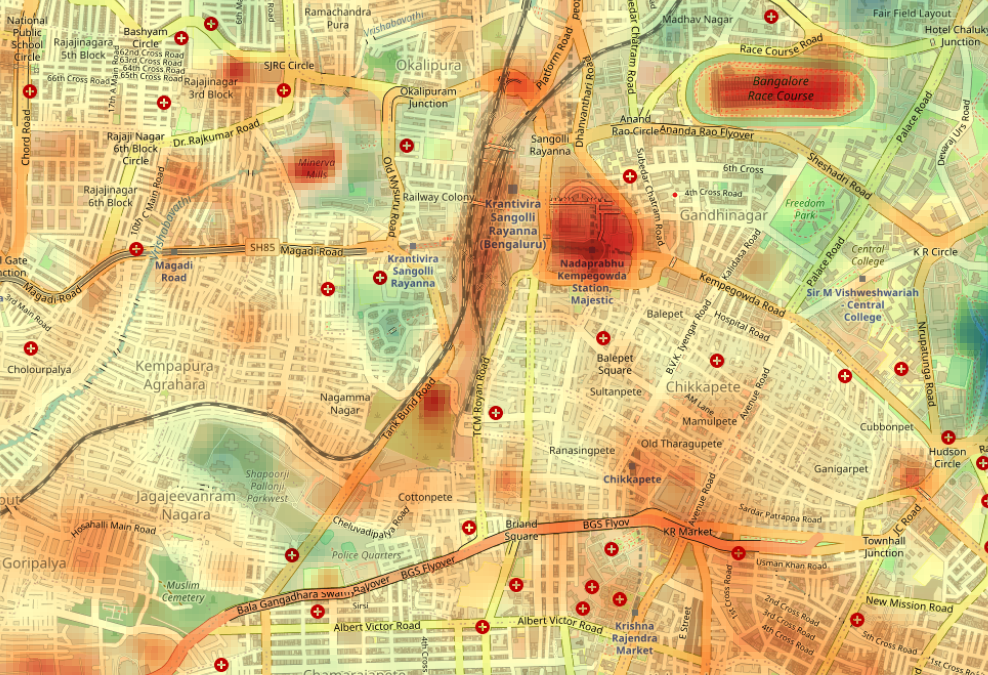
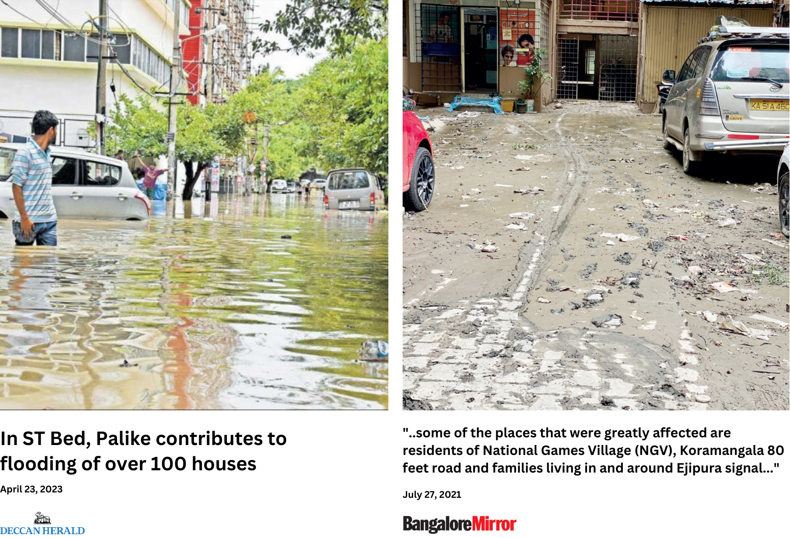

# Assessment of Comfort {#assessment-of-comfort}

So far, we've only analyzed things in terms of the physical environment or the consequence of that environment on mobility. This is where most street audits stop. This is the environment in so-called 'lab conditions' - it is imagined to be without any other unpredictable factors that affect its usage; we assume that if the correct number of sidewalks exist and the numbers look nice after an analysis, the area is walkable to users. This is a sterile and detached way of assessing walkability because it leaves out important factors that influence people's walking behavior, such as their comfort levels and the impact of variables we did not account for, such as weather conditions [@tongDevelopingMultiscaleWalkability].

To fully understand walkability, it is crucial to assess walking comfort, which involves evaluating how people feel while walking in a given environment. This includes not only factors such as the quality of the pavement and the width of sidewalks but also considering the impact of weather on walking behavior. People may be less likely to walk in extreme weather conditions such as heavy rain, snow, or excessive heat. Assessing walkability in different weather conditions can help identify areas where improvements could be made to encourage more walking, such as adding shelters or improving drainage to reduce the impact of rain. Section \@ref(street-comfort-qualitative) discusses this in more detail in the context of Ejipura and how to approach this qualitatively, but this section will focus on examining some key factors most likely to affect Indian cities.

## Combining Data

{width="14cm"}

Green cover, heat island, and shade map analyses provide crucial insights for conducting a comprehensive walkability audit. These maps can help identify areas where walking is uncomfortable due to high temperatures and inadequate shade. Furthermore, they can identify areas where additional green spaces and shading devices are required to enhance the walking experience. Heat island maps enable us to mitigate temperature impacts on pedestrians by increasing green coverage in areas where temperatures are higher. The use of shading devices such as trees and canopies can also make walking more comfortable by providing relief from the sun. Combined with data on pedestrian traffic and infrastructure, we can use these maps to help develop effective strategies for enhancing walkability and promoting sustainable transportation.

## Green Cover {#green-cover}

Mapping green cover is a critical step in understanding the walkability of urban areas. Urban green spaces such as trees, shrubs, and grass beautify the environment and provide numerous benefits, such as reducing the urban heat island effect, improving air quality, and providing shade to pedestrians. It has been found that the presence of green spaces can also promote physical activity and improve mental health.

In the context of Ejipura, a neighborhood in Bangalore, the lack of green cover has been identified as a significant issue affecting the area's walkability. In Section \ref(@street-comfort-qualitative), I explain how we found that most locals were dissatisfied with the lack of green space in their area. This lack of green space not only negatively impacts the area's walkability but also adversely affects the overall health and well-being of the residents.

To visualize this issue, we can use satellite data from the Sentinel satellites to map the green cover in the area. Sentinel satellites are a series developed by the European Space Agency (ESA) that provide high-resolution images of the Earth's surface. These images can be used to map vegetation cover and monitor changes over time. We will only visualize the green cover on a specific day.

### Mapping Green Cover with Sentinel Imagery {#sentinel-guide}

Head to the [**Sentinel Hub**](https://www.sentinel-hub.com/) and create an account. The Hub allows us to easily access satellite imagery for all available dates from multiple sources, such as Landsat and the sentinel array of satellites.

Once you have your account, go to the [EO Browser](https://apps.sentinel-hub.com/eo-browser/). This is where you will search for your location and browse images.

{width="10cm"}

In the upper right-hand corner, locate the search bar and search for your region of interest (for now, Ejipura). The map should re-center.

{width="10cm"}

The left-hand panel (\@ref(fig:search)) will allow you to select the satellite from which you'd like to source the data. We will choose Sentinel 2, toggle Advanced Controls, and set the `Max. cloud coverage` to a low value. This automatically filters out imagery obscured by cloud cover, so we have clear images to analyze.

By default, the search fetches the latest images, so if it brings no results, try adjusting the cloud coverage value to something more reasonable. Generally, anything between **15-30%** is okay. Run the search.

{width="10cm"}

The results that load should look something like figure \@ref(fig:single-result). The essential details are the **date**, **time**, and cloud cover percentage. Please select any one of them by clicking visualize.

In the map area, what should load first is the True Color image of Ejipura. The layers panel will also update with various pre-processed 'bands' that give you different levels of information about the same region. Relevant bands are explained in \@ref(tab:layers).

```{=tex}
\tipbox{
Sentinel satellites take pictures of the Earth's surface using sensors that detect different types of light, including infrared. This infrared light can be used to measure the amount of chlorophyll in plants, which is an indicator of how healthy they are.

The Normalized Difference Vegetation Index (NDVI) is a special formula that uses the amount of infrared light detected by the satellite to calculate the amount of vegetation in a specific area. Sentinel satellites use this formula to create an NDVI layer, a map showing the density of vegetation in a particular region. 
}
```
| Layer Name          | Relevance                                                               |
|---------------------|-------------------------------------------------------------------------|
| True Color          | Provides a natural color representation of the area of interest         |
| False Color (urban) | Helps identify vegetation and its density                               |
| NDVI                | Enhances urban features such as roads and buildings                     |
| NDWI                | Reveals water presence in the site, useful for mapping flooding extents |

: (#tab:layers) Sentinel layers relevant to site study.

Select the `NDVI` layer.

{width="14cm"}

The green cover is already visible in the raw image (\@ref(fig:ndvi-eo)); you can quickly see how well we can use this data. While you could just download this and use it to make your case, we can turn this into a nicer visualization and use it for further analysis.

To download this, locate the download image button on the right. This should bring up the download dialog box. Switch the tab to `Analytical` and change your settings to those shown in figure \@ref(fig:settings-sentinel).

{width="14cm"}

1.  **Image Format** TIFF (32-bit float), high resolution
2.  **Coordinate System**: WSG 84 (EPSG:4326)

Download your file!

Open up QGIS and load your image. **Please make sure your Project CRS is set to the relevant UTM zone. If you are performing this analysis for an Indian city, it is UTM 43N**.

------------------------------------------------------------------------

#### Download QGIS Model {.unnumbered}

To make the next stage of your analysis even more manageable, I have compiled a reusable workflow for the next steps. This will convert your raster file into a vector choropleth map that you can design perfectly. Download this model [here](https://github.com/thedivtagguy/files/raw/main/Extract%20Green%20Cover.model3).

------------------------------------------------------------------------

You will also need an extent file to help crop the map to the area you're interested in. You could download this from OSM (\@ref(extract-osm)) or draw this layer out yourself. Since this is an analysis of Ejipura, [here's an outline of the ward as well](https://raw.githubusercontent.com/thedivtagguy/files/main/ejipura.geojson).

You should now have your image from Sentinel and an 'extent' layer in the form of an outline, a bounding box, or any other shape you might have drawn. You should also have downloaded the `Extract Green Cover` model from above.

To import the model, you can do one of two things:

1.  Drag and drop the model into your project. This should bring up the dialog box in Figure \@ref(fig:model-box).

2.  Place the model in the correct system folder so you can access it from the Processing Toolbox later. The location of QGIS model files may vary based on your operating system. Here are the file paths for each:

    -   Windows: `C:\Users\[YOUR USERNAME]\AppData\Roaming\QGIS\QGIS3\profiles\default\processing\models`
    -   Mac: `/Users/[YOUR USERNAME]/Library/Application Support/QGIS/QGIS3/profiles/default/processing/models/`
    -   Linux: `/home/[YOUR USERNAME]/.local/share/QGIS/QGIS3/profiles/default/processing/models/`

    Remember to replace `[YOUR USERNAME]` with your username.

3.  @adhvaryuMappingPublicTransport2019

{width="10cm"}

For input, select the Sentinel raster image. Use the extent layer to calculate the extent (Dropdown \> Calculate from Layer \> Select Layer).

The `Grid Cell Size` value does not need to be changed but controls the size of the hexagonal grid cell (in meters). The default value works well. Run the action.

{width="8cm"}

You should now have a layer called `Green Cover` with just hexagons in it (\@ref(fig:just-hexagons)). Open up the `Symbology` tab in layer properties and select `Graduated` from the dropdown menu.

Set the input to `NUM_POINTS`, choose a nice color palette, and click classify. Et voila, you have figure \@ref(fig:green-cover).

{width="14cm"}

The NDVI data from Sentinel has now been converted into something you can keep designing and improving. Here are some ideas on what to do further:

1.  Count the length of road segments possibly 'passing' under trees.
2.  Is the green cover clustered, or is it evenly distributed?
3.  Overlay the green cover map with the population density map to see if any areas have high population density but low green cover.
4.  Analyze the change in green cover over time to see any trends or patterns.

## Heat Islands

Land surface temperature (LST) is a crucial indicator of the thermal conditions of urban areas, providing valuable insights into the comfort of walking in different parts of the city. Unlike weather data that measures the air temperature at specific locations, LST is the temperature of the Earth's surface as measured by satellite sensors, using Landsat imagery to calculate the surface temperature at a high resolution of 100 meters. This high-resolution data allows for measuring heat differences at the intra-street level, making it an essential tool for understanding the local conditions affecting walkability.

High LST values can indicate areas where the walking environment is uncomfortable due to excessive heat and a lack of shade, discouraging pedestrians from walking, especially during hot weather conditions. These areas can negatively impact the health and well-being of residents. Various factors, including the amount of vegetation, impervious surfaces, and the height and density of buildings, influence LST values. To enhance walkability, LST data can be used to identify areas where interventions such as creating green spaces, installing shading devices, or improvements in urban design are needed.

### Using Landsat imagery to map heat

The process for creating this visualization is similar to section \@ref(sentinel-guide), but we will be using the United States Geological Survey (USGS) [EarthExplorer](https://earthexplorer.usgs.gov/) to download our imagery. You can download this imagery via Sentinel Hub too, but because of some caveats with how our QGIS analysis is done, the naming convention of the files and the metadata that the USGS download option provides will be necessary. Please create an account before proceeding; you'll need it.

The EarthExplorer has a map on the right-hand to display what you'll be downloading, and the left-hand sidebar allows you to specify settings and make selections. First, find the `Extent` input in the sidebar (figure \@ref(fig:extent-usgs)).

Here, you can specify the extent in one of two recommended ways:

1.  **Zoom in** to your area of interest using the interactive map and click on `Use Map` to enter those coordinates.

2.  Switch the tab to `Predefined Area` and upload a shapefile with your area of interest.

{width="8cm"}

Next, set the period you're interested in using the date input (\@ref(fig:date-USGS)), tweak the cloud cover percentage to something between 15-30%, and then search.

{width="8cm" height="2cm"}

EarthExplorer will list out many different satellites that it aggregates, but we're interested in `Landsat` \> `Landsat Collection 2 Level-1` \> `Landsat 8-9 OLI/TIRS C2 L1` (\@ref(fig:usgs-landsat))

{width="8cm"}

When the results load, you can overlay them on the map by enabling browser overlay to see if your area of interest is covered (figure \@ref(fig:usgs-overlay)). Click `Download Options` to open the download dialog box.

{width="14cm"}

In the Download box, select the files ending in B10 and B11 (\@ref(fig:usgs-bands)) and a file ending in `MTL.text` and keep them in a folder.

```{=tex}
\tipbox {
    If the `B11` band is unavailable, just the B10 will do.
}
```
{width="14cm" height="2.6cm"}

```{=tex}
\tipbox {
Landsat images are divided into different bands, like different parts of the rainbow. Each band represents a diverse range of colors (wavelengths) the satellite can detect. We can calculate land surface temperature by comparing data from B10 and B11. To do this, we need to use a formula, which can be pretty complex, but we'll use the SCP plugin for QGIS to calculate automatically.
}
```
Open QGIS and download the [**Semi-Automatic Classification Plugin**](https://plugins.qgis.org/plugins/SemiAutomaticClassificationPlugin/) (search for SCP, and it should appear in the plugins manager). This will add a *lot* of new buttons to your QGIS interface, but what we need can be accessed by going to `SCP` \> `Preprocessing` \> `Landsat` (\@ref(fig:scp-process)).

{width="8cm" height="3.4cm"}

This will bring you to the Landsat preprocessing settings. Figure \@ref(fig:scp-settings) shows you how your settings should look after you have:

1.  Set the directory containing Landsat bands to the folder where you downloaded and extracted your Landsat images (click on the directory icon beside the input field to navigate it).
2.  Set the MTL file.
3.  Checked `Brightness temperature in Celsius`.
4.  Checked `Apply DOS1 atmospheric correction`.

{width="14cm"}

Run the program, and two new layers have been added to your layers panel. We're interested in the one ending in `B10`. Notice (\@ref(fig:scp-band)) how there's only one band, and the gradient goes from `35` to `12`? That is the temperature in Celsius!

The range is so significant because this one raster file spans around 200 km, and it chooses the minimum and maximum values from that entire area. You must **crop this raster to your study site before proceeding further**.

I am interested in visualizing heat differences over the Majestic Bus Stand in Bangalore, so I will crop my raster to that extent.

{width="8cm" height="2.8cm"}

Once cropped, open the Symbology panel and select `Singleband pseudocolor,` input a nice color ramp that will help you make sense of the values, click `Classify` and then apply it (figure \@ref(fig:color-ramps)).

```{=tex}
\tipbox {
QGIS has a lot of other color palettes built into it. Right-click on the color ramp field and select `Create new ramp` and in the dropdown, select `cpt-city` to explore more ramps.
}
```
{width="8cm"}

This should color your map with the selected palette. I like to overlay this over the OSM base map to understand where I'm looking.

1.  Go to `Layer Rendering` in `Symbology` and make the blend more into `Overlay.` Close this dialog box.
2.  In the Browser panel, find `XYZ Tiles` and select `OpenStreetMaps.`
3.  Place the newly added OSM map under your LST raster.

{width="14cm"}

If you've ever been to the Majestic Bus Stand, you will know how hot it can get. Due to the concrete built-up area and no trees, this area is far hotter than compared to Freedom Park (figure \@ref(fig:scp-map)). By analyzing temperature data from different city regions, we can identify places where walking might be uncomfortable due to high temperatures. This helps quantify insights that you might get from qualitative interviews and on-ground observations (as described in \@ref(street-comfort-qualitative)).

## Simple Flood Risk Mapping

Flooding can have a significant impact on walkability. Flooded streets and sidewalks can make walking dangerous and uncomfortable, and flooding can also damage infrastructure and amenities essential for pedestrians, such as benches, drinking fountains, and streetlights. It also disproportionately impacts low-income neighbourhoods, which often lack the resources to mitigate flood risk.

We found this to be true in Ejipura, where one of the biggest concerns that residents have is regarding how badly the roads will flood for that particular year's monsoon.

There are many, many different ways, with equally varying levels of complexity, to map areas prone to the risk of flooding. In the interest of making this work with the most easily accessible data, I present a way to quickly identify low-lying areas through **digital elevation models (DEM)** in this simple mapping exercise.

```{=tex}
\tipbox {
This kind of analysis is usually done with more information, such as built-up environment data or drainage and waterway systems, using some form of weighted overlay analysis. We're trading that level of detail here for ease, but this gives us a good ballpark of where at-risk areas will be.
}
```
We'll find the DEM data on [Sentinel EO Browser](https://apps.sentinel-hub.com/eo-browser/). Follow the same steps specified in \@ref(sentinel-guide) to log in, download and locate your area of interest; the only thing that changes is selecting `DEM` \> `Copernicus 30`. 30 refers to the 30-meter resolution of the DEM (\@ref(#fig:dem-download)).

{width="8cm" height="1.8cm"}

I'm downloading it for Ejipura again and cropping it in QGIS to a relevant boundary (which I recommend you do since its easier to see smaller variations for a reduced area). You should now have an image that looks like \@ref(fig:dem-raw).

{width="8cm"}

The black pixels represent low-lying areas while the white represents the higher ground, and the gradient between them is everything in between. We need to make this easier to understand so we will draw some contour polygons around them.

```{=tex}
\tipbox{
Contour polygons are lines that connect points of equal elevation on a raster image. When these lines are connected, they form closed shapes called contour polygons.

For example, let's say you have a raster image of a mountain, and you want to create contour polygons at intervals of 50 meters. The contour polygons would connect all the points on the raster image that have an elevation of 50 meters, another set of polygons would connect all the points on the raster image that have an elevation of 100 meters, and so on.
}
```
Go to `Processing Toolbox` \> `Contour Polygons` and open the dialog box shown in figure \@ref(fig:contour-polygons).

{width="14cm"}

Select the input layer as the clipped raster file and change the `Interval between contour lines` to how large you want the contour polygons to be. Since this is a small area, I'm entering `1` to have more number polygons (smaller number = denser contours).

When you click run, you should get a new layer with a single colour but lines dividing it into various sections. To make sense of what this means, open `Layer Properties` \> `Symbology` and set it to `Graduated`. For the value, select `ELEV_MAX` (or `ELEV_MIN`, since the DEM is a single band file, both correspond to the same value). Change the colour ramp to something nice as well (figure \@ref(fig:contour-dialog)).

{width="14cm"}

Two other settings control how your contours will be classified and coloured:

1.  The `Mode` (in fig. \@ref(fig:contour-dialog), it is set to `Natural Breaks`). Natural breaks mode looks for natural groupings or "breaks" in the data based on the distribution of the values. It tries to create classes that have the largest differences between them, based on where the data naturally cluster. You can try other modes as well.
2.  The number of `Classes` (set to `3` in \@ref(fig:contour-dialog)). I have chosen a small number here because I want only three colours on my map, making it easier to distinguish areas.

Apply your changes!

{width="14cm"}

Figure \@ref(fig:cpmap) shows the resulting map with an overlay of the roads in Ejipura, just to add some context about what we are looking at. The orange areas are low-lying and hence more susceptible to flooding in case of an extreme weather event.

To use this in the context of your audit, consider checking whether the footpaths, roads or drainage in this area will still facilitate walking if they were waterlogged. You can even try searching for incidents of such flooding in the areas that become highlighted.

{width="14cm"}

A cursory search for the highlighted area in figure \@ref(fig:cpmap) in local news outlets shows how common flooding is in this part of Ejipura [@reddyItNotDelugeional; @kulkarniSTBedPalike2017], with one even highlighting how the roads become unusable when such incidents do happen.

While simplistic, it should give you enough for further research and assessment.
