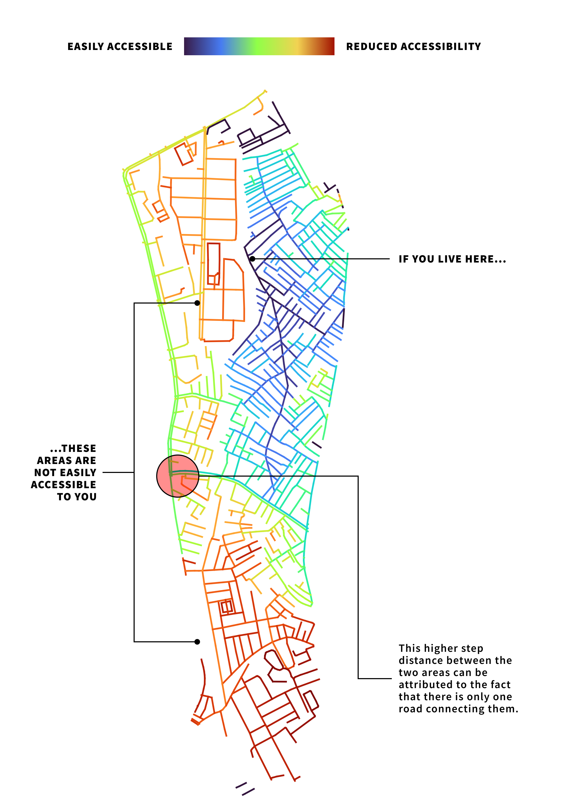

## The Cake

Identifying various social groups can be helpful in adding a deeper layer of analysis to your walkability study. I show some ways to identify segregation, and therefore potential determinants of exclusion, through a social, economic and spatial lens.

## Why it matters

Walkability is strongly correlated to health, and many studies have found that populations in more walkable areas are less likely to be obese [@riggsInclusivelyWalkableExploring2016] and perform better on many other health indicators as well [@suCommunityDeprivationWalkability2017]. Built environments and the design of neighbourhoods can influence residential behaviours and health consequences, according to accumulating research, with data indicating that these communities not only have lower rates of obesity and overweight people but greater active physical activity engagement as well.

When auditing any environment for walkability, therefore, it can be helpful to understand the following:

1.  **Who** are the more vulnerable or advantaged populations?
2.  **Where** are they located?
3.  **What** factors about their built environment and streets make them more vulnerable?

Answering these questions will help identify **how** we can improve an area to ensure an equitable allocation of resources.

## Ways of Identifying Segregation

Segregation can occur at various resolutions. The first obvious way to get an overview at a city level is through ward or constituency-level data, which is often easily available. For example, in the case of Bangalore, we can use 2011 census data to find where there are higher percentages of people belonging to scheduled caste/scheduled tribe (SC/ST):

{#scst width="650"}

## Social

### The Obvious

Caste is still the most significant factor in urban residential segregation in India, significantly higher than the level of socioeconomic segregation [@vithayathilSpacesDiscriminationResidential2012] and

{width="650"}

### The Less Obvious

Aside from the obvious stratification based on caste, what other ways can your study area be divided? Even in a seemingly homogenous area, various factors can influence *who lives where*. For example, the area could be divided between:

1.  **Native residents** and **migrants**.

2.  **Working population** by **type of work**, such as those working in the service industry vs those working in the informal sector.

3.  **Language**: Based on the language spoken by the residents, such as those who speak the local language versus those who speak a different language.

4.  **Housing tenure:** Segregating an area by housing tenure, such as those who rent vs those who own their homes, could reveal disparities in wealth and access to affordable housing.

In Ejipura, we were able to identify some micro-neighbourhoods this way. For example, it is a home to many people from the north-east region. We identified the region where the this population was concentrated by observing the kind of shops and restaurants in some areas:

{width="650"}

Similarly, paying guest accomodations and apartments that are generally for short-term rental for students and working class people are concentrated in another area:

{width="650"}

## Economic

Unfortunately, there is no comprehensive source of data that helps us spatially visualize economic segregation. Even the general census does not include questions on consumption levels or economic condition of households.

However, you can construct a broad map of income levels based on visual observation of streets and buildings as well. For example, in Ejipura, we used observational and anecdotal evidence to divide the area into three income groups. This was based on the type of housing, condition of streets, and interviews with residents.

{width="650"}

These are subjective observations by their very nature but some of the things you can look for, in addition to the above, are:

1.  **Housing type and condition:** Look at the type and condition of housing in a given area. Low-income areas may have more rental housing and consist of smaller units. Mid-income regions may have a mix of rental and owner-occupied housing, while high-income areas may have larger, more expensive homes in better condition.

2.  **Transportation options:** Look at the transportation options available in a given area. Low-income areas may have limited access to public transportation and poorer pedestrian infrastructure. In contrast, high-income regions may have more options for alternative transportation and better-maintained roads and sidewalks.

3.  **Public spaces and amenities:** Look at the quality and availability of public spaces and amenities in a given area. Low-income areas may have fewer parks and open spaces, while high-income regions may have more resources and better-maintained public spaces.

Such characteristics should be **always** be considered alongside other variables from census data and income surveys if available, since they are not always reliable markers of income levels. If you're able to get your hands on enumerator block level census data, which is the smallest unit of census data available, it can help inform these decisions better. Unfortunately, the process of getting access to this data is complicated and very restrictive (as shown [on the website for IIM Bangalore](https://library.iimb.ac.in/CEBdataset)).

## Spatial

The built environment, through the design of streets and connectivity between them, can also reflect the extent of segregation in an area [@vlachouSuccessionalSegregationGerani2015]. It is possible to map the spatial properties of your study area through spatial syntax analysis (SSA), a quantative method to understand the configuration of a built environment and reveal how it is used [@dettlaffSpaceSyntaxAnalysis]

{width="650"}
