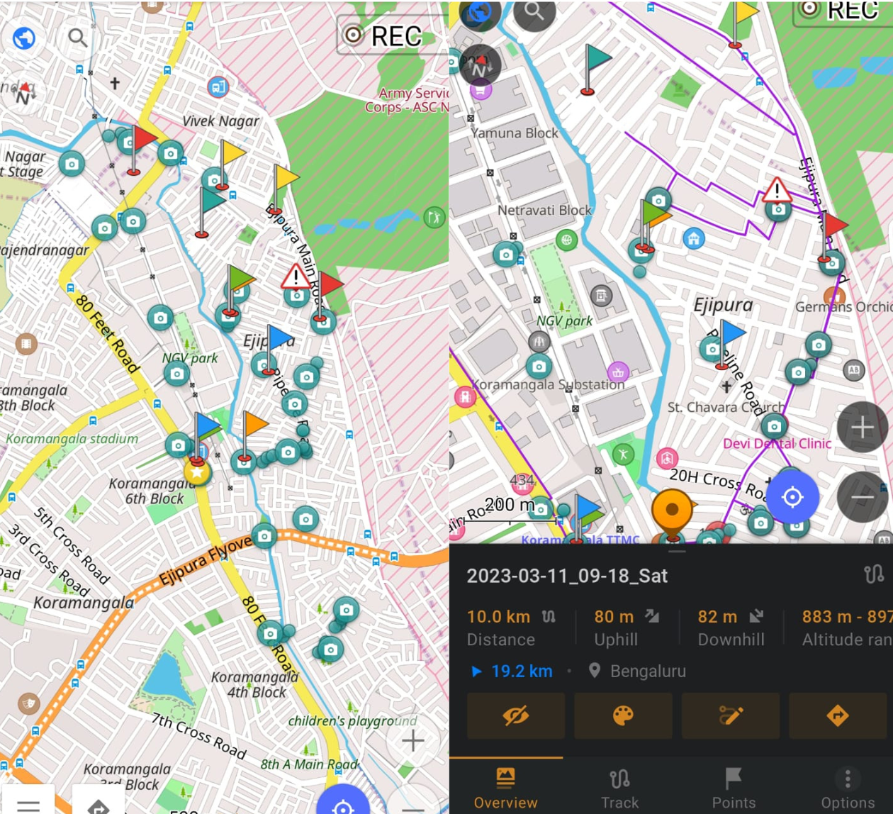
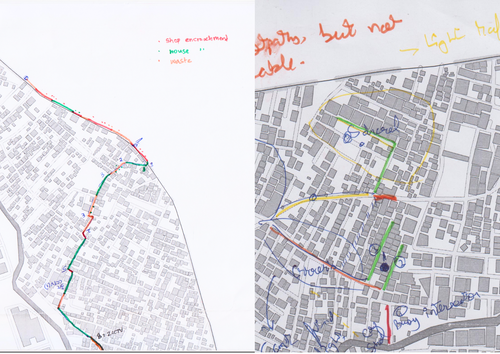

# (PART) Qualitative Assessment Guides {.unnumbered}

# Field Visits

Field visits, ideally, will be the biggest part of your walkability assessment. They provide an opportunity to observe and experience the walking environment firsthand, allowing you to identify strengths and weaknesses that may not be apparent from data alone. In this chapter, I will explore how to plan and conduct effective field visits, as well as how to collect and analyze data during your visits. I will also provide tips for observing & engaging with locals, who can be valuable partners in your walkability assessment.

I recommend doing at least four visits to your site in order to have a good understanding of what the space is like. Of course, the more the better but four visits is a good minimum.

## Before your visit {#before}

Depending on how near or far you live to the study site, you will want to optimize each one to save on time and resources, hence planning what you're going to do on site becomes paramount. Here's a checklist to keep handy:

1.  **Review and research your study objectives.** Before heading to the site, review your study objectives and make sure you have a clear understanding of what you want to achieve during your visit. This will help you achieve most of your goals for the day. Are you looking to assess the pedestrian infrastructure, traffic conditions, or walkability of a specific area? Having a clear understanding of your study objectives will help you focus your attention on the most relevant aspects of the area during your visit. This will change based on your visit, so before each one, reorient your objectives for the day.

2.  **Identify key areas of interest and plan a route** Based on your study objectives, identify the key areas of interest that you want to visit during your field visit. This may include specific streets, intersections, or public spaces that are important for understanding the pedestrian experience. For example, If you're assessing walkability to and from bus stops, where are those bus stops and which ones are the busiest? You can use Google Maps to identify these and begin your site visit there.

    You can also use the methods descibed in section \@ref(space-analysis) to identify the busiest streets and begin your work there. Land use maps, traversing the neighbourhood in Street View news articles about your site, landmarks; all of these will not only help you orient yourself to your surroundings but also use them in conversation with residents. People like people who know about where they live.

3.  **Prepare the paraphernalia.** While you're walking around the neighborhood, a tool like [OSMAnd](https://osmand.net/) will help you take geo-tagged notes and track your route. You'll also want to carry a notebook, markers of different colors, water and some plain basemaps of the site in case you want to take notes. You can also download **AR Ruler** to help you measure street widths with your phones.

4.  **Find a buddy (or two)**. Field visits, especially walkability audits, are much more effective when done with company. Find a person who's interested and willing to come, introduce them to your research questions and co-design your field visit with them. If you can't find someone to accompany you, I'm sorry I hit a nerve.

## During your visit {#during}

Once you have arrived at your site, it is time to begin your walkability audit. Here are some key things to keep in mind during your visit:

1.  **Start tracking your walk**: Begin tracking your route as soon as you start your walk. This will allow you to easily recreate your route and make notes about specific locations later on. You can use tools like OSMAnd to track your location and take geo-tagged notes along the way.

    {width="10cm"}

2.  **Take lots of AV notes**: Record audio and video notes as you walk through the site. These notes can capture the sounds and sights of the area, which can be valuable data for your analysis. It's important to capture your initial perceptions and feelings as you walk through the area, as these can be used to validate or contradict later findings.

3.  **Audit the streets based on standard metrics and perception**: Walk through the streets and audit them based on standard walkability metrics such as sidewalk width, street lighting, and the presence of street furniture. You can also note the perceived safety of the area, the amount of foot and vehicle traffic, and the overall comfort of the walking experience.

    \
    \
    {width="14cm"}

4.  **Draw on your basemaps**: As you walk through the area, use your plain basemaps to make notes and draw any specific features or observations that you want to remember. You can also use colored markers to highlight important areas or features (\@ref(fig:basemaps)).

5.  **Confirm findings from secondary research**: As you walk through the area, confirm any findings from your secondary research. You may find that your initial assumptions and expectations about the area are confirmed or challenged by your on-the-ground observations. If you've identified some information about the population, try spotting instances of segregation outline in Appendix \@ref(identify-segregation).

Remember to be observant and take detailed notes during your visit. These notes will be crucial for your analysis and will help you build a comprehensive understanding of the walkability of the area.

## After your visit {#after}

After your site visit, there are a few things you should do to make sure you make the most out of the data you collected:

1.  **Document your visit.** Take some time to document your visit and write down any observations, thoughts, or insights that you may have had during your visit. You can do this in your notebook or using a digital tool such as Notion or Obsidian. It is important to document as much as possible to avoid forgetting important details later.

2.  **Export your tracks.** If you used a tracking tool such as OSMAnd during your visit, make sure to export the tracks so that you can import them into a GIS software later. This will help you visualize and analyze the data you collected during your visit.

3.  **Elaborate on notes.** Take some time to elaborate on the notes you took during your visit. Add more details, sketches or photographs to supplement your observations. Make sure that you understand what you have collected and that your data is coherent.

4.  **Plan next visit.** Based on your observations and findings, plan your next visit to the site. Determine if you need to focus on a different aspect of walkability, or if you need to visit during a different time of day. It is essential to make sure you plan your visit based on the insights and limitations you may have experienced during the previous visit.

## Structuring your visits

In Section \@ref(levels), I outlined how I separate my study in Ejipura into what I believed to be its constitutent parts. Suppose you have only four visits thatr you can do and you need to make the most of them, how would each one look like? Table \@ref(tab:four) offers some insight.

<!-- | Site Visit \# | Activities                                               | Areas of Focus                                                                                                                                                                                                                                                                                                                                                                             | -->

<!-- |-----------------------|---------------------|----------------------------| -->

<!-- | 1             | Walk-through exploration, mapping, and photography       | Level 1 and 2: Analyze the overall characteristics of the neighborhood, including its geographic boundaries, land uses, and demographic patterns. Also examine the pedestrian landscape of the neighborhood, including the design and accessibility of sidewalks, crosswalks, and other public spaces.                                                                                     | -->

<!-- | 2             | On-ground analysis, participatory exercises              | Level 3 and 4: Investigate the distribution and characteristics of residential units and blocks within the neighborhood, such as their size, age, occupancy rate, and more. Also examine how land in the neighborhood is used, including the types of businesses and institutions present, the prevalence of green spaces and public parks, and the location of major roads and highways.   -->

<!--                                                                             Conduct interviews with local residents to understand their perspectives on the neighborhood.                                                                                                                                                                                                                                                                                               | -->

<!-- | 3             | Interviews, surveys, and community engagement activities | Level 5: Examine the availability and accessibility of key amenities and services in the neighborhood, including public transit, grocery stores, restaurants, schools, and healthcare facilities. Conduct more interviews in a different region to remove spatial bias.                                                                                                                    | -->

<!-- | 4             | Data analysis, community engagement or street audit      | Level 6: Look at how people interact with the neighborhood, including their perceptions of safety, community engagement, social capital, and overall quality of life as a whole. You can also choose to do a street audit by auditing important routes that you should know of by now and assess streets based on standardized metrics.                                                    | -->

<!-- : (#tab:four) If you had four visits. -->

```{r four}
library(knitr)

visits <-data.frame(
  `Site Visit #` = c(1, 2, 3, 4),
  Activities = c(
    "Walk-through exploration, mapping, and photography",
    "On-ground analysis, participatory exercises",
    "Interviews, surveys, and community engagement activities",
    "Data analysis, community engagement or street audit"
  ),
  `Areas of Focus` = c(
    "Level 1 and 2: Analyze the overall characteristics of the neighborhood, including its geographic boundaries, land uses, and demographic patterns. Also examine the pedestrian landscape of the neighborhood, including the design and accessibility of sidewalks, crosswalks, and other public spaces.",
    "Level 3 and 4: Investigate the distribution and characteristics of residential units and blocks within the neighborhood, such as their size, age, occupancy rate, and more. Also examine how land in the neighborhood is used, including the types of businesses and institutions present, the prevalence of green spaces and public parks, and the location of major roads and highways. Conduct interviews with local residents to understand their perspectives on the neighborhood.",
    "Level 5: Examine the availability and accessibility of key amenities and services in the neighborhood, including public transit, grocery stores, restaurants, schools, and healthcare facilities. Conduct more interviews in a different region to remove spatial bias.",
    "Level 6: Look at how people interact with the neighborhood, including their perceptions of safety, community engagement, social capital, and overall quality of life as a whole. You can also choose to do a street audit by auditing important routes that you should know of by now and assess streets based on standardized metrics."
  )
)

kable(visits, format="latex", booktabs = TRUE, col.names = c(
  "Site Visit No.",
  "Activities",
  "Areas of Focus"
), caption = "If you had four visits..."
) %>%
  kableExtra::kable_styling(latex_options = "striped") %>% 
  kableExtra::column_spec(1, width = "2em", bold = T) %>% 
  kableExtra::column_spec(2, width = "7em" ) 
```

Of course, you *must* be flexible when it comes to something as subjective and variable as site visits, but the above example is to show how areas of focus can be split across multiple visits. The key is in planning them out.

# Semi-structured interviews {#interviews}

In addition to your quantitative analysis using external sources and site visits that you will do on your own, you will *definitely* need to talk to residents. This is because while you are analyzing a good deal of data, both objective and subjective, it does not truly reflect the lived experiences of users who interact with the space everyday. You might come across insights that you had never thought would be an issue, or verify a hypothesis you may have formed while doing your secondary research.

It is nearly impossible to give definitive tips on how to make an interview useful for you since a lot depends on the interviewees and their behavior, willingness to talk, ability to describe their experiences, and how they perceive you as a researcher. However, it doesn't hurt to have the following things in your belt before you start.

### Things to keep in mind {#kim}

Before you start talking to people, I recommend getting a good sense of the locality beforehand which is why Table \@ref(tab:four) suggests putting interviews off till your second or third site visit. Don't appear to be a stranger in the neighborhood.

1.  **Familiarize yourself with the surroundings.** It is necessary for you how to refer to various areas of the study site so you can bring it up in conversation. This can be important roads, temples, churches, playgrounds, large shops, and crucial intersections. It can also be in the form of historical information about things that have happened here (for example, maybe a government body has repaved some roads) and how they affected the residents. Keep this related to your research questions and avoid any sensitive topics.

2.  **Account for language differences.,** but do not be scared of them. While knowing the local language gives you an edge, you'll find that if you show interest in people, and treat them with patience and respect, they are willing to make the conversation work however they can. I recommend taking a person who knows the language with you if they are willing, it certainly helps move things faster.

3.  **Think about how they will perceive you**. You should aim to blend in as much as possible, in terms of behavior, clothing, and appearance. For instance, if the study site mostly has residents from a weaker-socioeconomic background and are wearing mostly slippers or *chappals*, it would make it easier for you to be a part of their surroundings by doing the same. Dress as simply as possible. As strange as this sounds, we were able to do many more interviews in Ejipura once we started going in simple pants, a plain t-shirt, and *chappals*. We appeared less intimidating to the locals and encouraged more conversation than if we were to seem like complete outsiders. This depends on the site, of course, and if you're auditing an area where you feel this won't be an issue, then it is okay.

### Interview Methodology {#interview-methodology}

#### Finding People & Taking Notes {#finding-people}

Finding participants to interview on the street can be challenging since they may have other obligations and may not be willing to participate. It is crucial to consider the participants' time constraints and not stop people who appear to be in a hurry. Convenience sampling can be used to identify residents in each area of the study site who are willing to participate and approach them when they are in public places such as parks, markets, community centers, sitting outside their houses, or at shops. To avoid any spatial bias, choose people on different streets and in various regions of the study site.

It is important to keep the interviews restricted to 15-20 minutes initially and extend only if it feels like the participants are willing to give you more time. Additionally, before recording any interviews, it is essential to ask the participants for their permission. However, if possible, avoid recording since knowing that they are being recorded or even being asked that question can make people feel uncomfortable. Instead, take quick notes and try to remember as much as you can during the conversation.

Finally, approach interviews with a friendly demeanor! As a researcher coming from outside the community, it's natural to feel like you're at a disadvantage when it comes to having a conversation. However, this can actually work in your favor by encouraging people to share more about their experiences and way of life. When your interviewee talks about something you haven't encountered before, respond with enthusiasm or amazement. By taking on the role of someone who is unfamiliar with the area, you create space for asking questions that might seem silly or obvious [@chiswellLongYouRe2016]. This approach can make your interviewee feel more comfortable sharing their knowledge about the site, and can help you gain valuable insights that you might not have considered otherwise.

Once the interview concludes, elaborate on those notes more to capture as much detail as possible.

#### Interview Structure {#interview-structure}

Begin the interview by introducing yourself, explaining the purpose of the interview, and thanking the interviewee for their time. Ensure that the interviewee is comfortable and understands the process and the kind of work you are doing. Simplify this as much as you can for their understanding. Be clear that this is a research exercise that aims to try to dismiss any apprehensions they might have about any other motives. Take notes about who the participant is and try to build their profile:

2.  What is their age, gender, and occupation?
3.  How long have they lived in this neighborhood? Where do they work and how do they get there?
4.  What are their typical daily routines that involve walking around the neighborhood?
5.  Do they own a car? If so, how often do they use it?
6.  Do they use public transportation? If so, how often do they use it? What are the reasons for not using it?
7.  How often do they walk in this neighborhood? How far do they usually go?

Once introductions are out of the way, here's a structure that your interview may follow split into various categories:

#### Satisfaction {.unnumbered}

Start with questions about the interviewee's satisfaction with their neighborhood streets. Begin with open-ended questions and then follow up with more specific ones. Encourage the interviewee to elaborate on their responses and provide examples.

For example:

1.  What makes a street more desirable to walk on for you?
2.  Can you tell me about your biggest issue with the streets here?
3.  Do you feel safe walking at night?
4.  How long do you typically stay out?
5.  What are the streets like in the monsoon? What are they like in the summer?
6.  When do you feel like walking more and why?
7.  Is there enough shade when you walk? Where is it better?

#### Characteristics of Streets {.unnumbered}

Move on to questions that explore the characteristics of the streets in the area and how easy it is to walk around. Again, begin with open-ended questions and then ask more specific ones. Encourage the interviewee to describe their experiences and provide examples.

For example:

1.  Is it easy to walk around this area for you?
2.  Can you describe the condition of the roads?
3.  Are there footpaths present? Do you need them?

#### Characteristics of the Area {.unnumbered}

Finally, ask questions that focus on the overall characteristics of the neighborhood, including the type of people who live there, the availability of facilities and services, and transportation options.

For example:

1.  What kind of people live where? What kind of people live in your area?
2.  Which is your nearest park?
3.  Do the streetlights work?
4.  Where do you go to shop?
5.  Why do you travel outside the study site, and for what?
6.  How do you travel outside the study site and within it?
7.  What facilities are missing from your area but you would like them?

#### Conclusion {.unnumbered}

End the interview by thanking the interviewee for their time and providing contact information if they have any further thoughts or feedback. Ensure that they are comfortable with how the information they provided will be used. You can also offer to provide a summary of the findings or share the final report with the interviewee as a way of showing appreciation for their time and contributions.
