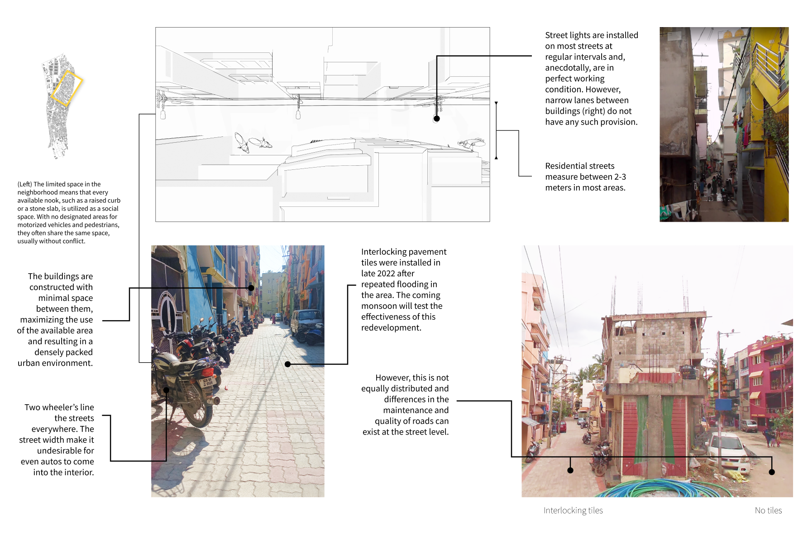

# Street Audits

## Built Environment Observations {#built-environment-observations}

As part of your street audits, you might already have a sense of the space through Google Street View (section \@ref(google-street-view)) or secondary data analysis through quantitative methods (\@ref(physical-environment)). This section focuses on qualitative observations and insights about the built environment and how they can help you understand your study site more comprehensively.

### What we can learn {#learn-observations}

Insights obtained through these observations will contradict, support or add more context to your secondary analysis. For example, if you have identified the busiest streets in the neighbourhood in section \@ref(space-analysis), observations from the site will confirm whether or not this is true. It may add to your analysis, helping you notice roads that are just as important but did not appear in the study. We also learn nuances about the site that help us analyse Every site is unique, and your observations will hence be diverse too; there is no one checklist to tick off to understand your site. The following sections aim to illustrate how we observed Ejipura and what kind of takeaways those observations led to.

Site observation can be a valuable tool for **developing interview questions** when researching the built environment. By physically observing the space being studied, we can gain a deeper understanding of the characteristics of the environment and the experiences of the people using it. During site observation, we can take note of the physical features of the environment, such as the layout of streets, the type of buildings and their uses, the Presence of public spaces like parks or plazas, and the condition of infrastructure like sidewalks and streetlights. We can also observe how people move through the environment, including traffic patterns, pedestrian behaviour, and social interactions. Together, these observations can develop interview questions tailored to the specific context of our study site. For example, if you observe that pedestrians frequently walk on the road despite a sidewalk present, we can develop interview questions that focus on the reasons behind this behaviour. Observations of social interactions can also inform interview questions about the use of public spaces. For example, a particular park is popular among families with young children. In that case, they can ask questions about the importance of such spaces to families, their perceived safety, and any potential areas for improvement.

+-------------------------------------------------+-----------------------------------------------------------------------------------------------------------+--------------------------------------------------------------------------------------------------------------------------------------------------+
| Category                                        | What to ask & observe                                                                                     | What to note                                                                                                                                     |
+=================================================+===========================================================================================================+==================================================================================================================================================+
| **Street Design**                               | -   How are the streets designed? For what kind of mode of transport are they designed?                   | -   The width of the street and how it affects pedestrian flow and safety.                                                                       |
|                                                 |                                                                                                           |                                                                                                                                                  |
|                                                 | -   How is the street used (e.g. for parking, cycling, pedestrians, children playing)?                    | -   Whether the street is designed for multiple modes of transportation, such as pedestrians, cyclists, and public transit.                      |
|                                                 |                                                                                                           |                                                                                                                                                  |
|                                                 | -   What is the street's character (e.g. busy, quiet)?                                                    | -   Whether the street design is appropriate for the surrounding area.                                                                           |
|                                                 |                                                                                                           |                                                                                                                                                  |
|                                                 | -   What are the materials used in the streets (e.g. paved, interlocking etc.).                           |                                                                                                                                                  |
+-------------------------------------------------+-----------------------------------------------------------------------------------------------------------+--------------------------------------------------------------------------------------------------------------------------------------------------+
| **Neighbourhood characteristics**               | -   What types of houses are present in the neighbourhood?                                                | -   The type of houses and how they contribute to the neighbourhood's character.                                                                 |
|                                                 |                                                                                                           |                                                                                                                                                  |
|                                                 | -   What is the layout of the neighbourhood?                                                              | -   The layout of the neighbourhood and how it affects walkability.                                                                              |
|                                                 |                                                                                                           |                                                                                                                                                  |
|                                                 | -   What is the socio-economic status of the residents?                                                   | -   The socio-economic status of the residents and how it affects access to services and amenities.                                              |
+-------------------------------------------------+-----------------------------------------------------------------------------------------------------------+--------------------------------------------------------------------------------------------------------------------------------------------------+
| **Land use patterns**                           | -   What is the predominant land use in the area (e.g. commercial, residential, industrial)?              | -   The predominant land use and how it affects walkability.                                                                                     |
|                                                 |                                                                                                           |                                                                                                                                                  |
|                                                 | -   What other land uses are present?                                                                     | -   Other land uses and how they contribute to the area's character.                                                                             |
|                                                 |                                                                                                           |                                                                                                                                                  |
|                                                 | -   How do these land uses interact with each other?                                                      | -   How the land uses interact with each other and how they differ in terms of walkability.                                                      |
+-------------------------------------------------+-----------------------------------------------------------------------------------------------------------+--------------------------------------------------------------------------------------------------------------------------------------------------+
| **Public spaces**                               | -   What public spaces exist (e.g. parks, vacant plots, street corners etc.)?                             | -   The presence of public spaces.                                                                                                               |
|                                                 |                                                                                                           |                                                                                                                                                  |
|                                                 | -   How are these public spaces used?                                                                     | -   How these public spaces are used and by whom.                                                                                                |
|                                                 |                                                                                                           |                                                                                                                                                  |
|                                                 | -   What amenities are present in these public spaces?                                                    | -   The amenities present in these public spaces and how they contribute to the area's character.                                                |
+-------------------------------------------------+-----------------------------------------------------------------------------------------------------------+--------------------------------------------------------------------------------------------------------------------------------------------------+
| **Infrastructure**                              | -   What transportation systems exist (e.g. buses, trains, metros)?                                       | -   The availability of utilities, transportation systems and public facilities and how they are *affected* by walkability.                      |
|                                                 |                                                                                                           |                                                                                                                                                  |
|                                                 | -   What public facilities exist (e.g. hospitals, schools, libraries)?                                    |                                                                                                                                                  |
+-------------------------------------------------+-----------------------------------------------------------------------------------------------------------+--------------------------------------------------------------------------------------------------------------------------------------------------+
| **Environmental features**                      | -   What natural elements are present (e.g. trees, vegetation)?                                           | -   The presence of green spaces and how they contribute to the area's character.                                                                |
|                                                 |                                                                                                           |                                                                                                                                                  |
|                                                 | -   What green spaces are present?                                                                        | -   Are they equally accessible? Can different groups of users (adults, children, senior citizens etc.) access them with the same level of ease? |
|                                                 |                                                                                                           |                                                                                                                                                  |
|                                                 | -   What water bodies are present?                                                                        |                                                                                                                                                  |
+-------------------------------------------------+-----------------------------------------------------------------------------------------------------------+--------------------------------------------------------------------------------------------------------------------------------------------------+
| **Pedestrian and vehicular traffic patterns**   | -   What are the area's pedestrian and vehicular traffic patterns?                                        | -   The pedestrian and vehicular traffic patterns and how they affect walkability.                                                               |
|                                                 |                                                                                                           |                                                                                                                                                  |
|                                                 | -   Are there any areas with high congestion levels or low levels of pedestrian activity?                 | -   Areas with high congestion or low levels of vehicular activity and how they affect walkability.                                              |
|                                                 |                                                                                                           |                                                                                                                                                  |
|                                                 | -   How safe do pedestrians feel in the area?                                                             | -   How safe pedestrians feel in the area and whether there are any safety concerns.                                                             |
+-------------------------------------------------+-----------------------------------------------------------------------------------------------------------+--------------------------------------------------------------------------------------------------------------------------------------------------+
| **Building heights, materials, and styles**     | -   What is the typical building height in the area?                                                      | -   The typical building height (this can be helpful in understanding if it will provide shade during the day.                                   |
|                                                 |                                                                                                           |                                                                                                                                                  |
|                                                 | -   What are the dominant building characteristics?                                                       | -   The dominant building characteristics and how differ within the study region.                                                                |
+-------------------------------------------------+-----------------------------------------------------------------------------------------------------------+--------------------------------------------------------------------------------------------------------------------------------------------------+
| **Street furniture and amenities**              | -   What street furniture is present (e.g. benches, trash cans, streetlights)?                            | -   The presence of street furniture and its variance.                                                                                           |
|                                                 |                                                                                                           |                                                                                                                                                  |
|                                                 | -   What public amenities exist (e.g., benches, fountains, temples, etc.)?                                | -   The presence of public amenities and how they contribute to the area's character.                                                            |
|                                                 |                                                                                                           |                                                                                                                                                  |
|                                                 | -   Are there any facilities for cyclists or pedestrians (e.g. bike racks, pedestrian crossings)?         | -   The presence of facilities for cyclists or pedestrians and how they contribute to walkability.                                               |
+-------------------------------------------------+-----------------------------------------------------------------------------------------------------------+--------------------------------------------------------------------------------------------------------------------------------------------------+
| **Presence of signage and wayfinding elements** | -   What signage is in the area?                                                                          | -   Whether there are any language or cultural barriers for pedestrians and how they can be addressed.                                           |
|                                                 |                                                                                                           |                                                                                                                                                  |
|                                                 | -   Are there any wayfinding elements (e.g. maps, directional signs)?                                     | -   Is there a difference is the kind of signage in different areas?                                                                             |
|                                                 |                                                                                                           |                                                                                                                                                  |
|                                                 | -   Are there any language or cultural barriers for pedestrians?                                          | -   Who is the lack of signage (or information displayed in any manner) excluding?                                                               |
+-------------------------------------------------+-----------------------------------------------------------------------------------------------------------+--------------------------------------------------------------------------------------------------------------------------------------------------+
| **Social and cultural activities**              | -   What social and cultural activities tend to happen in the area (e.g. festivals, parades, gatherings)? | -   The presence of social and cultural activities and how they contribute to the area's character.                                              |
|                                                 |                                                                                                           |                                                                                                                                                  |
|                                                 | -   How often do these activities take place?                                                             | -   The frequency of these activities and how they affect walkability.                                                                           |
|                                                 |                                                                                                           |                                                                                                                                                  |
|                                                 | -   What is the impact of these activities on walkability?                                                | -   The impact of these activities on walkability and whether they enhance or detract from it.                                                   |
+-------------------------------------------------+-----------------------------------------------------------------------------------------------------------+--------------------------------------------------------------------------------------------------------------------------------------------------+

: (#tab:observations) Examples of questions and observations.

### Taking Visual Notes {#visual-notes}

In addition to the notes that you inevitably will be taking, it is a good idea to take enough pictures of things that catch your attention which you can use to study later. Using a tool like [OSMAnd](https://osmand.net/) can help you attach such visual notes to a map to help you remember where you took a picture and add more context about it. Observations about the design of streets and, their usage, their materiality can help you recollect details from your site visits. Figure \@ref(fig:visual-notes) shows how these notes can be assembled.

{width="15cm"}

1.  To observe and document the differences in the materiality of the streets, photographs can be taken to visually represent how the walking experience can vary on different roads. These photographs can highlight the condition and quality of the sidewalks, the presence of obstacles or hazards, and other factors that contribute to walkability.

2.  The observations include various streets, ranging from those in middle-income areas with many parked two-wheelers to roads in low-income areas with limited lighting and tightly-packed housing. Observing and documenting these different types of streets makes it possible to understand better how walkability varies across other neighbourhoods and income levels.

3.  Besides photographs, drawing a simple aerial representation of the street can help show its width and layout. This also highlights that most houses open directly onto the road, underscoring the street's importance as the area's primary public space.

{width="15cm"}

Observing the different ways spaces are used within the study area provides essential insights into the site and its people. In the case of Ejipura, the absence of open spaces for children to play is compensated for by the use of vacant plots for car parking. This highlights the need for more priority given to public amenities such as parks and playgrounds and the importance placed on private vehicle ownership in the area.

In contrast, in a different region within the study area, we observed that an equivalent amount of space was used for housing with balconies and gardens. This suggests a different set of priorities and values within this community, with more emphasis placed on outdoor living spaces and greenery.

Infographics created to showcase these different types of land use can be very helpful in communicating these observations to others. Figure \@ref(fig:plots) shows an excerpt from some of my infographics for Ejipura. By providing a clear and visual representation of the different ways in which spaces are used within the study area, it is possible to highlight the existing disparities and inequities and advocate for improvements in public amenities.

## Google Street View for Audits

Street audits are a crucial tool for assessing the built environment's impact on public health. However, conducting physical street audits can take time and effort. Recent advancements have made virtual street audits using Google Street View a cost-effective and efficient alternative. In situations where physical visits to the site may be difficult or impossible, such as logistical constraints, virtual street audits can supplement our analysis and provide a more comprehensive understanding of the environment. In India, most major cities have already been mapped out, providing full coverage that can be accessed [here]([[https://www.google.com/streetview/how-it-works/#map](https://www.google.com/streetview/how-it-works/#map).](https://www.google.com/streetview/how-it-works/#map%5D(https://www.google.com/streetview/how-it-works/#map).)

Although there are some limitations to using Street View, such as the inability to assess certain features, basic observational audits can be performed easily. A study by Rundle et al. (2011)[\@rundleUsingGoogleStreet2011] found that virtual street audits produced results comparable to physical audits, indicating that they can be a reliable and efficient tool for assessing neighborhood environments.

We can follow the same systematic protocol used in physical audits to perform a virtual street audit using Google Street View. We can use Google Street View to navigate the streets and document the presence of built environment features such as sidewalks, crosswalks, bike lanes, streetlights, and amenities such as parks, playgrounds, and public transportation. This approach can speed up the process, help us acclimatize to the surroundings, and save at least one field visit for exploratory purposes. Figure \@ref(fig:image-ref-for-in-text) is a sample checklist of indicators to consider during a virtual street audit.

```{r checklist, echo = FALSE, message=FALSE, fig.align='center', fig.cap='Some cool caption', out.width='\\linewidth'}
knitr::include_graphics("./maps/street-view.pdf")

```

### Auditing a Road in Ejipura

To demonstrate how we can do a virtual audit with the checklist in \@ref(fig:checklist), we'll choose one of Ejipura's busiest streets, traverse it using Street View and take some notes alongside.

We're starting from `12.9413571, 77.627867`, which is the Sri Rama Temple road in Ejipura. Referring the land use maps tells me that this

::: {.cols data-latex=""}
::: {.col data-latex="{0.55\\textwidth}"}
```{=tex}
\begin{minipage}[t]{\linewidth}
    \vspace{-2ex}
    \includegraphics[width=\linewidth]{images/street-view-2.png}
    \captionof{figure}{Screenshot of Street View in Ejipura}
  \end{minipage}
```
:::

::: {.col data-latex="{0.05\\textwidth}"}
  <!-- an empty Div (with a white space), serving as
a column separator -->
:::

::: {.col data-latex="{0.4\\textwidth}"}
The image on the left-hand side shows a screenshot from our starting poing. We will search for the `Plus Code` , a proprietary geolocating method by Google Maps, of this location. `Plus Code` is used because of its compactness, but feel free to use coordinates as well.

Identify your `Segment`, which can be understood as going from one end of the street to another. Give this segment a unique ID so you can remember which segment corresponds to which street.

Now, take a screenshot and use an image editor of your choice to spot features from the checklist at \@ref(fig:checklist). What can you see?
:::
:::

{width="14cm"}

While not *all* items from this list may be evident, fig. \@ref(fig:checklist-example-1) shows how some things may be observed and marked. Note the land usage, presence of traffic, types of buildings, possible time of day and how much shade this road provides, whether footpaths are present at both sides of the street etc. Zoom in, pan around, go back and forth to see what other details you could be missing.

Remember, this is what this particular section of the street looked like at a specific point in time, so things might have changed since this picture was last taken. Hence, look for things that may *not* have changed so easily and make a note of those. The checklist provided at \@ref(fig:checklist) is more of a starting point than a definitive list, so feel free to modify it as you see fit.

{width="10cm"}

Exploring the study site more, we can highlight many things that would also be equally evident in a physical audit:

1.  Some streets appear to be purely commercial, with a notable absence of residential buildings and amenities.
2.  The condition of the roads and footpaths appears to be poor, with signs of disrepair and fragmentation observed.
3.  During the summer months, due to the absence of shade along the streets, walking in the area may be less comfortable.
4.  Some streets appear to be littered and unclean.
5.  The footpaths appear to be obstructed in certain areas, which may impede pedestrian mobility and safety.
6.  The lack of a buffer between the street and the footpath (or even buildings) may increase the risk of accidents and reduce the overall safety of the walking environment.

\newpage
## Auditing Street Comfort {#street-comfort-qualitative}

Various factors influence walkability, including street connectivity, footpath availability, width, land use, and aesthetics. While researchers tend to focus more on street conditions and the function of the environment, we should not overlook the perceptions of the street and pedestrian experiences as they impact walkability [@tongDevelopingMultiscaleWalkability]. However, existing studies assessing comfort primarily use questionnaire surveys, which may only effectively capture some indicators and is hard to scale up in the long run. So how should we do this, and is it even necessary?

### Drawbacks of a cross-sectional audit

While walkability audits provide valuable insights into the pedestrian experience, they have certain limitations. Since these audits are cross-sectional, they analyze a site at a specific point in time, considering a particular population in a specific environment. As a result, they do not capture the dynamic nature of streets, which are constantly exposed to time, weather, and the people who walk on them.

In my experience conducting a walkability audit in Ejipura, I found that residents' concerns were primarily related to their lived experiences rather than objective walkability scores. For example, during monsoons, residents mentioned the difficulty of walking knee-deep in water due to poor drainage, despite being okay with the lack of sidewalks or broader roads.

Different pedestrians and street users have varying needs and priorities, which are difficult to measure through traditional research methods. For instance, children who play on the streets and women who walk to buy groceries are vocal about the flooding of roads, whereas when we interviewed young adults between 17-20, we commonly heard:

> We come here [National Games Village] because it has benches and lovely trees that keep them shaded so we can sit peacefully.

Different groups of pedestrians and street users have different priorities and needs. In both cases, their concerns are related to their perceived comfort and feelings of inconvenience. They feel upset about the lack of open spaces, and they feel inconvenienced when it floods; they think it's becoming hotter to walk to during the day, and possibly many other things that our sterile research methods do not account for because these are things that are difficult to measure.

### Finding ways to visualize comfort

For Ejipura, these 'feelings' were something I wanted to pay attention to. I could audit the physical environment all I wanted, but if people still chose to drive or take an auto because it was too hot, this needed to be shown in my findings somehow.

Begin by taking a statement that can be visualized. For example, from our interviews, here's one by a woman in her 60s who sells vegetables in Ejipura:

> Even though I live less than a kilometer away, I sometimes prefer to take an auto because who wants to walk in this heat at my age?

Now, identify the 'feeling' here. In the above, a route or an area is **too hot**.

What kind of measure or data is this feeling related to? Here, I know that I must think of **temperature**. There will likely be something you can think of.

```{r sample-feelings-measures}
library(knitr)

feelings <- data.frame(
  Feeling = c("Fear", "", "", "Annoyance", "", "", "Discomfort", "", "", "Amenities", "", "", "Pleasantness & Vibrancy", "", ""),
  Factor = c("Pedestrian safety", "Pedestrian safety", "Pedestrian safety", "Traffic", "Traffic", "Traffic", "Air quality", "Temperature", "Water-logging", "Land use", "Land use", "Land use", "Greenery", "Greenery", "Greenery"),
  Possible_measures = c("Number of reported crimes", "Perception of safety", "Lighting levels", "Vehicle", "Average travel time", "Decibel level", "Particulate matter concentration", "Weather related data", "Flood risk assessments", "Distance to shops, restaurants, and services", "Diversity of land uses", "Accessibility to public transportation", "Tree canopy coverage", "Access to parks and green spaces", ""),
  Data_sources = c("Government records", "Surveys and interviews", "Field observations and light meters", "Google Maps Traffic data", "GPS data and traffic apps", "Acoustic sensors and noise mapping apps", "Air quality monitoring data", "Satellite imagery, weather APIs", "Elevation data, government data", "Geographic information systems and field observations", "Government records, OSM data, Google Maps data, field observations", "Government data, OSM, and field observations", "Aerial imagery and remote sensing data", "OSM and field observations", "")
)


kable(feelings, format="latex", booktabs = TRUE, col.names = c(
  "Feeling",
  "Factor",
  "Possible Measures",
  "Data Sources"
), caption = "Shows you some lines of thought to get you started."
) %>%
  kableExtra::kable_styling(latex_options = "striped") %>% 
  kableExtra::column_spec(1, width = "5em", bold = T) %>% 
  kableExtra::column_spec(3, width = "7em")
```

<!-- +-----------------------------+-------------------+----------------------------------------------+--------------------------------------------------------------------+ -->

<!-- | Feeling                     | Factor            | Possible measures                            | Data sources                                                       | -->

<!-- +=============================+===================+==============================================+====================================================================+ -->

<!-- | **Fear**                    | Pedestrian safety | Number of reported crimes                    | Government records                                                 | -->

<!-- +-----------------------------+-------------------+----------------------------------------------+--------------------------------------------------------------------+ -->

<!-- |                             |                   | Perception of safety                         | Surveys and interviews                                             | -->

<!-- +-----------------------------+-------------------+----------------------------------------------+--------------------------------------------------------------------+ -->

<!-- |                             |                   | Lighting levels                              | Field observations and light meters                                | -->

<!-- +-----------------------------+-------------------+----------------------------------------------+--------------------------------------------------------------------+ -->

<!-- | **Annoyance**               | Traffic           | Vehicle                                      | Google Maps Traffic data                                           | -->

<!-- +-----------------------------+-------------------+----------------------------------------------+--------------------------------------------------------------------+ -->

<!-- |                             |                   | Average travel time                          | GPS data and traffic apps                                          | -->

<!-- +-----------------------------+-------------------+----------------------------------------------+--------------------------------------------------------------------+ -->

<!-- |                             |                   | Decibel level                                | Acoustic sensors and noise mapping apps                            | -->

<!-- +-----------------------------+-------------------+----------------------------------------------+--------------------------------------------------------------------+ -->

<!-- | **Discomfort**              | Air quality       | Particulate matter concentration             | Air quality monitoring data                                        | -->

<!-- +-----------------------------+-------------------+----------------------------------------------+--------------------------------------------------------------------+ -->

<!-- |                             | Temperature       | Weather related data                         | Satellite imagery, weather APIs                                    | -->

<!-- +-----------------------------+-------------------+----------------------------------------------+--------------------------------------------------------------------+ -->

<!-- |                             | Water-logging     | Flood risk assessments                       | Elevation data, government data                                    | -->

<!-- +-----------------------------+-------------------+----------------------------------------------+--------------------------------------------------------------------+ -->

<!-- | **Amenities**               | Land use          | Distance to shops, restaurants, and services | Geographic information systems and field observations              | -->

<!-- +-----------------------------+-------------------+----------------------------------------------+--------------------------------------------------------------------+ -->

<!-- |                             |                   | Diversity of land uses                       | Government records, OSM data, Google Maps data, field observations | -->

<!-- +-----------------------------+-------------------+----------------------------------------------+--------------------------------------------------------------------+ -->

<!-- |                             |                   | Accessibility to public transportation       | Government data, OSM, and field observations                       | -->

<!-- +-----------------------------+-------------------+----------------------------------------------+--------------------------------------------------------------------+ -->

<!-- | **Pleasantness & Vibrancy** | Greenery          | Tree canopy coverage                         | Aerial imagery and remote sensing data                             | -->

<!-- +-----------------------------+-------------------+----------------------------------------------+--------------------------------------------------------------------+ -->

<!-- |                             |                   | Access to parks and green spaces             | OSM and field observations                                         | -->

<!-- +-----------------------------+-------------------+----------------------------------------------+--------------------------------------------------------------------+ -->

<!-- : @ref(tab:sample-feelings-measures) shows you some lines of thought to get you started. -->

Now that I have a clear understanding of the factors that contribute to the feeling of comfort, I need to find data sources that meet the following criteria:

1.  They are publicly available and reasonably accurate.
2.  They may not be directly related to the scientific definition of comfort but can serve as proxies for it. Refer to @ref(tab:sample-feelings-measure) for examples.
3.  The data's resolution should be sufficient for analyzing differences at the street level and other levels of analysis.

Some of the data sources I mapped out for $temperature$ are shown in figure \@ref(fig:temp).

{width="14cm"}

Out of everything I found through my research, I settled on the thermal layer from Landsat 1 describing land surface temperature at $100m$ resolution. I can use it to map out the temperatures in different areas and see which areas form 'heat islands.' Section \@ref(landsat-tut) describes the process.

### What is it suitable for?

After exploring the section @ref(landsat-tut) on mapping land surface temperature in different areas, the next step is to use the data to gain insights and make informed decisions. It's essential to remember that, as with most walkability audit indicators, collecting data on a single variable or measure is to **assess whether that aspect of the system is functioning correctly or needs improvement**.

In the case of land surface temperature, visualizing existing and emerging heat islands can help identify areas that are more susceptible to higher heat levels. This information can then be used to make recommendations for improving those spaces and mitigating the effects of urban heat islands.

It's worth noting that addressing the issue of urban heat islands requires a holistic approach that considers various factors, such as urban form, land use patterns, and green infrastructure. By integrating land surface temperature data with other relevant data sources, such as land use and vegetation cover, we can better understand the underlying factors contributing to uncomfortable experiences for pedestrians.

Section \@ref(assessment-of-comfort) explores multiple ways to analyze some factors using open data.
