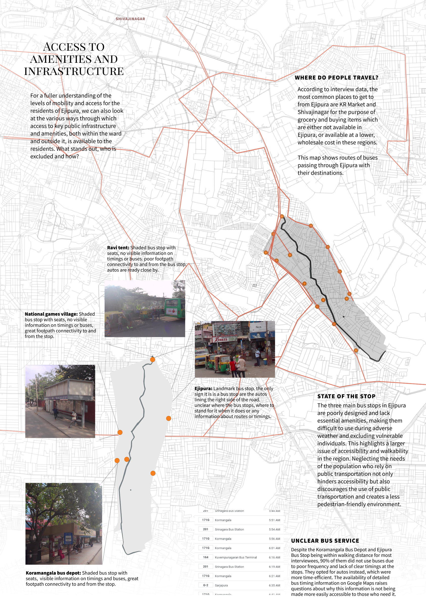

# (PART) Visualizing Results {.unnumbered}

Congratulations on completing the assessment! I hope that you have covered all the aspects discussed in this guidebook and are now well-equipped to present your findings. It's important to note that this guidebook was not intended to provide a list of methods to create a composite score or a single visualization to summarize your study site. Rather, its purpose was to demonstrate how to conduct a comprehensive audit of a site and uncover insights about the space, the population, and their interactions. I believe that reducing the analysis to a composite score oversimplifies the complexities of the situation and obscures more than it reveals. Therefore, we will not be using that approach. In this section, I will showcase my work in Ejipura and demonstrate how it relates to the topics covered in this book. If you have followed all the sections, you should be able to create similar visualizations with ease.

## Showcasing your study site {#showcase-site}

| Aim                                                                                                                                         | Components                                                                                                                                                                                                                                                                           | Section                                                                                                                                                 | Example                                                         |
|---------------|---------------------------|---------------|---------------|
| To provide an overview of the study site, including its location, size, and any relevant contextual information.                            | A map of the study site with geographic boundaries and landmarks identified. Demographic data, historical or cultural significance, economic data, or other relevant information about the site.                                                                                     | Section \@ref(secondary-research) (census data), Section \@ref(visual-notes) (visual notes), Appendix \@ref(identify-segregation) (micro-neighborhoods) | Figure \@ref(fig:explore)                                       |
| To identify and showcase the physical characteristics of the built environment in the study site and how they impact the community.         | Illustrations or photographs from the study site highlighting different types of buildings (residential, commercial, institutional, etc.) and their distribution. Information on the physical features of the built environment, such as building height, density, distribution etc. | Section \@ref(built-environment-observations) (built environment), Section \@ref(street-audits), Appendix \@ref(identify-segregation)                   | Figure \@ref(fig:built-environment-info)                        |
| To assess the availability and quality of public infrastructure in the study site.                                                          | Maps showing the location of public infrastructure such as schools, healthcare facilities, public transit stops, and parks, connectivity. Images or photographs of public infrastructure in the study site, highlighting any issues or deficiencies in accessibility or quality.     | Section \@ref(assessment-of-infrastructure-accessibility) (assessing infrastructure)                                                                    | Figure \@ref(fig:infrastructure-info) , Figure \@ref(fig:parks) |
| To understand how weather patterns and seasonal changes affect walkability in the study area and explore the dynamic nature of walkability. | Comparison of walkability during different seasons or weather patterns. Identification of areas that are particularly affected by weather patterns.                                                                                                                                  | Section \@ref(street-comfort-qualitative) (qualitative analysis of comfort), Section \@ref(assessment-of-comfort) (GIS mapping of weather effects)      | Figure \@ref(fig:comfort-info)                                  |

{width="15cm"}

{width="15cm"}

{width="15cm"}

{width="15cm"}

{width="15cm"}
