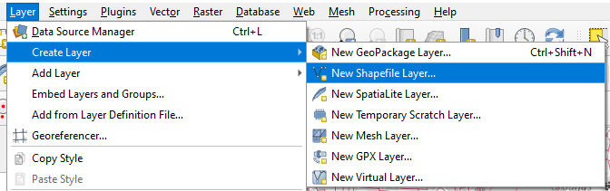
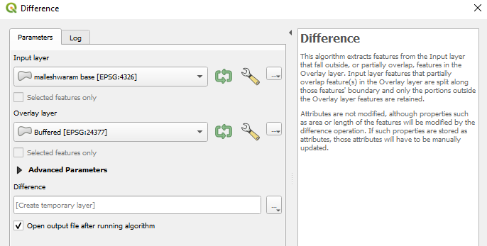

# Creating a city block map {#create-blocks}

{width="7cm"} {width="7cm"}

For some analyses, you might need data on **blocks** instead of street networks. This is needed for \@ref(block-sizes) and for other analysis you might explore, such as interface catchment analysis. If you're lucky, you might have access to block data but in the event that you don't, you can make something that is fairly accurate yourself.

This is fairly simple[^20-appendix-creating-blocks-1]. What you're essentially doing is drawing polygons for the areas enclosed by the streets. Think of it like making cookies, you're creating shapes by 'cutting' a flat layer with a cookie cutter (here, the roads).

[^20-appendix-creating-blocks-1]: Credit to user \`geozelot\` for outlining this process in their brief comment on [this](https://gis.stackexchange.com/questions/445089/osm-get-residentials-blocks-i-e-polygons-enclosed-by-roads) StackExchange question.

First, open the `gis_osm_roads` layer in QGIS and then create a new shapefile layer called `boundary` by going to `Layer` \> `Create Layer` \> `New Shapefile Layer`. The default settings are good enough for this, save your layer to a new location and it will appear in your list of layers.

{width="14cm"}

Go into edit mode and draw a rectangle that marks the extent of the area you want to analyze. Once saved, you should have two layers; the `boundary` on top of you `gis_osm_roads` layer like so:

{width="14cm"}

```{=tex}
\notebox {
Since we're going to be doing computation that is a little intense for some systems, I advise you to clip your road network to the extent of the `boundary` layer. 
}
```
Head over the `Processing Toolbox` and search for `Buffer` under `Vector` operations. In the dialog box, select your roads layer and set a `Buffer` value. All lines in the selected layer will be 'widened' by that much. I generally go with **5 meters**, since most streets are likely to be a little less or more than.

{width="10cm"}

This should 'inflate' the lines in your roads layer. Go to the `Processing Toolbox` again and search for `Difference` and open it.

Now, **the base layer (extent) goes in the `Input`** and the **Buffered layer goes into `Overlay`**.

{width="14cm"}

An easy way to remember this is you're cutting **base** using **the buffered layer**. Run it and you should get a new `Difference` layer which looks something like the map in Figure \@ref(fig:difference).

{width="14cm"}

There you have it! You've just created your own map of blocks in the study region.

One thing you'll notice if you try querying individual features of this layer, the entire layer will be selected, making it impossible to select individual blocks. You can fix this by going to `Processing Toolbox` and searching for `Multipart to Singlepart` and running it the current layer. The new layer contains individually selectable blocks. That's it!

Remember to save these layers, they're temporary for now.
