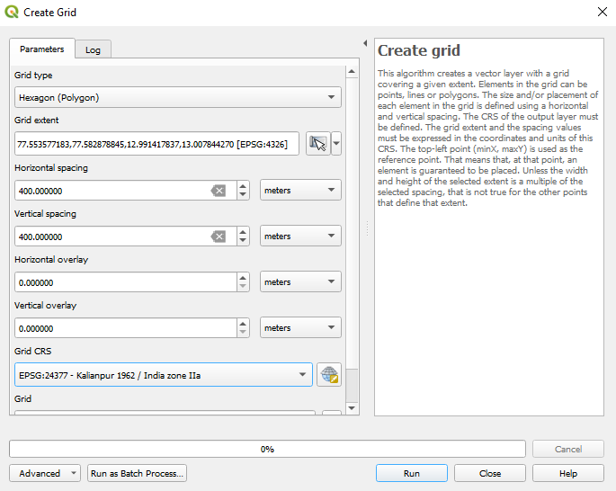
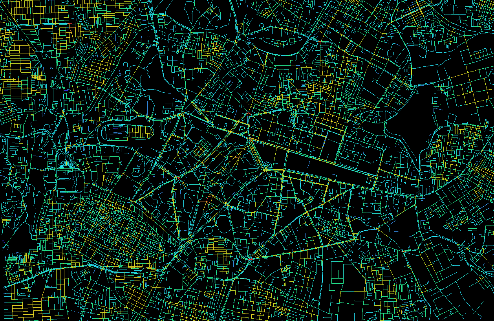
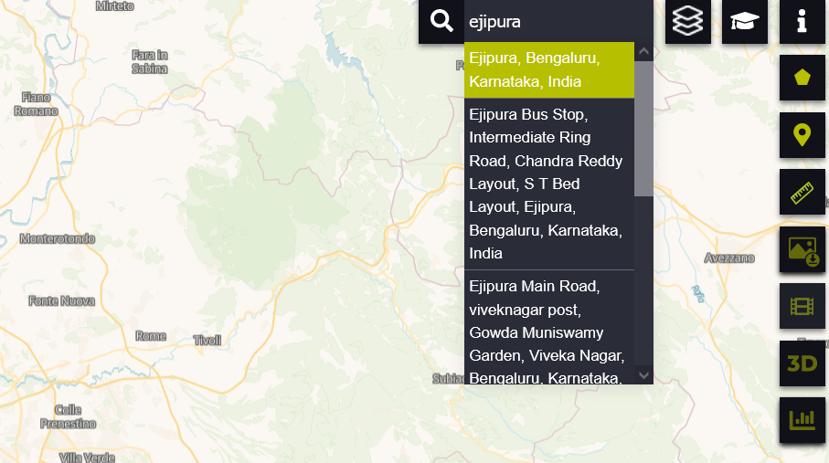
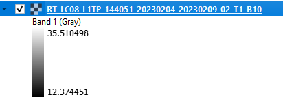
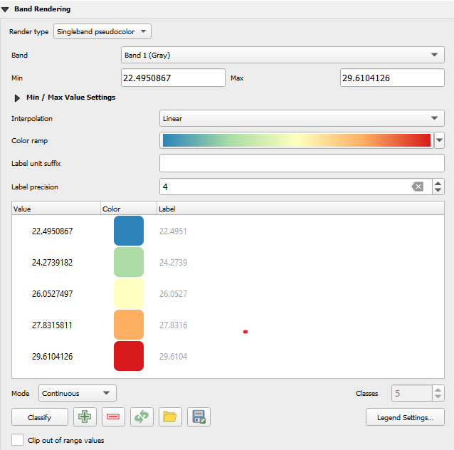
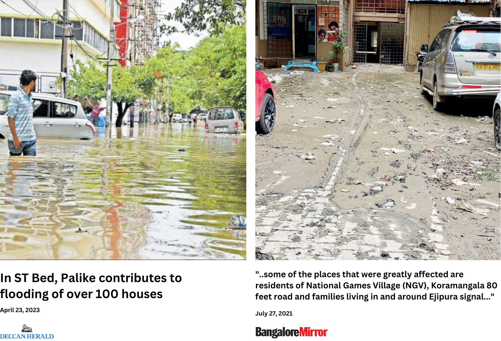
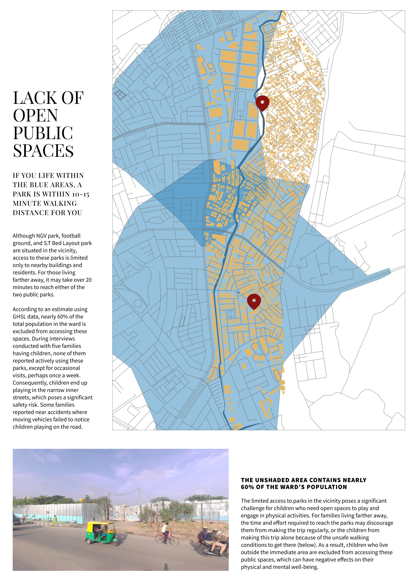

```{r include=FALSE}
# automatically create a bib database for R packages

knitr::write_bib(c(
  .packages(), 'bookdown', 'knitr', 'rmarkdown', 'rmallet'
), 'packages.bib')

knitr::opts_chunk$set(echo=FALSE)
knitr::include_graphics(rep("static/cover.png"))

outline_content <- function(href, img_src, heading, content) {
  paste0('<a href="./', href, '.html" ><div class="card-menu" style="display:flex; width:100%;"><div class="side1"><p></p></div><div class="side2"><h4 id="', make.names(heading), '" class="hasAnchor">', heading, '</h4><p>', content, '</p></div></div></a>')
}
knitr::opts_chunk$set(fig.align = "center")
library(tidyverse)


box_args <- function(
  vrulecolor = 'white',
  hrule = c('\\abLongLine', '\\abShortLine', ''),
  title = '', vrulewidth = '0pt',
  icon = 'Bomb', iconcolor = 'black'
) {
  hrule <- match.arg(hrule)
  sprintf(
    '[%s][%s][\\textbf{%s}]{%s}{\\fa%s}{%s}',
    vrulecolor, hrule, title, vrulewidth, icon, iconcolor
  )
}
```

```{r echo = F}
# When R encounters an error
options(error = function(){
  #Run your code here
  }
 )

# When R exits the knitr session    
.Last <- function() {
 system('CMD /C "ECHO The R process has finished running && PAUSE"',
   invisible=FALSE, wait=FALSE)
  }
```


```{r setup, include=FALSE}
options(
  htmltools.dir.version = FALSE, formatR.indent = 2, width = 55, digits = 4
)

# install the packages needed by this book; you fill out c(), e.g. c('ggplot2', 'dplyr')
lapply(c('xfun', 'tidyverse'), function(pkg) {
  if (system.file(package = pkg) == '') install.packages(pkg)
})
```


# Welcome to The Walkability Wiki {.unnumbered}

<br>


```{=html}
<style>
.inline-figure {
    border: none !important;
  overflow-x: visible !important;
}
</style>
```
This is the [website](http://walkability.wiki/) for *The Walkability Wiki*, a crowd-sourced cookbook of qualitative & quantitative methods for measuring pedestrian experience! Visit the [GitHub repository for this site](https://github.com/thedivtagguy/walkability-wiki).
The content for this guide has been contributed by multiple people, the full list of which can be viewed here. If you are someone who studies urban development, or have engaged with studying walkability in any measure, we'd love to have you here too.
Contribution guidelines are available here and can be submitted via pull requests to our main repository
## Outline {.unnumbered}
This book has been divided into the following categories to make it easier to get through:
`r outline_content('intro', 'static/scope.png', 'Getting Started', 'This section provides an overview of the book, outlining its purpose, scope, and an introduction to the concepts of walkability.')`
`r outline_content('quantitative-assessments', 'static/quant.png', 'Quantitative Methods', 'This section includes guidance on sourcing data for street and urban environment assessments, recipes for processing and analyzing data, creating maps, and running numbers.')`
`r outline_content('qualitative-assessments', 'static/qual.png', 'Qualitative Methods', 'This section offers tips for conducting interviews, designing street audits, framing questions to elicit valuable information, and creating participatory activities.')`
`r outline_content('hybrid-assessments', 'static/gap.png', 'Bridging the Gap', 'This section explains how to combine qualitative and quantitative methods to fill in gaps, derive insights, and present results for analysis.')`
`r outline_content('case-studies', 'static/case.png', 'Case Studies', 'This section features real-life examples of street audits in various contexts and locations, detailing the tools used and the analysis methods employed.')`
<a rel="license" href="http://creativecommons.org/licenses/by-nc/4.0/"></a><br />This work is licensed under a <a rel="license" href="http://creativecommons.org/licenses/by-nc/4.0/">Creative Commons Attribution-NonCommercial 4.0 International License</a>.

<!--chapter:end:index.Rmd-->

# (PART) Getting Started {.unnumbered}

# Introduction {#intro}

Walking in a city is an experience that most people take for granted. The ease of mobility on foot, especially in urban areas, has long been overshadowed by the convenience and speed provided by personal vehicles or public transportation systems. Until recently, I was also among those who overlooked and underappreciated its importance. Although I have been aware of the issues with poor infrastructure in cities in India, I never fully grasped the severity of the problem, nor did I connect the individual inconveniences I experienced to a larger systemic issue. Admittedly, this lack of awareness could be viewed as naive or shortsighted, but it is what it is.

However, in 2021, my perspective changed when I stumbled upon an Instagram account called "bengawalk" run by **Pravar Chaudhary**. Through this account, Pravar documented his observations of the streets and people of Bangalore, highlighting a range of issues and interactions that occur on a daily basis. Whether it was a simple post about wayfinding, accompanied by a single hashtag or a video of person crossing a busy street despite being next to a footbridge, to a more complex analysis of traffic congestion and flyovers, the account provided me with a new lens through which to view the city and its challenges.

As a designer and a person interested in using data to understand problems, this appealed to me as one of the most tangible, omnipresent topic that I had *never* fully paid attention to. From there, I have read through countless documents on urban mobility, walkability, transport and streets; admittedly one of the best rabbit-holes I've fallen into. The data-storytelling enthusiast in me always wants to find ways to mould information into a spreadsheet I can import into R or a shapefile I can visualize in QGIS, which is what I did with this too.

The more I've engaged with walkability and urban mobility, though, I've realized that quantitative data is often not enough to describe something as complex as streets and transport, or the people who use them. In my research on street usage and accessibiilty in Ejipura, Bangalore, several new insights came up through qualitative analyses that I would have completely missed if I was focusing on large numbers. I was also lucky enough to work with people more experienced than I was who brought with them different, unique ways to analyze urban environments.

This book is a distillation of things I learnt along the way.

Through qualitative analysis, community engagement, and data-driven approaches such as those discussed here, we can try to gain a deeper understanding of our streets and how they impact individuals from all walks of life.

The methodologies presented in this book are just a starting point - there is still much work to be done!

# Project background {#pb}

This book is the product of my first-hand experience working in the Ejipura ward in Bangalore. At the start of my thesis, I was excited to experiment with QGIS and OpenStreetMap data to create visualizations of Bangalore's roads, streets and bus stops. However, my guide, Lakshmi, encouraged me to take a step back and consider what I was missing. I realized that while analyzing large-scale data was relatively easy, it was important to also consider smaller neighborhoods and the unique factors that contribute to walkability.

{width="14cm"}

That's when I decided to use Ejipura as my lab and started exploring what makes a place walkable beyond *conventional* ideas of walkability. Over the next few weeks, I fell in love with the neighborhood's tightly wound lanes, bustling shops, and vibrant buildings. Despite the language barrier, the residents were eager to contribute to my research, and I learned to use their insights to conduct detailed descriptive analyses of the neighborhood. As I delved deeper, I also realized that the issues affecting walkability were complex and intertwined with social identities, accessibility to public transport, and differing impacts on various groups of people. Rather than trying to assign a numerical value to the walkability of the neighborhood, I found more satisfaction in understanding and analyzing the complex factors at play. The rest is covered in the next few dozen pages.

<!--chapter:end:01-intro.Rmd-->

# Scope

{.people .no-border style="margin:0 auto; display:block;" width="8cm"}

I really like the idea of **eat cake first** [@cetinkaya-rundelLetThemEat2018], which means at the heart of this book's approach is the belief that it's best to dive in and get started with the task at hand, even if that means adopting a "good enough" approach initially.

There may be more complex or nuanced workflows available, and I'll be sure to point those out as well. There might even be better ways to derive insights or understand results, but the methods discussed here are enough to get started with. My goal is to provide you with the quickest and most straightforward path to achieving your desired outcome.\
\
This also means **no prior knowledge of GIS or programming** is required to follow along. Wherever needed, I will link to appropriate guide material to reduce redundancy of writing it here again. What I *will* show is how to use those results in a real-life context. There are some things to keep in mind while using this book, so that you make the most of it.

## What to expect

This guidebook **will**:

1.  Demonstrate how to combine methods for better understanding walkability.
2.  Present real-life case studies to illustrate how this information can be practically used.
3.  Provide resources for urban planning professionals, academics, and anyone interested in the field to conduct their own research.
4.  Provide a framework for assessing walkability and encourages readers to draw their own conclusions based on their research and analysis

But it **won't**:

1.  Aim to provide an exhaustive list of measures or a comprehensive review of research.
2.  Claim to offer a one-size-fits-all solution for assessing walkability.
3.  Provide technical guidance on every aspect of GIS and data analysis, only practical techniques and code snippets.
4.  Aim to be prescriptive or offer definitive answers on what makes a city or street walkable

## Who is this for? {.no-border}

```{=html}
<style>
.inline-figure {
    border: none !important;

  overflow-x: visible !important;
}
</style>
```
{.people .no-border width="14cm" height="4.5cm"}

This book *does assume you have some understanding of walkability audits and assessments*, and what you are looking for is methods to fill gaps in that knowlege. Little-to-no prior knowledge is required for following the methods discussed in this book. You might be a:

1.  Urban planner or designer, for whom this book offers insights on how to assess walkability in Indian cities and neighborhoods.

2.  Community advocate, for whom this book provides a framework for promoting walkable neighborhoods and understanding the factors that make them successful.

3.  A researcher, academic, or student in urban planning, public health, or related fields, for whom this book is a great resource for gaining a comprehensive understanding of walkability and its impact on the people that use them.

## How to read this book

Much like The Machete Order, I suggest the following flow to get through this book, which will guide you through the methods and concepts presented in a logical sequence.

1.  **Learn how to understand your site** through the methods described in Section \@ref(secondary-research). This will help you understand important ways to understand the built space.
2.  **Plan your field visits** or **conduct a preliminary virtual tour** through the methods outlined in Section \@ref(field-visits) and Section \@ref(google-street-view-for-audits).
3.  **Conduct interviews** and **make comprehensive notes & observations** about the site and its people through the methods in Section \@ref(built-environment-observations), Section \@ref(interview-structure), and Section \@ref(interview-methodology).
4.  **Delve into quantitative analysis** and learn how to **analyse your qualitative data through visualizations** in Section \@ref(hybrid-assessments), Section \@ref(combining-data), Section \@ref(finding-ways-to-visualize-comfort) and Section \@ref(part-quantitative-assessment-guides).
5.  **Visualize your results** and presenting findings by looking at examples in Section \@ref(part-visualizing-results).

For any important steps in an analysis process, screenshots and text is presented clearly. References to anything within a software or inside an image is `Formatted like so`. I have done these analyses on a Windows 10 laptop, so if you have any errors specifc to this OS, rest assured they can be searched for on Google. If you are using Mac OS and are unable to troubleshoot an error, I recommend shutting down your laptop and getting a Windows.

<!--chapter:end:02-structure.Rmd-->

# Recommended softwares and tools

I will be using the following to collect data, perform analysis and visualize the results:

1.  [**OpenStreetMaps**](https://openstreetmaps.org) **(OSM)**: OSM is a crowdsourced mapping tool that is used to collect and update geographic data. It is a free and open-source mapping tool that provides map data and related services to users worldwide. You might compare this to Google Maps, but it is even better because we will be able to *pull* data from the OSM database and perform analyses

2.  [**QGIS**](https://qgis.org/en/site/): QGIS is a free and open-source geographic information system (GIS) software that is used for creating, editing, visualizing, and analyzing geospatial data. QGIS is a powerful tool that supports a wide range of vector, raster, and database formats.

3.  [**Figma**](https://figma.com): Figma is a cloud-based design tool that makes it a breeze to layout and create infographics. You could use Photoshop or Illustrator do the the same thing but I like it for the convenience. We'll need a vector editing tool to handle SVG formats.

4.  **Python**: Python is a popular language for geospatial data analysis and visualization due to its large ecosystem of libraries and tools. We'll be using this rarely if we need to process some data for analysis.

5.  [**R**](https://posit.co/products/open-source/rstudio/): R is a programming language that is widely used for statistical analysis and data visualization. R has a large number of libraries and packages for geospatial analysis and visualization.

6.  [**DepthmapX**](https://archtech.gr/varoudis/depthmapX/): DepthmapX is a free and open-source software tool used for spatial network analysis. It was developed by researchers at the Bartlett School of Architecture, University College London. One of the key features of DepthmapX is its ability to perform space syntax analysis. Space syntax is a theory that links the spatial configuration of a built environment to the social, cultural, and economic activities that take place within it. DepthmapX provides a range of tools to analyze spatial configurations, such as isovist and visibility analysis, axial analysis, and integration analysis.

Having these handy will help you go faster. Let us get started.

<!--chapter:end:03-recommended-softward.Rmd-->

# (PART) Overview of Methods {.unnumbered}

# Walkability

Take a moment to consider what comes to mind when you hear the term "walkability." Do you imagine a specific place or think of sidewalks? Perhaps you envision a street without cars. If you're drawing a blank, that's understandable too. Even for those of us who have recently become familiar with the concept, it can be challenging to provide a concise definition, or even consider the idea of there being one strange.

We often only notice the lack of walkability in a space when it's absent. While significant effort has been dedicated to understanding and designing spaces for motorized vehicles over the last few decades, walkability has only recently become a focus in planning processes.

::: {.cols data-latex=""}
::: {.col data-latex="{0.55\\textwidth}"}

:::

::: {.col data-latex="{0.05\\textwidth}"}
  <!-- an empty Div (with a white space), serving as
a column separator -->
:::

::: {.col data-latex="{0.4\\textwidth}"}
Think of your city and how it is designed, can you walk in it without weaving through haphazardly parked cars, broken sidewalks, and other obstacles? Unfortunately, planning for walkable cities has received far less attention, funding, and seriousness than its motorized counterparts. Shown alongside is some data from the '*Comprehensie Mobility Plan for Bengalurur (2020)*' by the Directorate of Urban Land Transport. Pedestrian infrastructure receives the *least* amount of money by a factor of nearly 20 times.
:::
:::

> All further augmentation of urban road capacity, be it at-grade or along elevated corridors, should pay particular attention to the equitable allocation of road space, and should prioritise movements of public transport vehicles, pedestrians and bicyclists. - CMP 2020, *DULT*

This is not unique to Bangalore. Most Indian cities have undergone a rapid urban expansion that has mostly been geared towards cars, resulting in sprawls that are impossible to navigate without them. As a result, we often find ourselves in cities where walking is either inconvenient or downright dangerous, particularly for those with disabilities or who are otherwise marginalized [@ComprehensiveMobilityPlan2020].

{width="15cm"}

Over the years, there have been many, many attempts at getting to the root of what making something walkable means.

Research has suggested that a range of factors contribute to walkability, including the presence of sidewalks and crosswalks, street lighting, traffic calming measures, proximity to destinations such as schools and shops, and the overall design and layout of the built environment [@spearsReviewPedestrianTransitOriented2017]. These factors can vary from place to place and even from one street to the next, making it challenging to create a single, definitive definition of walkability. Planners, policymakers, and community activists in India are working together to create spaces in cities that prioritize pedestrians, with more accessible sidewalks, dedicated bike lanes, and improved public transportation. These efforts are not only good for public health and the environment but also local economies. Studies have shown that neighborhoods with higher walkability ratings tend to have higher property values and more vibrant local businesses [@Jacobs1961Death2011; @spearsReviewPedestrianTransitOriented2017].

When residents have a better understanding of how their neighborhoods are designed, they are more likely to push for changes that prioritize pedestrians and create more vibrant, walkable spaces. Fortunately, people are taking more interest in reclaiming spaces for pedestrians than ever before.

One way of doing this is through walkability audits. Walkability audits involve evaluating the walking environment using both quantitative and qualitative metrics. This process allows residents and community members to identify problem areas and suggest potential solutions for making their neighborhoods more pedestrian-friendly.

While there is a wealth of data available on walkability at a macro scale, these methods presented in this book allow you to conduct audits at a micro-scale. By collecting data at the street and neighborhood level, you can gain a deeper understanding of how your surroundings impact your walking experience. This approach is especially helpful for identifying areas that need improvement but may have been overlooked in large-scale analyses.

The methods presented in this book aim to provide a toolkit for conducting walkability audits that can be tailored to the specific needs and contexts of different neighborhoods, and hopefully empower individuals and communities to take a closer look at their surroundings

<!--chapter:end:04-overview.Rmd-->

# Types of analysis

When assessing the walkability of a neighborhood or a city, it is important to use both quantitative and qualitative analyses.

Quantitative analysis is done with metrics are **objective, measurable characteristics** of a place that can be quantified using numerical data. Examples of quantitative metrics include sidewalk coverage, street connectivity, and pedestrian counts. These metrics are important because **they provide a standardized way of evaluating walkability** and can be used to compare the walkability of different areas.

Qualitative analysis, on the other hand, is done with metrics are **subjective characteristics** of a place that are difficult to measure using numerical data. Examples of qualitative metrics include the aesthetic quality of the environment, social perceptions of safety, and the presence of public amenities. These metrics are important because **they capture aspects of the pedestrian experience that are not easily quantifiable**, such as the perceived safety of a neighbourhood or quality of living that being able to walk in it easily can foster.

By using both quantitative and qualitative metrics in walkability assessments, we can develop a more comprehensive understanding of the walking environment. This book will introduce case-studies to show how these methods can be combined.

## Levels of analysis {#levels}

To fully understand the walkability of an area, it is essential to examine the neighbourhood at multiple levels and look beyond just the physical environment, such as sidewalks and green spaces, to consider the social interactions and dynamics that shape the experience of walking. For example, we may find that even within a single community, there are divisions based on socioeconomic status or other factors, which could impact the level of access and resources available to different groups of residents and affect their ability to walk and enjoy the neighbourhood.

This approach recognizes that the physical layout of the neighbourhood is just one aspect of what makes it walkable and by looking at the neighbourhood as the sum of its various parts and expanding our understanding of the walking experience, we can gain a more holistic view of the factors contributing to walkability.

In the case of Ejipura, I wanted to see how these various levels could be explored. Figure \@ref(fig:levels) describes this approach. This book describes how to engage in some methods of analysis of each of these levels.

{width="15cm"}

<!--chapter:end:05-types-of-analysis.Rmd-->

# Hybrid Assessments

Combining qualitative and quantitative data is essential to understand issues as complex as mobility fully. However, analyzing both data types can be challenging, and integrating them into a cohesive analysis is often tricky. Here, hybrid assessments can help bridge the gap between qualitative and quantitative studies.

## Why do we need them?

In the next few sections, we will explore various walkability measures, including an area's built and natural environment and other essential aspects. While GIS techniques and macro data sources can provide a baseline understanding of the walkability of a site, they often miss out on the unique issues and experiences that residents face on a day-to-day basis.

In early 2023, [Sensing Local](https://www.sensinglocal.in/), an organization that works on urban and environmental issues in Indian cities, commenced a series of walkability for 24 wards in Bangalore [@byiffathRaisingStreets2022]. As of writing this, more than 139 km of footpaths have been audited in 10 wards has been completed. These audits, using collaborative tools and with the help of community volunteers, mapped various street features, such as footpath conditions, street litter, encroachment, and streetlight presence. Although these are important indicators of the neighbourhoods they visited, there may be other problems that these criteria missed.

To better understand the region, another audit of Bangalore's wards was conducted by ichangemycity in 2016 and produced data for all wards, including Ejipura [@ichangemycityEjipuraWard1482016]. This audit included a broader set of criteria, such as:

1.  **Civic Facilities**: Presence of parks, public toilets, bus stops, and waste collection centres.
2.  **Quality of life**: Walkability of footpaths and conditions of significant crossings, streetlight presence, and other citizen grievances.
3.  **Budget allocation**: Areas of budget allocations and overview of budgeted works.

This more comprehensive approach not only provides an understanding of the accessibility of various amenities but also includes qualitative data on what the **residents feel is an issue**.

As researchers, we often study areas that we aren't familiar with. Therefore, standardized metrics, such as sidewalk measurements, street lighting, and footpath conditions, are crucial for providing a foundational understanding of the walkability of an area. However, relying solely on these metrics can limit our understanding of residents' unique issues and experiences. Qualitative research can provide valuable insights into the lived experiences of individuals in the community. For example, an on-ground study conducted by community volunteers can reveal micro-scale insights that data analysis using GIS techniques and macro data sources may miss. Section \@ref(street-comfort-qualitative) shows some unique insights that can be gathered from interviews.

## Grassroots approach

We can use a grassroots approach to designing audits to help fill these quantitative research gaps, often created based on standardized metrics.

Grassroots, also known as bottom-top approaches, focus on collecting data from participants locally instead of entirely relying on higher-level data sources. The grassroots process is particularly relevant in fields such as community development, social justice, and public health, where understanding the experiences and needs of the local community is critical to developing effective interventions or policies and can similarly be applied to inform the assessment process, which can ultimately lead to more effective and inclusive solutions [@knapskogExploringWaysMeasuring2019a].

## Differences in methods

In most of the walkability audits I have encountered, and others have studied, the qualitative features of streets fail to attract the necessary attention and aren't investigated. [@aghaabbasiEvaluatingCapabilityWalkability2018]. Most studies follow the framework shown in Figure \@ref(fig:usual).

{width="12cm"}

This isn't bad in itself, and if the study aims to audit an environment with the *specific* intention of only assessing things like sidewalks and streets, that is okay. However, it may not capture the lived experiences of the people who use the space daily. Engaging with local residents and considering their perspectives is essential to gain a more holistic understanding of walkability.

Based on my experience in Ejipura, taking a different approach helped. Instead of assessing standard walkability measures, I went to the site on multiple visits to see what I needed improvement. Since these observations are still detached from what the residents experienced daily, I conducted interviews and other participatory activities to try to answer the fundamental question I outlined above:

> *What does walkability mean to the people who live there?*

This process differs from the flow I illustrated above and uses qualitative research to develop the indicators I must assess. Figure \@ref(fig:proposed) outlines my process while studying Ejipura.

{width="12cm"}

This process involved qualitative research to develop indicators that emerged from local knowledge. Using site visits as an essential part of verifying results, I ensured that my insights were grounded in the community context. This approach allowed me to tailor my findings to the specific needs of Ejipura rather than attempting to impose Western models of development that may not be appropriate for Indian cities.

One challenge of using qualitative research is that it can be perceived as unscalable. However, in the following sections, I will demonstrate how I used qualitative data to analyze the environment quantitatively based on the insights gained from interviews and observations. This method can help to bridge the gap between qualitative and quantitative approaches, providing a more comprehensive understanding of walkability in Indian cities. These methods will be demonstrated using Ejipura as the context but can be replicated easily for any other region. Let's get into it!

<!--chapter:end:06-hybrid-assessments.Rmd-->

# (PART) Quantitative Assessment Guides {.unnumbered}

# Site assessment {#site-assessment}

## Secondary research

Chances are, you already know where you'll be conducting your walkability assessment. This could be your neighborhood, a section of an area you visit often, or even a place you've never been to. If you have already narrowed down such a region, \@ref(space-analysis) shows you how to identify important and busy streets for your audit. \@ref(secondary-research) shows you how to get information about your site's population, which can help you understand the region's demographics.

### Understanding the population

In \@ref(types-of-analysis), we discussed the importance of adding a socio-economic layer of context to our assessments. TLDR; understanding your demographic, income levels, and social makeup can help you show *who* is being excluded and design your solutions more inclusively. We can use a variety of data sources to view information about the population. I discuss some ways to use this data to identify segregation within areas in Section \@ref(identify-segregation)

### Census data {#census-data .unnumbered}

The last general census in India was conducted in 2011. While outdated by almost all counts, this data remains the only comprehensive source of information at a country-wide level. The highest resolution (the level of detail) at which this data is available is at a city's ward level. If you live in any of the large metro cities, this might already be available through [OpenCity](https://opencity.in). Some states and government bodies have also opened their GIS servers for access, a full list of which you can find [here](https://opencity.in/explainer/how-to-access-government-gis-data-for-indian-cities-states/). For smaller cities, the compiled population information by [@balk2019] for the entire country from a variety of sources can be [downloaded](https://sedac.ciesin.columbia.edu/data/set/india-spatial-india-census-2011/data-download#) in the form of CSV and GeoTIFF files.

### Global Human Settlement Layer {.unnumbered}

The [Global Human Settlement Layer (GHSL)](https://ghsl.jrc.ec.europa.eu/download.php?ds=pop) by the Joint Research Centre provides high-resolution population estimates for nearly every country. This can be downloaded for various years (in my experience, the 2015 dataset works well) and for your specific region of interest through the website's interactive map.

The GHSL dataset is commonly used for estimating the population, whereas other datasets might be hard to get. The data is provided in raster format, where each pixel represents the number of people at that point. You can easily visualize this in software like QGIS. An excellent project that makes it available to explore only is Tom Forth's [Population around a point](https://www.tomforth.co.uk/circlepopulations/).

{width="10cm"}

### Understanding the space {#space-analysis}

You have your region, and you know something about your population. Now how would you decide which streets to audit? Space Syntax Analysis (SSA) can help!

Space syntax analysis is a method of analyzing and understanding the spatial configuration of built environments developed by University College London (UCL) researchers in the 1970s and 1980s.

The basic premise of space syntax analysis is that how buildings and cities are configured spatially can significantly impact how people use and interact with those spaces. By analyzing the spatial relationships between different parts of a built environment, space syntax analysis can help reveal movement patterns, interaction, and social activity [@vannesIntroductionSpaceSyntax2021]. This can be done using street networks from OpenStreetMap and DepthMapX, a software dedicated to such analysis.

### Components of Space Syntax Analysis {#components-ssa}

There are three measures that this method will provide you with. In extremely simple, intuitive terms, these are:

1.  **Choice:** Choice is a way to measure how likely a street or road segment is to be used by people traveling between different parts of a system. For example, imagine a city and all the different routes people could take to get from one place to another. Choice measures how often a particular street segment is used on the shortest path between any two locations in the system. A high choice value means that many people are likely to use that street segment, while a low choice value means fewer people are likely to use it. So, the choice measures how important a street segment is for connecting different system parts [@hillierSocialLogicSpace1984].

2.  **Integration**: Integration is a way to measure how close or connected one place is to all the other places in a system. For example, think of a city and its different neighborhoods. Integration measures how easy it is to get from one area to another. The higher the integration, the more connected the neighborhoods are and the easier it is to move around [@hillierSocialLogicSpace1984].

We can use these measures to extrapolate many insights from quantitative data in the form of street networks and build a model for understanding the space. The theory also proposes that the street network adapts and changes over time to intensify local connections, which leads to more efficient movement patterns and porous structures. Essentially, SSA describes how the layout of the street network shapes the development of urban centers and how the evolution of the street network over time influences the formation and location of centers within the urban settlement layout as a whole.

### Using DepthmapX for SSA {#using-depthmapx}

So you've chosen your area to audit, but you want to maximize your resources and time and start by auditing the most important streets in the region. If you know the neighborhood, you already know what to do. If not, the `choice` measure can help you provide a starting point.

First, get the following things ready before moving ahead:

1.  **Download DepthmapX**: You can find the relevant copy for your operating system [here](https://archtech.gr/varoudis/depthmapX/).

2.  **Download your region's OSM street network**: Trim the network to your region of interest so you can process the data faster.

3.  **Fire up QGIS**: We'll use this to convert our street files into an appropriate format for use in `DepthMapX` and then bring it back here for polishing touches after analysis.

Let's get started!

#### Step 1. Convert your street network into `.mif` {.unnumbered}

`.mif` stands for a MapInfo file, which is a type of digital file that contains information about a map. It is like a virtual version of a paper map that can be opened on a computer. It contains data about different features on the map, such as roads, buildings, and rivers; basically everything you'll need about your street network to pull it into `DepthmapX`.

{width="10cm"}

You can do this by right clicking on your street layer and going to `Export` \> `Save Features As` and selecting `.mif` from the export dialog box.

{width="10cm"}

#### Step 2. Prepare it in DepthMapX {.unnumbered} {width="10cm"}

Open your copy of `DepthMapX` and create a new project by going to `File` \> `New`. We can now import our map by going to `Map` \> `Import`.

{width="10cm"}

What you should now see is a map with all streets with different colors. Each part of a street that is a different color is a **segment**. Right now, `DepthMapX` does not know how much each segment measures. To do that, go to `Tools` \> `Convert Active Map` and choose `Segment Map` from the dialog that opens.

{width="12cm"}

Once you click `OK`, your map should process and be done fairly quickly.

{width="12cm"}

In your `Attributes List` pane on the left-hand side, you can click on various layers and watch the map update in colors. Here's what is important for you:

1.  **Ref Number** is a unique ID for each segment.

2.  **Angular Connectivity** is a way of measuring the degree of connectivity between different segments of a street network. It is calculated by adding up the cumulative turn angles from a root segment to all other segments in the network. Essentially, it measures the overall angle of turns that must be made when traveling from the root segment to other segments, which can indicate how direct or indirect the route is.

    For example, if you have a network of streets and you want to travel from point A to point B, segment angular connectivity would measure the total angle of turns you would need to make along the way. A high segment angular connectivity would mean that there are many turns along the way, while a low segment angular connectivity would indicate a more direct route. This metric can be useful in analyzing the accessibility and ease of movement within a street network.

3.  **Connectivity** is a measure of how many other spaces are directly connected to a given space in a system.

    For example, in a street network, connectivity measures the number of streets that intersect with a particular street or node, which can affect how easily people can move between different areas of the city. Higher connectivity generally means that there are more direct routes between spaces, which can make movement more efficient and promote social interaction.

4.  **Segment Length**, as the name implies, color codes the parts of the street network that have similar lengths.

#### Step 3. Run Segment Analysis {.unnumbered}

We need to find out which roads are the most important, or the busiest, in this region. Go to `Tools` \> `Segment` \> `Run Angular Segment Analysis`.

{width="12cm"}

This should bring up a dialog box that looks something like Figure @ref(fig:segment-analysis). For best results, here are the recommended settings and what they mean:

1.  **Tulip Bins** refers to how accurate (hence slower) or less accurate (faster) the analysis should be. Any value around 500 is good enough.

2.  **Include choice** should be ticked because that is the measure we are interested in.

3.  **Radius Type** should be **metric** because we're measuring values in meters.

4.  **Radii** refers to the distances or areas surrounding a central point, also known as a root space. This is how much area can be covered with ease for different types of mobility. Generally, it is **400m** for pedestrians, **800m** for cyclists and we'll keep the rest **n** because this is all we're interested in at the moment.

5.  **Weighted measures** should be ticked, and set to `Segment Length` because we want that metric to be used to measure all these values.

Once you've done this, run and wait!

{width="10cm"}

If all goes well, your `Attributes List` pane should be filled with new layers. Play around with them, what do you understand?

The layer we're interested in should be named `T1024 Choice` (or whatever number you set for tulip bins). Once you click on it, most of the colors should disappear and you should have a few streets being highlighted, as shown in Map @ref(fig:choice-map).


These are roads that SSA hypothesizes are the busiest, most important roads in the network! There are also layers like `T1024 Choice R100.00 metric`, which will show you how the `Choice` measure varies with the kind of distance we set it too but since our network is rather small, these layers are pretty much the same.

### Insights from analysis

SSA is a powerful tool to evaluate the spatial configuration of urban environments and identify potentially important streets within the network. However, it should only be used as a starting point to uncover these potentially important streets, rather than a final decision-making tool.

In order to validate the results of SSA, it is important to conduct site visits or compare the analysis with other relevant information, such as land use maps. This is because there may be other factors that influence the importance of a street beyond its spatial configuration, such as its location in relation to commercial or residential areas, the presence of important landmarks or institutions, or social and cultural factors.

For example, in the case of Map \@ref(fig:choice-map), the streets highlighted in red were identified as potentially important according to SSA. However, it was only after comparing this analysis with a land use map that it was clear that these streets were significant due to their concentration of commercial buildings and shops. In this case, the importance of the streets was related to their function within the urban environment, rather than just their spatial configuration.

Therefore, while SSA is a valuable tool for urban analysis and planning, it should always be used in conjunction with other forms of data and on-site investigation to fully understand the context and significance of potentially important streets.

<!--chapter:end:07-site-selection.Rmd-->

# Assessment of Physical Environment {#physical-environment}

In Section \@ref(site-assessment), we looked at how we can use some secondary data to surface important insights about how these roads are used. Let us now look at how we can use other parts of the physical environment to measure walkability through easily available data. Table \@ref(tab:physical-indicators) shows some indicators and how they can help you understand how walkable an area is. There are many more that other studies have collated [@knapskogExploringWaysMeasuring2019a], but I will be going over these because the data to analyze these is easily accessibly through OpenStreetMaps and hence should work for most cities.

\renewcommand{\arraystretch}{2}

```{r physical-indicators}
library(knitr)

table <- data.frame(
  "I want to find out..." = c("If it is easy to move within a specific place", " ", "If it is easy to move from one place to another", " "),
  "Quantitative Measure" = c("Permeability", "Intersection Density", "Connectedness", "Integration"),
  "Good Walkability" = c("Easy to move around", "High Density", "Well connected", "Easy to get to"),
  "Poor Walkability" = c("Hard to move around", "Low Density", "Poorly Connected", "Harder to get to")
)

kable(table, format="latex", booktabs = TRUE, col.names = c(
  "I want to find out...",
  "Quantitative Measure",
  "Good Walkability",
  "Poor Walkability"
), caption = "Indicators that can be readily analysed"
) %>%
  kableExtra::kable_styling(latex_options = "striped") %>% 
  kableExtra::column_spec(1, width = "10em", bold = T) 

```

These measures have been divided into two; those that tell you about the walkability of a **bounded region** and those that help describe how much a place allows **movement to other places** within it. As Table \@ref(tab:physical-indicators) shows, there is more than one indicator that you can use to answer these questions and for the most comprehensive understanding, it is better to use these **together**.

## Measuring permeability {#block-sizes}

*Permeability* refers to how easy or difficult it is for people to move through a specific location. It is mainly concerned with the physical features of the space, such as the design of the streets, buildings, sidewalks, and public spaces. A high permeability space is easy to navigate, with multiple entrances and exits, clear paths, and few barriers. On the other hand, a low permeability space is harder to navigate, with limited access points, narrow pathways, and obstacles that make it challenging for people to move through.

A method for calculating permeability was developed by @pafkaPermeabilityInterfaceCatchment2017 through two measures - Area-weighted average Perimeter ($AwaP$) and Interface Catchment ($IC$). By using their associated QGIS plugins, performing this analysis is a trivial task (the section below is distilled from their [video](https://vimeo.com/574850313) on the topic).

We'll focus on $AwaP$ in this chapter.

You'll need the following before you get started:

1\. The $AwaP$ plugin for QGIS, which can be downloaded from the plugins manager (search for 'AwaP') or [through the online repository](https://plugins.qgis.org/plugins/awap/).

2\. A city block map for your area of interest. Appendix \@ref(create-blocks) describes how to do this with a road network layer from OpenStreetMaps.

### Calculating $AwaP$ in QGIS

This section assumes you have your city block map ready. You will not need anything else. For this example, I'll select Bangalore's central business district area (covering MG Road, Majestic and others).

{width="14cm"}

#### Step 1. Create a Grid {.unnumbered}

Go to `Plugins` \> `AwaP` to bring up the dialogue box to get started. Since we have a large area, we'll visualise this as a choropleth map. Begin by selecting `Multiple Polygons` in the `Boundary layer options` and clicking the button that says `Create a polygon grid` to bring up the grid dialogue box:

{width="14cm"}

I like to choose hexagons are my grid shape. Why? There are [some advantages](https://www.esri.com/about/newsroom/insider/thematic-mapping-with-hexagons/) of using hexagons to map things because they tessellate better and more organically than a rectangle, but it is also a stylistic choice; I like how the look.

For `Grid Extent`, set your extent as you wish (If you're coming from just creating your city block map from Section \@ref(create-blocks), you can use your base layer to keep things simple).

I set the `Horizontal Spacing` to $400 m$, which is what the hexagon would measure from one edge to the other one across. This is up to your needs, but $400$ is something I prefer as studies consider this a distance that is comfortably walked [@duncanValidationWalkScores2013].

```{=tex}
\notebox{
If you cannot see units in meters, you might have to change your project CRS to a UTM zone. I am using `EPSG:24377`
}
```
#### Step 2. Configure settings {.unnumbered}

Once your grid has been made, return to the $AwaP$ dialogue box, which should still be open. Here, you can:

1.  Choose the **amount of area of the grid a block should occupy** to be considered as a part of that grid. The default value is okay for most cases.
2.  Choose to remove **dead-ends** (cul-de-sacs) from the analysis, as they imply that there's no way to 'permeate' past that point anyway (this might be discriminatory to ghosts).

But the most important setting here is the `Apply custom style categories` dropdown. You must set it to **by AwaP** so that only a single layer with all the values is output.

Click run.

You should get something like Figure \@ref(fig:permeable).

{width="14cm"}

If you see coloured hexagons, your analysis has been successful. But we can't understand anything by just looking at this, so head over to the `Layer Properties` and in the `Layer Rendering` section of the `Symbology` tab, change the blend mode to something that allows the city block map also to show through. Changing mine to `Overlay` gives me the map shown in Figure \@ref(fig:blended-map).

{width="14cm"}

If you zoom out, you can see how different areas compare.

### Understanding the map

By adding context of the underlying layout, the map becomes easier to read and more useful.

The colors on the map are correlated with the size of the blocks that they are over. Red areas on the map tend to have larger blocks, which can make it challenging to navigate around the area or find shortcuts. Large blocks can limit the number of streets or intersections available, which can result in longer travel times and limited options for getting from one place to another. In contrast, green areas on the map feature smaller blocks, which tend to have more intersections and roads. Even if these areas do not have sidewalks, there are typically multiple ways to get from one place to another, making it easier to navigate and explore.

If you need even more resolution for your specific area, you can adjust the size of the grid blocks on the map. This will provide a more detailed view of the area. Can you make one for your site now?

\clearpage

## Measuring connectivity {#measuring-connectivity}

In Section \@ref(components-ssa), we explored two components of space syntax analysis (SSA); choice and integration. SSA also allows you to measure the connectivity of regions within the network.

```{=tex}
\tipbox {

Connectivity measures how many other spaces are directly connected to a given space in a system. For example, in a street network, connectivity measures the number of streets intersecting with a particular street or node, affecting how easily people can move between different city areas. Higher connectivity generally means more direct routes between spaces, making movement more efficient and promoting social interaction.

}
```
You can follow the steps in Section \@ref(using-depthmapx) to process your street network and find the `Connectivity` layer in DepthmapX. Using the CBD region as an example, we get shades of yellow, blue and orange, as shown in figure \@ref(fig:connectivity-one).

{width="10cm"}

What do these colours mean? We can understand the warmer regions as being more connected to each other, making it very easy to travel within those spaces [@dettlaffSpaceSyntaxAnalysis]. This results from the number of connections, or intersections, each street has to its directly neighbouring streets. Long roads, such as highways, do not provide ways for people to get off them if necessary.

We can make this even easier to see if I tweak the colours. Do this by going to `View` \> `Color Range` and opening the colours dialogue box. It gives you multiple default gradients to choose from, and by tweaking the sliders a little, you can increase or decrease how prominently each colour appears.

{width="8cm"}

I prefer to have my reds stick out a lot more as it helps me find spatial 'islands' separate from each other but well-connected within themselves, as shown in Figure \@ref(connectivity-two). Immediately, we can see that clusters are emerging from the map. These high intersection density regions are more inviting to walk in, and chances are, this is where you'd find the most pedestrians. Can you make your map to visualize this metric?

{width="14cm"}

\clearpage

<!--chapter:end:08-physical-environment.Rmd-->

# Assessment of Infrastructure Accessibility

Walking is the ideal last-mile solution for transportation, but it's only feasible if the infrastructure is
accessible. In this section, we will assess the infrastructure accessibility in our study site.

## Sourcing data using OpenStreetMaps {#osm-extract}

OpenStreetMap is the best readily available data source for most of your analysis needs because, unlike commercial maps like Google Maps and Bing Maps, *all* data on OSM can be downloaded and taken into your favourite GIS tool. You can even add details about your neighbourhood to document your surroundings better, such as adding information on sidewalks, CCTV cameras or streetlights [@safeyelli2022].

In OSM, the map is divided into three main components: nodes, edges, and relationships. Nodes are **points** on the map, such as buildings or points of interest, while edges are **lines that connect** them, like roads, rivers, and rail networks. Relationships describe how nodes and edges relate to each other, such as **how Bangalore is a city within Karnataka**.

One of the biggest strengths of OSM is its thorough documentation. Users can explore and select features on the map using the select query button, which brings up a list of features in the area. Each item in the list is tagged and annotated, providing detailed information about its type, category, name, and even who added and verified the information.

[Geofabrik](https://download.geofabrik.de/) is one of the most accessible sources of downloadable OSM data, providing pre-processed extracts of OSM data for various regions and countries around the world. The data provided by Geofabrik includes *all* OSM features, including roadways, water features, and buildings, among others.

In addition to Geofabrik, you can create custom queries to download specific OSM data based on their needs. This can be done using tools like Overpass Turbo, which allows you to build and run queries to extract particular features from OSM data.

### Using Overpass Turbo {#extract-osm}

As you delve deeper into the world of OSM, you'll inevitably want to extract data from it. While you can use a large dataset like Geofabrik offers, you might want to get what you need and nothing more. That's where Overpass Turbo comes in handy. [Overpass Turbo](https://overpass-turbo.eu/) is a user-friendly interface for running queries against the OSM database using the Overpass API.

First, identify what you're looking for on OSM's interface to start with Overpass Turbo. Are you trying to locate toilets, metro stations, shops, or something else? Once you've identified the features you're interested in, examine their tags to understand how OSM categorizes them.

For example, let's say you want to find all the toilets in Bangalore. A quick search on Google tells you that OSM categorizes toilets under `amenity`. To build a query in Overpass Turbo, open up the Turbo query wizard and type in your query:

``` sql
amenity=toilets in Bangalore    
```

Hit the run button, and you'll get a map of all the toilets in Bangalore! Or, you could find all the completed and proposed metro stations in the city as well (figure \@ref(fig:metro)).

{width="14cm"}

But why stop there? Overpass Turbo lets you play with all sorts of queries to extract the needed data. Here are a few examples to get you started:

``` sql
operator:BMRCL and subway=yes in Bangalore    // Metro lines and stations
amenity=restaurant in Bangalore              // Restaurants
highway=footway and bridge=yes in Bangalore  // Footbridges
natural=water in Bangalore                   // Lakes
```

Table \@ref(tab:osm-queries) shows some more sample queries to get you started.

Once you've settled on the query you want to use, you can export the data as a GeoJSON file by clicking on the "Export" button in the top bar of Overpass Turbo. From there, you can visualize the data in your favourite GIS software or share it with others for further analysis.

```{r osm-queries}

data_queries <- data.frame(
  Query = c(
    "highway=* and name=*",
    "public_transport=platform",
    "railway=station",
    "railway=tram",
    "route=bus",
    "admin_level=*",
    "amenity=restaurant",
    "amenity=cafe",
    "amenity=pub",
    "amenity=pharmacy",
    "amenity=hospital",
    "amenity=school"
  ),
  Description = c(
    "Extracts all roads with their names",
    "Extracts all public transport platforms, including bus stops and train stations",
    "Extracts all railway stations",
    "Extracts all tram lines",
    "Extracts all bus routes",
    "Extracts administrative boundaries at the specified level",
    "Extracts all restaurants",
    "Extracts all cafes",
    "Extracts all pubs",
    "Extracts all pharmacies",
    "Extracts all hospitals",
    "Extracts all schools"
  ),
  Example = c(
    "highway=* and name=* in Bangalore",
    "public_transport=platform in Bangalore",
    "railway=station in Bangalore",
    "railway=tram in Bangalore",
    "route=bus in Bangalore",
    "admin_level=4 in Bangalore (district level)",
    "amenity=restaurant in Bangalore",
    "amenity=cafe in Bangalore",
    "amenity=pub in Bangalore",
    "amenity=pharmacy in Bangalore",
    "amenity=hospital in Bangalore",
    "amenity=school in Bangalore"
  )
)


kable(data_queries, format="latex", booktabs = TRUE, col.names = c(
  "Query",
  "Description",
  "Syntax"
), caption = "Sample Overpass Turbo Wizard queries"
) %>%
  kableExtra::kable_styling(latex_options = "striped") %>% 
  kableExtra::column_spec(1, width = "12em", bold = T) %>% 
  kableExtra::column_spec(2, width = "10em") 
```

<!-- | Query                       | Description                                                                     | Example                                       | -->

<!-- |------------------|----------------------------------|--------------------| -->

<!-- | `highway=* and name=*`      | Extracts all roads with their names                                             | `highway=* and name=* in Bangalore`           | -->

<!-- | `public_transport=platform` | Extracts all public transport platforms, including bus stops and train stations | `public_transport=platform in Bangalore`      | -->

<!-- | `railway=station`           | Extracts all railway stations                                                   | `railway=station in Bangalore`                | -->

<!-- | `railway=tram`              | Extracts all tram lines                                                         | `railway=tram in Bangalore`                   | -->

<!-- | `route=bus`                 | Extracts all bus routes                                                         | `route=bus in Bangalore`                      | -->

<!-- | `admin_level=*`             | Extracts administrative boundaries at the specified level                       | `admin_level=4 in Bangalore` (district level) | -->

<!-- | `amenity=restaurant`        | Extracts all restaurants                                                        | `amenity=restaurant in Bangalore`             | -->

<!-- | `amenity=cafe`              | Extracts all cafes                                                              | `amenity=cafe in Bangalore`                   | -->

<!-- | `amenity=pub`               | Extracts all pubs                                                               | `amenity=pub in Bangalore`                    | -->

<!-- | `amenity=pharmacy`          | Extracts all pharmacies                                                         | `amenity=pharmacy in Bangalore`               | -->

<!-- | `amenity=hospital`          | Extracts all hospitals                                                          | `amenity=hospital in Bangalore`               | -->

<!-- | `amenity=school`            | Extracts all schools                                                            | `amenity=school in Bangalore`                 | -->

<!-- : (#tab:osm-queries) Sample Overpass Turbo Wizard queries. -->

## Visualizing ped sheds {#pedsheds}

Calculating the walking areas, also known as **ped sheds**, around a specific point is a critical step in determining the walkability of a particular location. By defining the areas within exact walking distance, we can better understand the accessibility of the site for pedestrians. To perform this task, we will use the "OpenRouteService" tool.

Before starting, you must set up ORS tools to work with QGIS. The process for this is described in Appendix \@ref(ors-setup).

Open the tool by clicking the 'ORS' button on the toolbar; it should be shaped like the hexagonal ORS logo. Otherwise, you can go to `Web` \> `ORS Tools`.

{width="8cm"}

Select `Isochrones from Point` \@ref(fig:isoselect)

\tipbox{ An isochrone is a map that shows areas of equal travel time from a specific point. In this case, we want to find reachable areas within a certain walking time from a specific point.}

{width="14cm"}

In the dialog box that appears (fig. \@ref(fig:isoinput)), select the "foot-walking" option as the `travel mode`. You can do this in various other methods, such as hiking, cycling, or driving.

Click on the "..." button in the `Input` field to locate the point on the canvas. You can select the point by clicking on the map or entering the coordinates manually.

In the `Dimension` field, select `Time` since this is the value we're interested in. After this, enter the time range you'd like to calculate in the `ranges` field. For example, if you want to find reachable areas within a 15-minute walk, set the time range to 15 minutes. You can also select multiple time ranges, such as 5 and 15 minutes, to see the different walking areas around the point. These will need to be separated by commas. I will visualize a ped shed for the Cubbon Park metro station for 10 and 15 minute values.

Click on "Run" to generate the map showing the reachable areas within the specified walking time.

{width="14cm"}

The resulting map (figure \@ref(fig:cubbon-pedshed)) will show the different areas within walking distance of the specified point. This information is critical for understanding the walkability of a particular location and identifying areas that may need improvement to enhance pedestrian accessibility. You can use these to calculate walking areas around bus stops, commercial spaces, hospitals, public toilets, etc.

### Understanding isochrones

Knowing the walking areas around a point is critical for understanding the accessibility of the site for pedestrians. By knowing which areas are within a specific walking distance, we can identify potential areas of improvement, such as missing sidewalks, pedestrian crossings, or other infrastructure that can improve the pedestrian experience. We can also identify areas where people are less likely to walk because they are too far away from their destinations, which can inform future planning and development.

In addition to identifying areas for improvement, the information generated from calculating the walking regions can also be used to evaluate the effectiveness of past improvements or interventions. For example, suppose a new pedestrian bridge or crossing has been constructed. In that case, the walking areas can be recalculated to see if it has improved accessibility or if areas still need further attention.

You might also notice that the shapes that are output are irregular. The shape of the isochrone depends on the terrain and the road network. If the area has hills or other physical barriers, it may take longer to walk or drive to certain areas, resulting in irregularly shaped isochrones. Similarly, if the road network in the area is not well connected, it may take longer to travel between specific points, resulting in irregularly shaped isochrones.

<!--chapter:end:09-infrastructure.Rmd-->

# Assessment of Comfort {#assessment-of-comfort}

So far, we've only analyzed things in terms of the physical environment or the consequence of that environment on mobility. This is where most street audits stop. This is the environment in so-called 'lab conditions' - it is imagined to be without any other unpredictable factors that affect its usage; we assume that if the correct number of sidewalks exist and the numbers look nice after an analysis, the area is walkable to users. This is a sterile and detached way of assessing walkability because it leaves out important factors that influence people's walking behavior, such as their comfort levels and the impact of variables we did not account for, such as weather conditions [@tongDevelopingMultiscaleWalkability].

To fully understand walkability, it is crucial to assess walking comfort, which involves evaluating how people feel while walking in a given environment. This includes not only factors such as the quality of the pavement and the width of sidewalks but also considering the impact of weather on walking behavior. People may be less likely to walk in extreme weather conditions such as heavy rain, snow, or excessive heat. Assessing walkability in different weather conditions can help identify areas where improvements could be made to encourage more walking, such as adding shelters or improving drainage to reduce the impact of rain. Section \@ref(street-comfort-qualitative) discusses this in more detail in the context of Ejipura and how to approach this qualitatively, but this section will focus on examining some key factors most likely to affect Indian cities.

## Combining data

{width="14cm"}

Green cover, heat island, and shade map analyses provide crucial insights for conducting a comprehensive walkability audit. These maps can help identify areas where walking is uncomfortable due to high temperatures and inadequate shade. Furthermore, they can identify areas where additional green spaces and shading devices are required to enhance the walking experience. Heat island maps enable us to mitigate temperature impacts on pedestrians by increasing green coverage in areas where temperatures are higher. The use of shading devices such as trees and canopies can also make walking more comfortable by providing relief from the sun. Combined with data on pedestrian traffic and infrastructure, we can use these maps to help develop effective strategies for enhancing walkability and promoting sustainable transportation.

## Green cover {#green-cover}

Mapping green cover is a critical step in understanding the walkability of urban areas. Urban green spaces such as trees, shrubs, and grass beautify the environment and provide numerous benefits, such as reducing the urban heat island effect, improving air quality, and providing shade to pedestrians. It has been found that the presence of green spaces can also promote physical activity and improve mental health.

In the context of Ejipura, a neighborhood in Bangalore, the lack of green cover has been identified as a significant issue affecting the area's walkability. In Section \@ref(street-comfort-qualitative), I explain how we found that most locals were dissatisfied with the lack of green space in their area. This lack of green space not only negatively impacts the area's walkability but also adversely affects the overall health and well-being of the residents.

To visualize this issue, we can use satellite data from the Sentinel satellites to map the green cover in the area. Sentinel satellites are a series developed by the European Space Agency (ESA) that provide high-resolution images of the Earth's surface. These images can be used to map vegetation cover and monitor changes over time. We will only visualize the green cover on a specific day.

### Mapping green cover with Sentinel imagery {#sentinel-guide}

Head to the [**Sentinel Hub**](https://www.sentinel-hub.com/) and create an account. The Hub allows us to easily access satellite imagery for all available dates from multiple sources, such as Landsat and the sentinel array of satellites.

Once you have your account, go to the [EO Browser](https://apps.sentinel-hub.com/eo-browser/). This is where you will search for your location and browse images.

{width="10cm"}

In the upper right-hand corner, locate the search bar and search for your region of interest (for now, Ejipura). The map should re-center.

{width="8cm"}

The left-hand panel (\@ref(fig:search)) will allow you to select the satellite from which you'd like to source the data. We will choose Sentinel 2, toggle Advanced Controls, and set the `Max. cloud coverage` to a low value. This automatically filters out imagery obscured by cloud cover, so we have clear images to analyze.

By default, the search fetches the latest images, so if it brings no results, try adjusting the cloud coverage value to something more reasonable. Generally, anything between **15-30%** is okay. Run the search.

{width="10cm"}

The results that load should look something like figure \@ref(fig:single-result). The essential details are the **date**, **time**, and cloud cover percentage. Please select any one of them by clicking visualize.

In the map area, what should load first is the True Color image of Ejipura. The layers panel will also update with various pre-processed 'bands' that give you different levels of information about the same region. Relevant bands are explained in \@ref(tab:layers).

```{=tex}
\tipbox{
Sentinel satellites take pictures of the Earth's surface using sensors that detect different types of light, including infrared. This infrared light can be used to measure the amount of chlorophyll in plants, which is an indicator of how healthy they are.

The Normalized Difference Vegetation Index (NDVI) is a special formula that uses the amount of infrared light detected by the satellite to calculate the amount of vegetation in a specific area. Sentinel satellites use this formula to create an NDVI layer, a map showing the density of vegetation in a particular region. 
}
```
| Layer Name          | Relevance                                                               |
|-------------------|-----------------------------------------------------|
| True Color          | Provides a natural color representation of the area of interest         |
| False Color (urban) | Helps identify vegetation and its density                               |
| NDVI                | Enhances urban features such as roads and buildings                     |
| NDWI                | Reveals water presence in the site, useful for mapping flooding extents |

: (#tab:layers) Sentinel layers relevant to site study.

Select the `NDVI` layer.

{width="14cm"}

The green cover is already visible in the raw image (\@ref(fig:ndvi-eo)); you can quickly see how well we can use this data. While you could just download this and use it to make your case, we can turn this into a nicer visualization and use it for further analysis.

To download this, locate the download image button on the right. This should bring up the download dialog box. Switch the tab to `Analytical` and change your settings to those shown in figure \@ref(fig:settings-sentinel).

{width="14cm"}

1.  **Image Format** TIFF (32-bit float), high resolution
2.  **Coordinate System**: WSG 84 (EPSG:4326)

Download your file!

Open up QGIS and load your image. **Please make sure your Project CRS is set to the relevant UTM zone. If you are performing this analysis for an Indian city, it is UTM 43N**.

------------------------------------------------------------------------

#### Download QGIS Model {.unnumbered}

To make the next stage of your analysis even more manageable, I have compiled a reusable workflow for the next steps. This will convert your raster file into a vector choropleth map that you can design perfectly. Download this model [here](https://github.com/thedivtagguy/files/raw/main/Extract%20Green%20Cover.model3).

------------------------------------------------------------------------

You will also need an extent file to help crop the map to the area you're interested in. You could download this from OSM (\@ref(extract-osm)) or draw this layer out yourself. Since this is an analysis of Ejipura, [here's an outline of the ward as well](https://raw.githubusercontent.com/thedivtagguy/files/main/ejipura.geojson).

You should now have your image from Sentinel and an 'extent' layer in the form of an outline, a bounding box, or any other shape you might have drawn. You should also have downloaded the `Extract Green Cover` model from above.

To import the model, you can do one of two things:

1.  Drag and drop the model into your project. This should bring up the dialog box in Figure \@ref(fig:model-box).

2.  Place the model in the correct system folder so you can access it from the Processing Toolbox later. The location of QGIS model files may vary based on your operating system. Here are the file paths for each:

    -   Windows: `C:\Users\[YOUR USERNAME]\AppData\Roaming\QGIS\QGIS3\profiles\default\processing\models`
    -   Mac: `/Users/[YOUR USERNAME]/Library/Application Support/QGIS/QGIS3/profiles/default/processing/models/`
    -   Linux: `/home/[YOUR USERNAME]/.local/share/QGIS/QGIS3/profiles/default/processing/models/`

    Remember to replace `[YOUR USERNAME]` with your username.

3.  @adhvaryuMappingPublicTransport2019

{width="10cm"}

For input, select the Sentinel raster image. Use the extent layer to calculate the extent (Dropdown \> Calculate from Layer \> Select Layer).

The `Grid Cell Size` value does not need to be changed but controls the size of the hexagonal grid cell (in meters). The default value works well. Run the action.

{width="8cm"}

You should now have a layer called `Green Cover` with just hexagons in it (\@ref(fig:just-hexagons)). Open up the `Symbology` tab in layer properties and select `Graduated` from the dropdown menu.

Set the input to `NUM_POINTS`, choose a nice color palette, and click classify. Et voila, you have figure \@ref(fig:green-cover).

{width="14cm"}

The NDVI data from Sentinel has now been converted into something you can keep designing and improving. Here are some ideas on what to do further:

1.  Count the length of road segments possibly 'passing' under trees.
2.  Is the green cover clustered, or is it evenly distributed?
3.  Overlay the green cover map with the population density map to see if any areas have high population density but low green cover.
4.  Analyze the change in green cover over time to see any trends or patterns.

## Heat islands

Land surface temperature (LST) is a crucial indicator of the thermal conditions of urban areas, providing valuable insights into the comfort of walking in different parts of the city. Unlike weather data that measures the air temperature at specific locations, LST is the temperature of the Earth's surface as measured by satellite sensors, using Landsat imagery to calculate the surface temperature at a high resolution of 100 meters. This high-resolution data allows for measuring heat differences at the intra-street level, making it an essential tool for understanding the local conditions affecting walkability.

High LST values can indicate areas where the walking environment is uncomfortable due to excessive heat and a lack of shade, discouraging pedestrians from walking, especially during hot weather conditions. These areas can negatively impact the health and well-being of residents. Various factors, including the amount of vegetation, impervious surfaces, and the height and density of buildings, influence LST values. To enhance walkability, LST data can be used to identify areas where interventions such as creating green spaces, installing shading devices, or improvements in urban design are needed.

### Using Landsat imagery to map heat

The process for creating this visualization is similar to section \@ref(sentinel-guide), but we will be using the United States Geological Survey (USGS) [EarthExplorer](https://earthexplorer.usgs.gov/) to download our imagery. You can download this imagery via Sentinel Hub too, but because of some caveats with how our QGIS analysis is done, the naming convention of the files and the metadata that the USGS download option provides will be necessary. Please create an account before proceeding; you'll need it.

The EarthExplorer has a map on the right-hand to display what you'll be downloading, and the left-hand sidebar allows you to specify settings and make selections. First, find the `Extent` input in the sidebar (figure \@ref(fig:extent-usgs)).

Here, you can specify the extent in one of two recommended ways:

1.  **Zoom in** to your area of interest using the interactive map and click on `Use Map` to enter those coordinates.

2.  Switch the tab to `Predefined Area` and upload a shapefile with your area of interest.

{width="8cm"}

Next, set the period you're interested in using the date input (\@ref(fig:date-USGS)), tweak the cloud cover percentage to something between 15-30%, and then search.

{width="8cm" height="2cm"}

EarthExplorer will list out many different satellites that it aggregates, but we're interested in `Landsat` \> `Landsat Collection 2 Level-1` \> `Landsat 8-9 OLI/TIRS C2 L1` (\@ref(fig:usgs-landsat))

{width="8cm"}

When the results load, you can overlay them on the map by enabling browser overlay to see if your area of interest is covered (figure \@ref(fig:usgs-overlay)). Click `Download Options` to open the download dialog box.

{width="14cm"}

In the Download box, select the files ending in B10 and B11 (\@ref(fig:usgs-bands)) and a file ending in `MTL.text` and keep them in a folder.

```{=tex}
\tipbox {
    If the `B11` band is unavailable, just the B10 will do.
}
```
{width="14cm" height="2.6cm"}

```{=tex}
\tipbox {
Landsat images are divided into different bands, like different parts of the rainbow. Each band represents a diverse range of colors (wavelengths) the satellite can detect. We can calculate land surface temperature by comparing data from B10 and B11. To do this, we need to use a formula, which can be pretty complex, but we'll use the SCP plugin for QGIS to calculate automatically.
}
```
Open QGIS and download the [**Semi-Automatic Classification Plugin**](https://plugins.qgis.org/plugins/SemiAutomaticClassificationPlugin/) (search for SCP, and it should appear in the plugins manager). This will add a *lot* of new buttons to your QGIS interface, but what we need can be accessed by going to `SCP` \> `Preprocessing` \> `Landsat` (\@ref(fig:scp-process)).

{width="8cm" height="3.4cm"}

This will bring you to the Landsat preprocessing settings. Figure \@ref(fig:scp-settings) shows you how your settings should look after you have:

1.  Set the directory containing Landsat bands to the folder where you downloaded and extracted your Landsat images (click on the directory icon beside the input field to navigate it).
2.  Set the MTL file.
3.  Checked `Brightness temperature in Celsius`.
4.  Checked `Apply DOS1 atmospheric correction`.

{width="14cm"}

Run the program, and two new layers have been added to your layers panel. We're interested in the one ending in `B10`. Notice (\@ref(fig:scp-band)) how there's only one band, and the gradient goes from `35` to `12`? That is the temperature in Celsius!

The range is so significant because this one raster file spans around 200 km, and it chooses the minimum and maximum values from that entire area. You must **crop this raster to your study site before proceeding further**.

I am interested in visualizing heat differences over the Majestic Bus Stand in Bangalore, so I will crop my raster to that extent.

{width="8cm" height="2.8cm"}

Once cropped, open the Symbology panel and select `Singleband pseudocolor,` input a nice color ramp that will help you make sense of the values, click `Classify` and then apply it (figure \@ref(fig:color-ramps)).

```{=tex}
\tipbox {
QGIS has a lot of other color palettes built into it. Right-click on the color ramp field and select `Create new ramp` and in the dropdown, select `cpt-city` to explore more ramps.
}
```
{width="8cm"}

This should color your map with the selected palette. I like to overlay this over the OSM base map to understand where I'm looking.

1.  Go to `Layer Rendering` in `Symbology` and make the blend more into `Overlay.` Close this dialog box.
2.  In the Browser panel, find `XYZ Tiles` and select `OpenStreetMaps.`
3.  Place the newly added OSM map under your LST raster.

{width="14cm"}

If you've ever been to the Majestic Bus Stand, you will know how hot it can get. Due to the concrete built-up area and no trees, this area is far hotter than compared to Freedom Park (figure \@ref(fig:scp-map)). By analyzing temperature data from different city regions, we can identify places where walking might be uncomfortable due to high temperatures. This helps quantify insights that you might get from qualitative interviews and on-ground observations (as described in \@ref(street-comfort-qualitative)).

## Simple flood risk mapping

Flooding can have a significant impact on walkability. Flooded streets and sidewalks can make walking dangerous and uncomfortable, and flooding can also damage infrastructure and amenities essential for pedestrians, such as benches, drinking fountains, and streetlights. It also disproportionately impacts low-income neighbourhoods, which often lack the resources to mitigate flood risk.

We found this to be true in Ejipura, where one of the biggest concerns that residents have is regarding how badly the roads will flood for that particular year's monsoon.

There are many, many different ways, with equally varying levels of complexity, to map areas prone to the risk of flooding. In the interest of making this work with the most easily accessible data, I present a way to quickly identify low-lying areas through **digital elevation models (DEM)** in this simple mapping exercise.

```{=tex}
\tipbox {
This kind of analysis is usually done with more information, such as built-up environment data or drainage and waterway systems, using some form of weighted overlay analysis. We're trading that level of detail here for ease, but this gives us a good ballpark of where at-risk areas will be.
}
```
We'll find the DEM data on [Sentinel EO Browser](https://apps.sentinel-hub.com/eo-browser/). Follow the same steps specified in \@ref(sentinel-guide) to log in, download and locate your area of interest; the only thing that changes is selecting `DEM` \> `Copernicus 30`. 30 refers to the 30-meter resolution of the DEM (\@ref(fig:dem-download)).

{width="8cm" height="1.8cm"}

I'm downloading it for Ejipura again and cropping it in QGIS to a relevant boundary (which I recommend you do since its easier to see smaller variations for a reduced area). You should now have an image that looks like \@ref(fig:dem-raw).

{width="8cm"}

The black pixels represent low-lying areas while the white represents the higher ground, and the gradient between them is everything in between. We need to make this easier to understand so we will draw some contour polygons around them.

```{=tex}
\tipbox{
Contour polygons are lines that connect points of equal elevation on a raster image. When these lines are connected, they form closed shapes called contour polygons.

For example, let's say you have a raster image of a mountain, and you want to create contour polygons at intervals of 50 meters. The contour polygons would connect all the points on the raster image that have an elevation of 50 meters, another set of polygons would connect all the points on the raster image that have an elevation of 100 meters, and so on.
}
```
Go to `Processing Toolbox` \> `Contour Polygons` and open the dialog box shown in figure \@ref(fig:contour-polygons).

{width="14cm"}

Select the input layer as the clipped raster file and change the `Interval between contour lines` to how large you want the contour polygons to be. Since this is a small area, I'm entering `1` to have more number polygons (smaller number = denser contours).

When you click run, you should get a new layer with a single colour but lines dividing it into various sections. To make sense of what this means, open `Layer Properties` \> `Symbology` and set it to `Graduated`. For the value, select `ELEV_MAX` (or `ELEV_MIN`, since the DEM is a single band file, both correspond to the same value). Change the colour ramp to something nice as well (figure \@ref(fig:contour-dialog)).

{width="14cm"}

Two other settings control how your contours will be classified and coloured:

1.  The `Mode` (in fig. \@ref(fig:contour-dialog), it is set to `Natural Breaks`). Natural breaks mode looks for natural groupings or "breaks" in the data based on the distribution of the values. It tries to create classes that have the largest differences between them, based on where the data naturally cluster. You can try other modes as well.
2.  The number of `Classes` (set to `3` in \@ref(fig:contour-dialog)). I have chosen a small number here because I want only three colours on my map, making it easier to distinguish areas.

Apply your changes!

{width="14cm"}

Figure \@ref(fig:cpmap) shows the resulting map with an overlay of the roads in Ejipura, just to add some context about what we are looking at. The orange areas are low-lying and hence more susceptible to flooding in case of an extreme weather event.

To use this in the context of your audit, consider checking whether the footpaths, roads or drainage in this area will still facilitate walking if they were waterlogged. You can even try searching for incidents of such flooding in the areas that become highlighted.

{width="14cm"}

A cursory search for the highlighted area in figure \@ref(fig:cpmap) in local news outlets shows how common flooding is in this part of Ejipura [@reddyItNotDelugeional; @kulkarniSTBedPalike2017], with one even highlighting how the roads become unusable when such incidents do happen.

While simplistic, it should give you enough for further research and assessment.

<!--chapter:end:10-comfort.Rmd-->

# (PART) Qualitative Assessment Guides {.unnumbered}

# Field visits

Field visits, ideally, will be the biggest part of your walkability assessment. They provide an opportunity to observe and experience the walking environment firsthand, allowing you to identify strengths and weaknesses that may not be apparent from data alone. In this chapter, I will explore how to plan and conduct effective field visits, as well as how to collect and analyze data during your visits. I will also provide tips for observing & engaging with locals, who can be valuable partners in your walkability assessment.

I recommend doing at least four visits to your site in order to have a good understanding of what the space is like. Of course, the more the better but four visits is a good minimum.

## Before your visit {#before}

Depending on how near or far you live to the study site, you will want to optimize each one to save on time and resources, hence planning what you're going to do on site becomes paramount. Here's a checklist to keep handy:

1.  **Review and research your study objectives.** Before heading to the site, review your study objectives and make sure you have a clear understanding of what you want to achieve during your visit. This will help you achieve most of your goals for the day. Are you looking to assess the pedestrian infrastructure, traffic conditions, or walkability of a specific area? Having a clear understanding of your study objectives will help you focus your attention on the most relevant aspects of the area during your visit. This will change based on your visit, so before each one, reorient your objectives for the day.

2.  **Identify key areas of interest and plan a route** Based on your study objectives, identify the key areas of interest that you want to visit during your field visit. This may include specific streets, intersections, or public spaces that are important for understanding the pedestrian experience. For example, If you're assessing walkability to and from bus stops, where are those bus stops and which ones are the busiest? You can use Google Maps to identify these and begin your site visit there.

    You can also use the methods descibed in section \@ref(space-analysis) to identify the busiest streets and begin your work there. Land use maps, traversing the neighbourhood in Street View news articles about your site, landmarks; all of these will not only help you orient yourself to your surroundings but also use them in conversation with residents. People like people who know about where they live.

3.  **Prepare the paraphernalia.** While you're walking around the neighborhood, a tool like [OSMAnd](https://osmand.net/) will help you take geo-tagged notes and track your route. You'll also want to carry a notebook, markers of different colors, water and some plain basemaps of the site in case you want to take notes. You can also download **AR Ruler** to help you measure street widths with your phones.

4.  **Find a buddy (or two)**. Field visits, especially walkability audits, are much more effective when done with company. Find a person who's interested and willing to come, introduce them to your research questions and co-design your field visit with them. If you can't find someone to accompany you, I'm sorry I hit a nerve.

## During your visit {#during}

Once you have arrived at your site, it is time to begin your walkability audit. Here are some key things to keep in mind during your visit:

1.  **Start tracking your walk**: Begin tracking your route as soon as you start your walk. This will allow you to easily recreate your route and make notes about specific locations later on. You can use tools like OSMAnd to track your location and take geo-tagged notes along the way.

    {width="10cm"}

2.  **Take lots of AV notes**: Record audio and video notes as you walk through the site. These notes can capture the sounds and sights of the area, which can be valuable data for your analysis. It's important to capture your initial perceptions and feelings as you walk through the area, as these can be used to validate or contradict later findings.

3.  **Audit the streets based on standard metrics and perception**: Walk through the streets and audit them based on standard walkability metrics such as sidewalk width, street lighting, and the presence of street furniture. You can also note the perceived safety of the area, the amount of foot and vehicle traffic, and the overall comfort of the walking experience.

    {width="10cm"}

4.  **Draw on your basemaps**: As you walk through the area, use your plain basemaps to make notes and draw any specific features or observations that you want to remember. You can also use colored markers to highlight important areas or features (\@ref(fig:basemaps)).

5.  **Confirm findings from secondary research**: As you walk through the area, confirm any findings from your secondary research. You may find that your initial assumptions and expectations about the area are confirmed or challenged by your on-the-ground observations. If you've identified some information about the population, try spotting instances of segregation outline in Appendix \@ref(identify-segregation).

Remember to be observant and take detailed notes during your visit. These notes will be crucial for your analysis and will help you build a comprehensive understanding of the walkability of the area.

## After your visit {#after}

After your site visit, there are a few things you should do to make sure you make the most out of the data you collected:

1.  **Document your visit.** Take some time to document your visit and write down any observations, thoughts, or insights that you may have had during your visit. You can do this in your notebook or using a digital tool such as Notion or Obsidian. It is important to document as much as possible to avoid forgetting important details later.

2.  **Export your tracks.** If you used a tracking tool such as OSMAnd during your visit, make sure to export the tracks so that you can import them into a GIS software later. This will help you visualize and analyze the data you collected during your visit.

3.  **Elaborate on notes.** Take some time to elaborate on the notes you took during your visit. Add more details, sketches or photographs to supplement your observations. Make sure that you understand what you have collected and that your data is coherent.

4.  **Plan next visit.** Based on your observations and findings, plan your next visit to the site. Determine if you need to focus on a different aspect of walkability, or if you need to visit during a different time of day. It is essential to make sure you plan your visit based on the insights and limitations you may have experienced during the previous visit.

## Structuring your visits

In Section \@ref(levels), I outlined how I separate my study in Ejipura into what I believed to be its constitutent parts. Suppose you have only four visits thatr you can do and you need to make the most of them, how would each one look like? Table \@ref(tab:four) offers some insight.

| Site Visit \# | Activities                                               | Areas of Focus                                                                                                                                                                                                                                                                                                                                                                                                                                                                          |
|---------------|----------------------------------------------------------|-----------------------------------------------------------------------------------------------------------------------------------------------------------------------------------------------------------------------------------------------------------------------------------------------------------------------------------------------------------------------------------------------------------------------------------------------------------------------------------------|
| 1             | Walk-through exploration, mapping, and photography       | Level 1 and 2: Analyze the overall characteristics of the neighborhood, including its geographic boundaries, land uses, and demographic patterns. Also examine the pedestrian landscape of the neighborhood, including the design and accessibility of sidewalks, crosswalks, and other public spaces.                                                                                                                                                                                  |
| 2             | On-ground analysis, participatory exercises              | Level 3 and 4: Investigate the distribution and characteristics of residential units and blocks within the neighborhood, such as their size, age, occupancy rate, and more. Also examine how land in the neighborhood is used, including the types of businesses and institutions present, the prevalence of green spaces and public parks, and the location of major roads and highways. Conduct interviews with local residents to understand their perspectives on the neighborhood. |
| 3             | Interviews, surveys, and community engagement activities | Level 5: Examine the availability and accessibility of key amenities and services in the neighborhood, including public transit, grocery stores, restaurants, schools, and healthcare facilities. Conduct more interviews in a different region to remove spatial bias.                                                                                                                                                                                                                 |
| 4             | Data analysis, community engagement or street audit      | Level 6: Look at how people interact with the neighborhood, including their perceptions of safety, community engagement, social capital, and overall quality of life as a whole. You can also choose to do a street audit by auditing important routes that you should know of by now and assess streets based on standardized metrics.                                                                                                                                                 |

: (#tab:four) What if you only had four visits?

Of course, you *must* be flexible when it comes to something as subjective and variable as site visits, but the above example is to show how areas of focus can be split across multiple visits. The key is in planning them out.

# Semi-structured interviews {#interviews}

In addition to your quantitative analysis using external sources and site visits that you will do on your own, you will *definitely* need to talk to residents. This is because while you are analyzing a good deal of data, both objective and subjective, it does not truly reflect the lived experiences of users who interact with the space everyday. You might come across insights that you had never thought would be an issue, or verify a hypothesis you may have formed while doing your secondary research.

It is nearly impossible to give definitive tips on how to make an interview useful for you since a lot depends on the interviewees and their behavior, willingness to talk, ability to describe their experiences, and how they perceive you as a researcher. However, it doesn't hurt to have the following things in your belt before you start.

### Things to keep in mind {#kim}

Before you start talking to people, I recommend getting a good sense of the locality beforehand which is why Table \@ref(tab:four) suggests putting interviews off till your second or third site visit. Don't appear to be a stranger in the neighborhood.

1.  **Familiarize yourself with the surroundings.** It is necessary for you how to refer to various areas of the study site so you can bring it up in conversation. This can be important roads, temples, churches, playgrounds, large shops, and crucial intersections. It can also be in the form of historical information about things that have happened here (for example, maybe a government body has repaved some roads) and how they affected the residents. Keep this related to your research questions and avoid any sensitive topics.

2.  **Account for language differences.,** but do not be scared of them. While knowing the local language gives you an edge, you'll find that if you show interest in people, and treat them with patience and respect, they are willing to make the conversation work however they can. I recommend taking a person who knows the language with you if they are willing, it certainly helps move things faster.

3.  **Think about how they will perceive you**. You should aim to blend in as much as possible, in terms of behavior, clothing, and appearance. For instance, if the study site mostly has residents from a weaker-socioeconomic background and are wearing mostly slippers or *chappals*, it would make it easier for you to be a part of their surroundings by doing the same. Dress as simply as possible. As strange as this sounds, we were able to do many more interviews in Ejipura once we started going in simple pants, a plain t-shirt, and *chappals*. We appeared less intimidating to the locals and encouraged more conversation than if we were to seem like complete outsiders. This depends on the site, of course, and if you're auditing an area where you feel this won't be an issue, then it is okay.

### Interview Methodology {#interview-methodology}

#### Finding People & Taking Notes {#finding-people}

Finding participants to interview on the street can be challenging since they may have other obligations and may not be willing to participate. It is crucial to consider the participants' time constraints and not stop people who appear to be in a hurry. Convenience sampling can be used to identify residents in each area of the study site who are willing to participate and approach them when they are in public places such as parks, markets, community centers, sitting outside their houses, or at shops. To avoid any spatial bias, choose people on different streets and in various regions of the study site.

It is important to keep the interviews restricted to 15-20 minutes initially and extend only if it feels like the participants are willing to give you more time. Additionally, before recording any interviews, it is essential to ask the participants for their permission. However, if possible, avoid recording since knowing that they are being recorded or even being asked that question can make people feel uncomfortable. Instead, take quick notes and try to remember as much as you can during the conversation.

Finally, approach interviews with a friendly demeanor! As a researcher coming from outside the community, it's natural to feel like you're at a disadvantage when it comes to having a conversation. However, this can actually work in your favor by encouraging people to share more about their experiences and way of life. When your interviewee talks about something you haven't encountered before, respond with enthusiasm or amazement. By taking on the role of someone who is unfamiliar with the area, you create space for asking questions that might seem silly or obvious [@chiswellLongYouRe2016]. This approach can make your interviewee feel more comfortable sharing their knowledge about the site, and can help you gain valuable insights that you might not have considered otherwise.

Once the interview concludes, elaborate on those notes more to capture as much detail as possible.

### Interview Structure {#interview-structure}

Begin the interview by introducing yourself, explaining the purpose of the interview, and thanking the interviewee for their time. Ensure that the interviewee is comfortable and understands the process and the kind of work you are doing. Simplify this as much as you can for their understanding. Be clear that this is a research exercise that aims to try to dismiss any apprehensions they might have about any other motives. Take notes about who the participant is and try to build their profile:

2.  What is their age, gender, and occupation?
3.  How long have they lived in this neighborhood? Where do they work and how do they get there?
4.  What are their typical daily routines that involve walking around the neighborhood?
5.  Do they own a car? If so, how often do they use it?
6.  Do they use public transportation? If so, how often do they use it? What are the reasons for not using it?
7.  How often do they walk in this neighborhood? How far do they usually go?

Once introductions are out of the way, here's a structure that your interview may follow split into various categories:

#### Satisfaction {.unnumbered}

Start with questions about the interviewee's satisfaction with their neighborhood streets. Begin with open-ended questions and then follow up with more specific ones. Encourage the interviewee to elaborate on their responses and provide examples.

For example:

1.  What makes a street more desirable to walk on for you?
2.  Can you tell me about your biggest issue with the streets here?
3.  Do you feel safe walking at night?
4.  How long do you typically stay out?
5.  What are the streets like in the monsoon? What are they like in the summer?
6.  When do you feel like walking more and why?
7.  Is there enough shade when you walk? Where is it better?

#### Characteristics of Streets {.unnumbered}

Move on to questions that explore the characteristics of the streets in the area and how easy it is to walk around. Again, begin with open-ended questions and then ask more specific ones. Encourage the interviewee to describe their experiences and provide examples.

For example:

1.  Is it easy to walk around this area for you?
2.  Can you describe the condition of the roads?
3.  Are there footpaths present? Do you need them?

#### Characteristics of the Area {.unnumbered}

Finally, ask questions that focus on the overall characteristics of the neighborhood, including the type of people who live there, the availability of facilities and services, and transportation options.

For example:

1.  What kind of people live where? What kind of people live in your area?
2.  Which is your nearest park?
3.  Do the streetlights work?
4.  Where do you go to shop?
5.  Why do you travel outside the study site, and for what?
6.  How do you travel outside the study site and within it?
7.  What facilities are missing from your area but you would like them?

#### Conclusion {.unnumbered}

End the interview by thanking the interviewee for their time and providing contact information if they have any further thoughts or feedback. Ensure that they are comfortable with how the information they provided will be used. You can also offer to provide a summary of the findings or share the final report with the interviewee as a way of showing appreciation for their time and contributions.

<!--chapter:end:11-field-visits.rmd-->

# Street Audits

Now that you have tackled people, let us understand the site itself.

## Built environment observations {#built-environment-observations}

As part of your street audits, you might already have a sense of the space through Google Street View (section \@ref(google-street-view)) or secondary data analysis through quantitative methods. This section focuses on qualitative observations and insights about the built environment and how they can help you understand your study site more comprehensively.

### What we can learn {#learn-observations}

Insights obtained through these observations will contradict, support or add more context to your secondary analysis. For example, if you have identified the busiest streets in the neighbourhood in section \@ref(space-analysis), observations from the site will confirm whether or not this is true. It may add to your analysis, helping you notice roads that are just as important but did not appear in the study. We also learn nuances about the site that help us analyse Every site is unique, and your observations will hence be diverse too; there is no one checklist to tick off to understand your site. The following sections aim to illustrate how we observed Ejipura and what kind of takeaways those observations led to.

Site observation can be a valuable tool for **developing interview questions** when researching the built environment. By physically observing the space being studied, we can gain a deeper understanding of the characteristics of the environment and the experiences of the people using it. During site observation, we can take note of the physical features of the environment, such as the layout of streets, the type of buildings and their uses, the Presence of public spaces like parks or plazas, and the condition of infrastructure like sidewalks and streetlights. We can also observe how people move through the environment, including traffic patterns, pedestrian behaviour, and social interactions. Together, these observations can develop interview questions tailored to the specific context of our study site. For example, if you observe that pedestrians frequently walk on the road despite a sidewalk present, we can develop interview questions that focus on the reasons behind this behaviour. Observations of social interactions can also inform interview questions about the use of public spaces. For example, a particular park is popular among families with young children. In that case, they can ask questions about the importance of such spaces to families, their perceived safety, and any potential areas for improvement.

+-------------------------------------------------+-----------------------------------------------------------------------------------------------------------+--------------------------------------------------------------------------------------------------------------------------------------------------+
| Category                                        | What to ask & observe                                                                                     | What to note                                                                                                                                     |
+=================================================+===========================================================================================================+==================================================================================================================================================+
| **Street Design**                               | -   How are the streets designed? For what kind of mode of transport are they designed?                   | -   The width of the street and how it affects pedestrian flow and safety.                                                                       |
|                                                 |                                                                                                           |                                                                                                                                                  |
|                                                 | -   How is the street used (e.g. for parking, cycling, pedestrians, children playing)?                    | -   Whether the street is designed for multiple modes of transportation, such as pedestrians, cyclists, and public transit.                      |
|                                                 |                                                                                                           |                                                                                                                                                  |
|                                                 | -   What is the street's character (e.g. busy, quiet)?                                                    | -   Whether the street design is appropriate for the surrounding area.                                                                           |
|                                                 |                                                                                                           |                                                                                                                                                  |
|                                                 | -   What are the materials used in the streets (e.g. paved, interlocking etc.).                           |                                                                                                                                                  |
+-------------------------------------------------+-----------------------------------------------------------------------------------------------------------+--------------------------------------------------------------------------------------------------------------------------------------------------+
| **Neighbourhood characteristics**               | -   What types of houses are present in the neighbourhood?                                                | -   The type of houses and how they contribute to the neighbourhood's character.                                                                 |
|                                                 |                                                                                                           |                                                                                                                                                  |
|                                                 | -   What is the layout of the neighbourhood?                                                              | -   The layout of the neighbourhood and how it affects walkability.                                                                              |
|                                                 |                                                                                                           |                                                                                                                                                  |
|                                                 | -   What is the socio-economic status of the residents?                                                   | -   The socio-economic status of the residents and how it affects access to services and amenities.                                              |
+-------------------------------------------------+-----------------------------------------------------------------------------------------------------------+--------------------------------------------------------------------------------------------------------------------------------------------------+
| **Land use patterns**                           | -   What is the predominant land use in the area (e.g. commercial, residential, industrial)?              | -   The predominant land use and how it affects walkability.                                                                                     |
|                                                 |                                                                                                           |                                                                                                                                                  |
|                                                 | -   What other land uses are present?                                                                     | -   Other land uses and how they contribute to the area's character.                                                                             |
|                                                 |                                                                                                           |                                                                                                                                                  |
|                                                 | -   How do these land uses interact with each other?                                                      | -   How the land uses interact with each other and how they differ in terms of walkability.                                                      |
+-------------------------------------------------+-----------------------------------------------------------------------------------------------------------+--------------------------------------------------------------------------------------------------------------------------------------------------+
| **Public spaces**                               | -   What public spaces exist (e.g. parks, vacant plots, street corners etc.)?                             | -   The presence of public spaces.                                                                                                               |
|                                                 |                                                                                                           |                                                                                                                                                  |
|                                                 | -   How are these public spaces used?                                                                     | -   How these public spaces are used and by whom.                                                                                                |
|                                                 |                                                                                                           |                                                                                                                                                  |
|                                                 | -   What amenities are present in these public spaces?                                                    | -   The amenities present in these public spaces and how they contribute to the area's character.                                                |
+-------------------------------------------------+-----------------------------------------------------------------------------------------------------------+--------------------------------------------------------------------------------------------------------------------------------------------------+
| **Infrastructure**                              | -   What transportation systems exist (e.g. buses, trains, metros)?                                       | -   The availability of utilities, transportation systems and public facilities and how they are *affected* by walkability.                      |
|                                                 |                                                                                                           |                                                                                                                                                  |
|                                                 | -   What public facilities exist (e.g. hospitals, schools, libraries)?                                    |                                                                                                                                                  |
+-------------------------------------------------+-----------------------------------------------------------------------------------------------------------+--------------------------------------------------------------------------------------------------------------------------------------------------+
| **Environmental features**                      | -   What natural elements are present (e.g. trees, vegetation)?                                           | -   The presence of green spaces and how they contribute to the area's character.                                                                |
|                                                 |                                                                                                           |                                                                                                                                                  |
|                                                 | -   What green spaces are present?                                                                        | -   Are they equally accessible? Can different groups of users (adults, children, senior citizens etc.) access them with the same level of ease? |
|                                                 |                                                                                                           |                                                                                                                                                  |
|                                                 | -   What water bodies are present?                                                                        |                                                                                                                                                  |
+-------------------------------------------------+-----------------------------------------------------------------------------------------------------------+--------------------------------------------------------------------------------------------------------------------------------------------------+
| **Pedestrian and vehicular traffic patterns**   | -   What are the area's pedestrian and vehicular traffic patterns?                                        | -   The pedestrian and vehicular traffic patterns and how they affect walkability.                                                               |
|                                                 |                                                                                                           |                                                                                                                                                  |
|                                                 | -   Are there any areas with high congestion levels or low levels of pedestrian activity?                 | -   Areas with high congestion or low levels of vehicular activity and how they affect walkability.                                              |
|                                                 |                                                                                                           |                                                                                                                                                  |
|                                                 | -   How safe do pedestrians feel in the area?                                                             | -   How safe pedestrians feel in the area and whether there are any safety concerns.                                                             |
+-------------------------------------------------+-----------------------------------------------------------------------------------------------------------+--------------------------------------------------------------------------------------------------------------------------------------------------+
| **Building heights, materials, and styles**     | -   What is the typical building height in the area?                                                      | -   The typical building height (this can be helpful in understanding if it will provide shade during the day.                                   |
|                                                 |                                                                                                           |                                                                                                                                                  |
|                                                 | -   What are the dominant building characteristics?                                                       | -   The dominant building characteristics and how differ within the study region.                                                                |
+-------------------------------------------------+-----------------------------------------------------------------------------------------------------------+--------------------------------------------------------------------------------------------------------------------------------------------------+
| **Street furniture and amenities**              | -   What street furniture is present (e.g. benches, trash cans, streetlights)?                            | -   The presence of street furniture and its variance.                                                                                           |
|                                                 |                                                                                                           |                                                                                                                                                  |
|                                                 | -   What public amenities exist (e.g., benches, fountains, temples, etc.)?                                | -   The presence of public amenities and how they contribute to the area's character.                                                            |
|                                                 |                                                                                                           |                                                                                                                                                  |
|                                                 | -   Are there any facilities for cyclists or pedestrians (e.g. bike racks, pedestrian crossings)?         | -   The presence of facilities for cyclists or pedestrians and how they contribute to walkability.                                               |
+-------------------------------------------------+-----------------------------------------------------------------------------------------------------------+--------------------------------------------------------------------------------------------------------------------------------------------------+
| **Presence of signage and wayfinding elements** | -   What signage is in the area?                                                                          | -   Whether there are any language or cultural barriers for pedestrians and how they can be addressed.                                           |
|                                                 |                                                                                                           |                                                                                                                                                  |
|                                                 | -   Are there any wayfinding elements (e.g. maps, directional signs)?                                     | -   Is there a difference is the kind of signage in different areas?                                                                             |
|                                                 |                                                                                                           |                                                                                                                                                  |
|                                                 | -   Are there any language or cultural barriers for pedestrians?                                          | -   Who is the lack of signage (or information displayed in any manner) excluding?                                                               |
+-------------------------------------------------+-----------------------------------------------------------------------------------------------------------+--------------------------------------------------------------------------------------------------------------------------------------------------+
| **Social and cultural activities**              | -   What social and cultural activities tend to happen in the area (e.g. festivals, parades, gatherings)? | -   The presence of social and cultural activities and how they contribute to the area's character.                                              |
|                                                 |                                                                                                           |                                                                                                                                                  |
|                                                 | -   How often do these activities take place?                                                             | -   The frequency of these activities and how they affect walkability.                                                                           |
|                                                 |                                                                                                           |                                                                                                                                                  |
|                                                 | -   What is the impact of these activities on walkability?                                                | -   The impact of these activities on walkability and whether they enhance or detract from it.                                                   |
+-------------------------------------------------+-----------------------------------------------------------------------------------------------------------+--------------------------------------------------------------------------------------------------------------------------------------------------+

: (#tab:observations) Examples of questions and observations.

### Taking visual notes {#visual-notes}

In addition to the notes that you inevitably will be taking, it is a good idea to take enough pictures of things that catch your attention which you can use to study later. Using a tool like [OSMAnd](https://osmand.net/) can help you attach such visual notes to a map to help you remember where you took a picture and add more context about it. Observations about the design of streets and, their usage, their materiality can help you recollect details from your site visits. Figure \@ref(fig:visual-notes) shows how these notes can be assembled.

{width="15cm"}

1.  To observe and document the differences in the materiality of the streets, photographs can be taken to visually represent how the walking experience can vary on different roads. These photographs can highlight the condition and quality of the sidewalks, the presence of obstacles or hazards, and other factors that contribute to walkability.

2.  The observations include various streets, ranging from those in middle-income areas with many parked two-wheelers to roads in low-income areas with limited lighting and tightly-packed housing. Observing and documenting these different types of streets makes it possible to understand better how walkability varies across other neighbourhoods and income levels.

3.  Besides photographs, drawing a simple aerial representation of the street can help show its width and layout. This also highlights that most houses open directly onto the road, underscoring the street's importance as the area's primary public space.

{width="15cm"}

Observing the different ways spaces are used within the study area provides essential insights into the site and its people. In the case of Ejipura, the absence of open spaces for children to play is compensated for by the use of vacant plots for car parking. This highlights the need for more priority given to public amenities such as parks and playgrounds and the importance placed on private vehicle ownership in the area.

In contrast, in a different region within the study area, we observed that an equivalent amount of space was used for housing with balconies and gardens. This suggests a different set of priorities and values within this community, with more emphasis placed on outdoor living spaces and greenery.

Infographics created to showcase these different types of land use can be very helpful in communicating these observations to others. Figure \@ref(fig:plots) shows an excerpt from some of my infographics for Ejipura. By providing a clear and visual representation of the different ways in which spaces are used within the study area, it is possible to highlight the existing disparities and inequities and advocate for improvements in public amenities.

## Google Street View for audits

Street audits are a crucial tool for assessing the built environment's impact on public health. However, conducting physical street audits can take time and effort. Recent advancements have made virtual street audits using Google Street View a cost-effective and efficient alternative. In situations where physical visits to the site may be difficult or impossible, such as logistical constraints, virtual street audits can supplement our analysis and provide a more comprehensive understanding of the environment. In India, most major cities have already been mapped out, providing full coverage that can be accessed [here](https://www.google.com/streetview/how-it-works/#map).

Although there are some limitations to using Street View, such as the inability to assess certain features, basic observational audits can be performed easily. A study by [@rundle2011] found that virtual street audits produced results comparable to physical audits, indicating that they can be a reliable and efficient tool for assessing neighborhood environments.

We can follow the same systematic protocol used in physical audits to perform a virtual street audit using Google Street View. We can use Google Street View to navigate the streets and document the presence of built environment features such as sidewalks, crosswalks, bike lanes, streetlights, and amenities such as parks, playgrounds, and public transportation. This approach can speed up the process, help us acclimatize to the surroundings, and save at least one field visit for exploratory purposes. Figure \@ref(fig:image-ref-for-in-text) is a sample checklist of indicators to consider during a virtual street audit.

```{r checklist, echo = FALSE, message=FALSE, fig.align='center', fig.cap='Some cool caption', out.width='\\linewidth'}
knitr::include_graphics("./maps/street-view.pdf")

```

### Auditing a road in Ejipura

To demonstrate how we can do a virtual audit with the checklist in \@ref(fig:checklist), we'll choose one of Ejipura's busiest streets, traverse it using Street View and take some notes alongside.

We're starting from `12.9413571, 77.627867`, which is the Sri Rama Temple road in Ejipura. Referring the land use maps tells me that this is a highly commercial area, so I can assume this is an important area for economic activity. As I pan around on Google Maps, I notice the street is bustling with activity - people walking on the sidewalk, cars moving through, street vendors selling their wares, and shops with their shutters half-open. The street itself is narrow, with two-wheelers parked on both sides. The buildings on either side of the street are a mix of residential and commercial, with apartments above the shops.

::: {.cols data-latex=""}
::: {.col data-latex="{0.55\\textwidth}"}
```{=tex}
\begin{minipage}[t]{\linewidth}
    \vspace{-2ex}
    \includegraphics[width=\linewidth]{images/street-view-2.png}
    \captionof{figure}{Screenshot of Street View in Ejipura}
  \end{minipage}
```
:::

::: {.col data-latex="{0.05\\textwidth}"}
  <!-- an empty Div (with a white space), serving as
a column separator -->
:::

::: {.col data-latex="{0.4\\textwidth}"}
The image on the left-hand side shows a screenshot from our starting poing. We will search for the `Plus Code` , a proprietary geolocating method by Google Maps, of this location. `Plus Code` is used because of its compactness, but feel free to use coordinates as well.

Identify your `Segment`, which can be understood as going from one end of the street to another. Give this segment a unique ID so you can remember which segment corresponds to which street.

Now, take a screenshot and use an image editor of your choice to spot features from the checklist at \@ref(fig:checklist). What can you see?
:::
:::

{width="14cm"}

While not *all* items from this list may be evident, fig. \@ref(fig:checklist-example-1) shows how some things may be observed and marked. Note the land usage, presence of traffic, types of buildings, possible time of day and how much shade this road provides, whether footpaths are present at both sides of the street etc. Zoom in, pan around, go back and forth to see what other details you could be missing.

Remember, this is what this particular section of the street looked like at a specific point in time, so things might have changed since this picture was last taken. Hence, look for things that may *not* have changed so easily and make a note of those. The checklist provided at \@ref(fig:checklist) is more of a starting point than a definitive list, so feel free to modify it as you see fit.

{width="10cm"}

Exploring the study site more, we can highlight many things that would also be equally evident in a physical audit:

1.  Some streets appear to be purely commercial, with a notable absence of residential buildings and amenities.
2.  The condition of the roads and footpaths appears to be poor, with signs of disrepair and fragmentation observed.
3.  During the summer months, due to the absence of shade along the streets, walking in the area may be less comfortable.
4.  Some streets appear to be littered and unclean.
5.  The footpaths appear to be obstructed in certain areas, which may impede pedestrian mobility and safety.
6.  The lack of a buffer between the street and the footpath (or even buildings) may increase the risk of accidents and reduce the overall safety of the walking environment.

\clearpage

## Auditing street comfort {#street-comfort-qualitative}

Various factors influence walkability, including street connectivity, footpath availability, width, land use, and aesthetics. While researchers tend to focus more on street conditions and the function of the environment, we should not overlook the perceptions of the street and pedestrian experiences as they impact walkability [@tongDevelopingMultiscaleWalkability]. However, existing studies assessing comfort primarily use questionnaire surveys, which may only effectively capture some indicators and is hard to scale up in the long run. So how should we do this, and is it even necessary?

### Drawbacks of a cross-sectional audit

While walkability audits provide valuable insights into the pedestrian experience, they have certain limitations. Since these audits are cross-sectional, they analyze a site at a specific point in time, considering a particular population in a specific environment. As a result, they do not capture the dynamic nature of streets, which are constantly exposed to time, weather, and the people who walk on them.

In my experience conducting a walkability audit in Ejipura, I found that residents' concerns were primarily related to their lived experiences rather than objective walkability scores. For example, during monsoons, residents mentioned the difficulty of walking knee-deep in water due to poor drainage, despite being okay with the lack of sidewalks or broader roads.

Different pedestrians and street users have varying needs and priorities, which are difficult to measure through traditional research methods. For instance, children who play on the streets and women who walk to buy groceries are vocal about the flooding of roads, whereas when we interviewed young adults between 17-20, we commonly heard:

> We come here [National Games Village] because it has benches and lovely trees that keep them shaded so we can sit peacefully.

Different groups of pedestrians and street users have different priorities and needs. In both cases, their concerns are related to their perceived comfort and feelings of inconvenience. They feel upset about the lack of open spaces, and they feel inconvenienced when it floods; they think it's becoming hotter to walk to during the day, and possibly many other things that our sterile research methods do not account for because these are things that are difficult to measure.

### Finding ways to visualize comfort

For Ejipura, these 'feelings' were something I wanted to pay attention to. I could audit the physical environment all I wanted, but if people still chose to drive or take an auto because it was too hot, this needed to be shown in my findings somehow.

Begin by taking a statement that can be visualized. For example, from our interviews, here's one by a woman in her 60s who sells vegetables in Ejipura:

> Even though I live less than a kilometer away, I sometimes prefer to take an auto because who wants to walk in this heat at my age?

Now, identify the 'feeling' here. In the above, a route or an area is **too hot**.

What kind of measure or data is this feeling related to? Here, I know that I must think of **temperature**. There will likely be something you can think of.

```{r sample-feelings-measures}
library(knitr)

feelings <- data.frame(
  Feeling = c("Fear", "", "", "Annoyance", "", "", "Discomfort", "", "", "Amenities", "", "", "Pleasantness & Vibrancy", "", ""),
  Factor = c("Pedestrian safety", "Pedestrian safety", "Pedestrian safety", "Traffic", "Traffic", "Traffic", "Air quality", "Temperature", "Water-logging", "Land use", "Land use", "Land use", "Greenery", "Greenery", "Greenery"),
  Possible_measures = c("Number of reported crimes", "Perception of safety", "Lighting levels", "Vehicle", "Average travel time", "Decibel level", "Particulate matter concentration", "Weather related data", "Flood risk assessments", "Distance to shops, restaurants, and services", "Diversity of land uses", "Accessibility to public transportation", "Tree canopy coverage", "Access to parks and green spaces", ""),
  Data_sources = c("Government records", "Surveys and interviews", "Field observations and light meters", "Google Maps Traffic data", "GPS data and traffic apps", "Acoustic sensors and noise mapping apps", "Air quality monitoring data", "Satellite imagery, weather APIs", "Elevation data, government data", "Geographic information systems and field observations", "Government records, OSM data, Google Maps data, field observations", "Government data, OSM, and field observations", "Aerial imagery and remote sensing data", "OSM and field observations", "")
)


kable(feelings, format="latex", booktabs = TRUE, col.names = c(
  "Feeling",
  "Factor",
  "Possible Measures",
  "Data Sources"
), caption = "Shows you some lines of thought to get you started."
) %>%
  kableExtra::kable_styling(latex_options = "striped") %>% 
  kableExtra::column_spec(1, width = "5em", bold = T) %>% 
  kableExtra::column_spec(3, width = "7em") %>% 
  kableExtra::column_spec(4, width = "12em")
```

<!-- +-----------------------------+-------------------+----------------------------------------------+--------------------------------------------------------------------+ -->

<!-- | Feeling                     | Factor            | Possible measures                            | Data sources                                                       | -->

<!-- +=============================+===================+==============================================+====================================================================+ -->

<!-- | **Fear**                    | Pedestrian safety | Number of reported crimes                    | Government records                                                 | -->

<!-- +-----------------------------+-------------------+----------------------------------------------+--------------------------------------------------------------------+ -->

<!-- |                             |                   | Perception of safety                         | Surveys and interviews                                             | -->

<!-- +-----------------------------+-------------------+----------------------------------------------+--------------------------------------------------------------------+ -->

<!-- |                             |                   | Lighting levels                              | Field observations and light meters                                | -->

<!-- +-----------------------------+-------------------+----------------------------------------------+--------------------------------------------------------------------+ -->

<!-- | **Annoyance**               | Traffic           | Vehicle                                      | Google Maps Traffic data                                           | -->

<!-- +-----------------------------+-------------------+----------------------------------------------+--------------------------------------------------------------------+ -->

<!-- |                             |                   | Average travel time                          | GPS data and traffic apps                                          | -->

<!-- +-----------------------------+-------------------+----------------------------------------------+--------------------------------------------------------------------+ -->

<!-- |                             |                   | Decibel level                                | Acoustic sensors and noise mapping apps                            | -->

<!-- +-----------------------------+-------------------+----------------------------------------------+--------------------------------------------------------------------+ -->

<!-- | **Discomfort**              | Air quality       | Particulate matter concentration             | Air quality monitoring data                                        | -->

<!-- +-----------------------------+-------------------+----------------------------------------------+--------------------------------------------------------------------+ -->

<!-- |                             | Temperature       | Weather related data                         | Satellite imagery, weather APIs                                    | -->

<!-- +-----------------------------+-------------------+----------------------------------------------+--------------------------------------------------------------------+ -->

<!-- |                             | Water-logging     | Flood risk assessments                       | Elevation data, government data                                    | -->

<!-- +-----------------------------+-------------------+----------------------------------------------+--------------------------------------------------------------------+ -->

<!-- | **Amenities**               | Land use          | Distance to shops, restaurants, and services | Geographic information systems and field observations              | -->

<!-- +-----------------------------+-------------------+----------------------------------------------+--------------------------------------------------------------------+ -->

<!-- |                             |                   | Diversity of land uses                       | Government records, OSM data, Google Maps data, field observations | -->

<!-- +-----------------------------+-------------------+----------------------------------------------+--------------------------------------------------------------------+ -->

<!-- |                             |                   | Accessibility to public transportation       | Government data, OSM, and field observations                       | -->

<!-- +-----------------------------+-------------------+----------------------------------------------+--------------------------------------------------------------------+ -->

<!-- | **Pleasantness & Vibrancy** | Greenery          | Tree canopy coverage                         | Aerial imagery and remote sensing data                             | -->

<!-- +-----------------------------+-------------------+----------------------------------------------+--------------------------------------------------------------------+ -->

<!-- |                             |                   | Access to parks and green spaces             | OSM and field observations                                         | -->

<!-- +-----------------------------+-------------------+----------------------------------------------+--------------------------------------------------------------------+ -->

<!-- : @ref(tab:sample-feelings-measures) shows you some lines of thought to get you started. -->

Now that I have a clear understanding of the factors that contribute to the feeling of comfort, I need to find data sources that meet the following criteria:

1.  They are publicly available and reasonably accurate.
2.  They may not be directly related to the scientific definition of comfort but can serve as proxies for it. Refer to \@ref(tab:sample-feelings-measure) for examples.
3.  The data's resolution should be sufficient for analyzing differences at the street level and other levels of analysis.

Some of the data sources I mapped out for $temperature$ are shown in figure \@ref(fig:temp).

{width="8cm"}

Out of everything I found through my research, I settled on the thermal layer from Landsat 1 describing land surface temperature at $100m$ resolution. I can use it to map out the temperatures in different areas and see which areas form 'heat islands.' Section \@ref(heat-islands) describes the process.

### What is it suitable for?

After exploring the section @ref(heat-islands) on mapping land surface temperature in different areas, the next step is to use the data to gain insights and make informed decisions. It's essential to remember that, as with most walkability audit indicators, collecting data on a single variable or measure is to **assess whether that aspect of the system is functioning correctly or needs improvement**.

In the case of land surface temperature, visualizing existing and emerging heat islands can help identify areas that are more susceptible to higher heat levels. This information can then be used to make recommendations for improving those spaces and mitigating the effects of urban heat islands.

It's worth noting that addressing the issue of urban heat islands requires a holistic approach that considers various factors, such as urban form, land use patterns, and green infrastructure. By integrating land surface temperature data with other relevant data sources, such as land use and vegetation cover, we can better understand the underlying factors contributing to uncomfortable experiences for pedestrians.

Section \@ref(assessment-of-comfort) explores multiple ways to analyze some factors using open data.

<!--chapter:end:12-street-audits.Rmd-->

# (PART) Visualizing Results {.unnumbered}

Congratulations on completing the assessment! I hope that you have covered all the aspects discussed in this guidebook and are now well-equipped to present your findings. It's important to note that this guidebook was not intended to provide a list of methods to create a composite score or a single visualization to summarize your study site. Rather, its purpose was to demonstrate how to conduct a comprehensive audit of a site and uncover insights about the space, the population, and their interactions. I believe that reducing the analysis to a composite score oversimplifies the complexities of the situation and obscures more than it reveals. Therefore, we will not be using that approach. In this section, I will showcase my work in Ejipura and demonstrate how it relates to the topics covered in this book. If you have followed all the sections, you should be able to create similar visualizations with ease.

## Showcasing your study site {#showcase-site}

| Aim                                                                                                                                         | Components                                                                                                                                                                                                                                                                           | Section                                                                                                                                                 | Example                                                         |
|---------------------------------------------------------------------------------------------------------------------------------------------|--------------------------------------------------------------------------------------------------------------------------------------------------------------------------------------------------------------------------------------------------------------------------------------|---------------------------------------------------------------------------------------------------------------------------------------------------------|-----------------------------------------------------------------|
| To provide an overview of the study site, including its location, size, and any relevant contextual information.                            | A map of the study site with geographic boundaries and landmarks identified. Demographic data, historical or cultural significance, economic data, or other relevant information about the site.                                                                                     | Section \@ref(secondary-research) (census data), Section \@ref(visual-notes) (visual notes), Appendix \@ref(identify-segregation) (micro-neighborhoods) | Figure \@ref(fig:explore)                                       |
| To identify and showcase the physical characteristics of the built environment in the study site and how they impact the community.         | Illustrations or photographs from the study site highlighting different types of buildings (residential, commercial, institutional, etc.) and their distribution. Information on the physical features of the built environment, such as building height, density, distribution etc. | Section \@ref(built-environment-observations) (built environment), Section \@ref(street-audits), Appendix \@ref(identify-segregation)                   | Figure \@ref(fig:built-environment-info)                        |
| To assess the availability and quality of public infrastructure in the study site.                                                          | Maps showing the location of public infrastructure such as schools, healthcare facilities, public transit stops, and parks, connectivity. Images or photographs of public infrastructure in the study site, highlighting any issues or deficiencies in accessibility or quality.     | Section \@ref(assessment-of-infrastructure-accessibility) (assessing infrastructure)                                                                    | Figure \@ref(fig:infrastructure-info) , Figure \@ref(fig:parks) |
| To understand how weather patterns and seasonal changes affect walkability in the study area and explore the dynamic nature of walkability. | Comparison of walkability during different seasons or weather patterns. Identification of areas that are particularly affected by weather patterns.                                                                                                                                  | Section \@ref(street-comfort-qualitative) (qualitative analysis of comfort), Section \@ref(assessment-of-comfort) (GIS mapping of weather effects)      | Figure \@ref(fig:comfort-info)                                  |

{width="15cm"}

{width="15cm"}

{width="15cm"}

{width="15cm"}

{width="15cm"}

<!--chapter:end:14-visualizing-results.Rmd-->

# (PART) Conclusion {.unnumbered}

# Finishing up

Glad you could make it to the end.

Throughout this book, I have explored the concept of walkability and various ways of seeing it. I have also introduced a toolkit for conducting walkability audits at a micro-scale, which can help us identify problem areas and suggest potential solutions for making our neighborhoods more walkable.

If there's one takeaway I hope you had from this book, it is that walkability is a multifaceted concept that goes beyond the presence of sidewalks or crosswalks; it involves factors which can vary widely depending on the context and the needs of different communities.

Looking ahead, there is much work to be done in designing more such ways to assess walkability, as this is one of the most powerful ways of presenting a case for creating more pedestrian-friendly environments. This requires a collaborative effort between individuals, communities, and policymakers to prioritize pedestrian transportation and invest in research, planning, and design that support walkability. It also requires a recognition of the intersectional nature of walkability, as it impacts different communities in different ways and can exacerbate existing inequalities.

The methods presented in this book offer a starting point for conducting walkability audits and empowering communities to take a more active role in shaping their surroundings. However, they are by no means exhaustive, and there is always room more.

Consider this a first step.

<!--chapter:end:15-conclusion.Rmd-->

# (PART) Appendix {-}

# Assessment of Segregation

## Why it matters

Walkability is strongly correlated to health, and many studies have found that populations in more walkable areas are less likely to be obese [@riggsInclusivelyWalkableExploring2016] and perform better on many other health indicators as well [@suCommunityDeprivationWalkability2017]. Built environments and the design of neighbourhoods can influence residential behaviours and health consequences, according to accumulating research, with data indicating that these communities not only have lower rates of obesity and overweight people but greater active physical activity engagement as well.

When auditing any environment for walkability, therefore, it can be helpful to understand the following:

1.  **Who** are the more vulnerable or advantaged populations?
2.  **Where** are they located?
3.  **What** factors about their built environment and streets make them more vulnerable?

Answering these questions will help identify **how** we can improve an area to ensure an equitable allocation of resources.

## Ways of Identifying Segregation {#identify-segregation}

Segregation can occur at various resolutions. The first obvious way to get an overview at a city level is through ward or constituency-level data, which is often easily available. For example, in the case of Bangalore, we can use 2011 census data to find where there are higher percentages of people belonging to scheduled caste/scheduled tribe (SC/ST):

{width="13cm"}

### Social {-}

### The obvious  {-}

Caste is still the most significant factor in urban residential segregation in India, significantly higher than the level of socioeconomic segregation [@vithayathilSpacesDiscriminationResidential2012] and has a significant impact on social cohesion and equal access to opportunities, as lower-caste individuals often face barriers to accessing amenities, and other resources due to their residential location. It is hard to spatialize this data in a definite way, but one way to look for it is by observing the presence of organizations associated with lower-caste communities. This can be done by collecting data on the location of organizations such as Dalit welfare associations, Ambedkarite organizations, and other social and political groups representing lower-caste communities, and plotting them on a map.

{width="13cm"}
 
### The less obvious {-}

Aside from the obvious stratification based on caste, what other ways can your study area be divided? Even in a seemingly homogenous area, various factors can influence *who lives where*. For example, the area could be divided between:

1.  **Native residents** and **migrants**.

2.  **Working population** by **type of work**, such as those working in the service industry vs those working in the informal sector.

3.  **Language**: Based on the language spoken by the residents, such as those who speak the local language versus those who speak a different language.

4.  **Housing tenure:** Segregating an area by housing tenure, such as those who rent vs those who own their homes, could reveal disparities in wealth and access to affordable housing.

In Ejipura, we were able to identify some micro-neighbourhoods this way. For example, it is a home to many people from the north-east region. We identified the region where the this population was concentrated by observing the kind of shops and restaurants in some areas:

{width="13cm"}

Similarly, paying guest accomodations and apartments that are generally for short-term rental for students and working class people are concentrated in another area:

{width="13cm"}

### Economic  {-}

Unfortunately, there is no comprehensive source of data that helps us spatially visualize economic segregation. Even the general census does not include questions on consumption levels or economic condition of households.

However, you can construct a broad map of income levels based on visual observation of streets and buildings as well. For example, in Ejipura, we used observational and anecdotal evidence to divide the area into three income groups. This was based on the type of housing, condition of streets, and interviews with residents.

{width="13cm"}

These are subjective observations by their very nature but some of the things you can look for, in addition to the above, are:

1.  **Housing type and condition:** Look at the type and condition of housing in a given area. Low-income areas may have more rental housing and consist of smaller units. Mid-income regions may have a mix of rental and owner-occupied housing, while high-income areas may have larger, more expensive homes in better condition.

2.  **Transportation options:** Look at the transportation options available in a given area. Low-income areas may have limited access to public transportation and poorer pedestrian infrastructure. In contrast, high-income regions may have more options for alternative transportation and better-maintained roads and sidewalks.

3.  **Public spaces and amenities:** Look at the quality and availability of public spaces and amenities in a given area. Low-income areas may have fewer parks and open spaces, while high-income regions may have more resources and better-maintained public spaces.

Such characteristics should be **always** be considered alongside other variables from census data and income surveys if available, since they are not always reliable markers of income levels. If you're able to get your hands on enumerator block level census data, which is the smallest unit of census data available, it can help inform these decisions better. Unfortunately, the process of getting access to this data is complicated and very restrictive (as shown [on the website for IIM Bangalore](https://library.iimb.ac.in/CEBdataset)).

### Spatial  {-}

The built environment, through the design of streets and the connectivity between them, can also reflect the extent of segregation in an area [@vlachouSuccessionalSegregationGerani2015]. This isn't to say that the design is intentionally exclusionary, but the inherent properties of the space may contribute to the exclusion of certain groups. The environment can influence the politics that govern it. Therefore, to fully understand how specific groups may be excluded, we need to consider the background and social context surrounding it [@winnerArtifactsHavePolitics1980].

It is possible to map the spatial properties of your study area through **spatial syntax analysis (SSA)**, a quantitative method to understand the configuration of a built environment and reveal how it is potentially used by pedestrians and motorists [@dettlaffSpaceSyntaxAnalysis]. The methodology is highly technical and includes many parameters we can analyse for our area, but we need to concern ourselves with only one metric; **angular step depth**.

In simple terms, **angular step depth** measures how near or *accessible* areas within the street network are. Well-connected streets with high intersection density allow you to walk from one place to another in lesser time. While this may seem obvious, as the farther you go, the less accessible an area is, the benefit of this analysis is evident when we analyse an area like Ejipura:

{width="13cm"}

Here, because of the design of the network, the National Games Village is just as inaccessible for people living in the blue region as the southern tip of the ward, despite being adjacent to each other. The reduced accessibility, whether by design or not, makes the two areas spatially segregated. This understanding, layered with observations on the built environment \@ref(social) and through secondary research methods, can provide a valuable starting point for identifying general levels of segregation within an area.

<!--chapter:end:17-appendix-access.rmd-->

# Creating a city block map {#create-blocks}

{width="7cm"} {width="7cm"}

For some analyses, you might need data on **blocks** instead of street networks. This is needed for \@ref(block-sizes) and for other analysis you might explore, such as interface catchment analysis. If you're lucky, you might have access to block data but in the event that you don't, you can make something that is fairly accurate yourself.

This is fairly simple[^20-appendix-creating-blocks-1]. What you're essentially doing is drawing polygons for the areas enclosed by the streets. Think of it like making cookies, you're creating shapes by 'cutting' a flat layer with a cookie cutter (here, the roads).

[^20-appendix-creating-blocks-1]: Credit to user \`geozelot\` for outlining this process in their brief comment on [this](https://gis.stackexchange.com/questions/445089/osm-get-residentials-blocks-i-e-polygons-enclosed-by-roads) StackExchange question.

First, open the `gis_osm_roads` layer in QGIS and then create a new shapefile layer called `boundary` by going to `Layer` \> `Create Layer` \> `New Shapefile Layer`. The default settings are good enough for this, save your layer to a new location and it will appear in your list of layers.

{width="14cm"}

Go into edit mode and draw a rectangle that marks the extent of the area you want to analyze. Once saved, you should have two layers; the `boundary` on top of you `gis_osm_roads` layer like so:

{width="14cm"}

```{=tex}
\notebox {
Since we're going to be doing computation that is a little intense for some systems, I advise you to clip your road network to the extent of the `boundary` layer. 
}
```
Head over the `Processing Toolbox` and search for `Buffer` under `Vector` operations. In the dialog box, select your roads layer and set a `Buffer` value. All lines in the selected layer will be 'widened' by that much. I generally go with **5 meters**, since most streets are likely to be a little less or more than.

{width="10cm"}

This should 'inflate' the lines in your roads layer. Go to the `Processing Toolbox` again and search for `Difference` and open it.

Now, **the base layer (extent) goes in the `Input`** and the **Buffered layer goes into `Overlay`**.

{width="14cm"}

An easy way to remember this is you're cutting **base** using **the buffered layer**. Run it and you should get a new `Difference` layer which looks something like the map in Figure \@ref(fig:difference).

{width="14cm"}

There you have it! You've just created your own map of blocks in the study region.

One thing you'll notice if you try querying individual features of this layer, the entire layer will be selected, making it impossible to select individual blocks. You can fix this by going to `Processing Toolbox` and searching for `Multipart to Singlepart` and running it the current layer. The new layer contains individually selectable blocks. That's it!

Remember to save these layers, they're temporary for now.

<!--chapter:end:20-appendix-creating-blocks.Rmd-->

# Setting up OpenRouteService {#ors-setup}

OpenRouteService (ORS) is a powerful plugin that enables various types of analysis, including isochrones and routing. By following these instructions, you can set up ORS in QGIS. Let's get to it!

### Step 1: Login and Token Generation {.unnumbered}

If you haven't done so already, create an account on [openrouteservice.org](https://openrouteservice.org/dev/#/home) and login. Once you're logged in, select `Standard` for token type and enter a name for your token.

{width="14cm" height="2cm"}

### Step 2: Downloading the ORS Plugin {.unnumbered}

1.  Go to the "Plugins" menu.
2.  Select "Manage and Install Plugins" from the dropdown list.
3.  In the Plugins dialog box, search for "ORS Tools" using the search bar on the right-hand side.
4.  When you find "ORS Tools", select it and click the "Install Plugin" button.
5.  QGIS will download and install the plugin for you. Once it's finished, close the Plugin dialog box.
6.  You should now see a new toolbar called "ORS Tools" in your QGIS interface.

### Step 3: Authenticating the Plugin {.unnumbered}

1.  Click on the "Settings" button on the ORS Tools toolbar.
2.  In the ORS Tools Settings dialog box, click on the "Authentication" tab.
3.  Enter your API key in the "API Key" field and add `https://api.openrouteservice.org` for Base URL.

{width="8cm"}

<!--chapter:end:21-appendix-ors.Rmd-->

