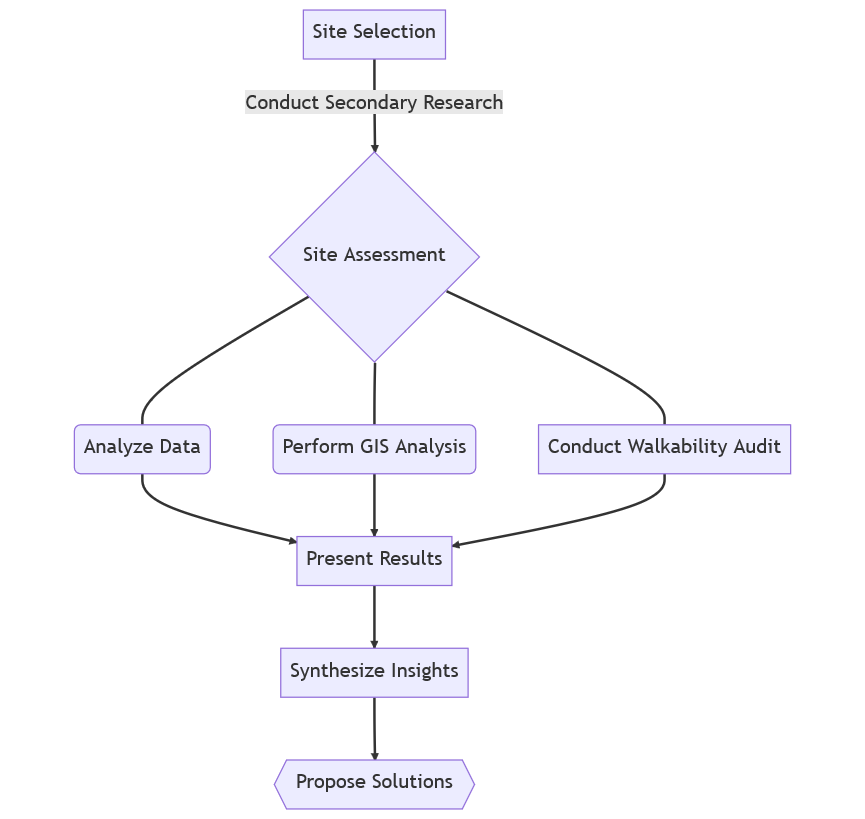
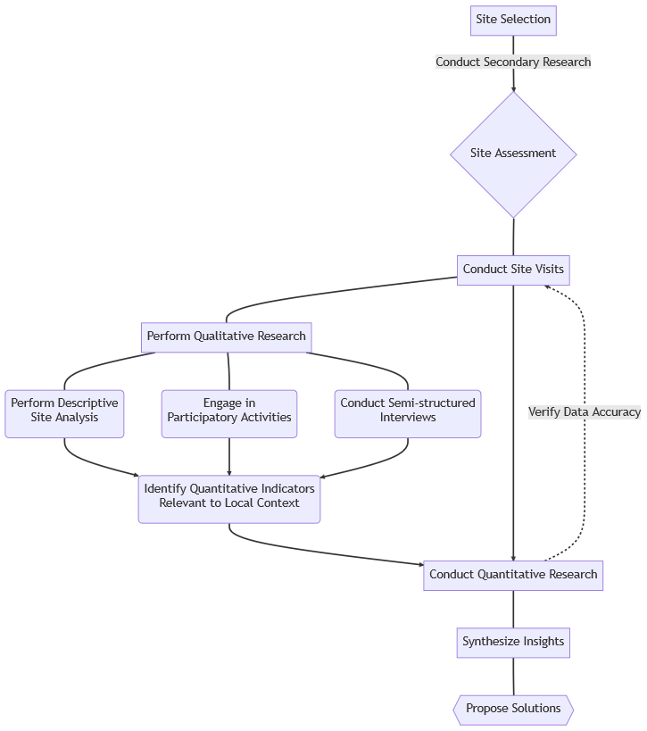
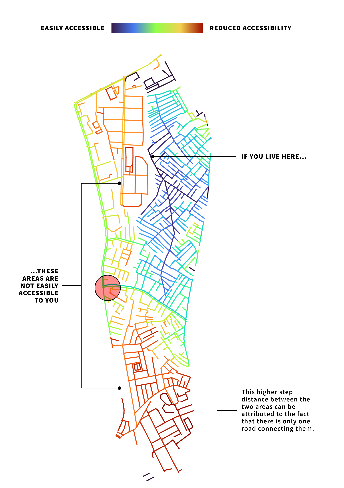

# Welcome to The Walkability Wiki {.unnumbered}

<br>


```{=html}
<style>
.inline-figure {
    border: none !important;

  overflow-x: visible !important;
}
</style>
```
This is [*The Walkability Wiki*](https://walkability.wiki), a guidebook of qualitative & quantitative methods for measuring pedestrian experience in Bangalore! Visit the [GitHub repository for this site](https://github.com/thedivtagguy/walkability-wiki) if you would like to contribute as well.

<!-- \mybox{static/quant.png}{Shooting Stars}{Blue bottle crucifix vinyl post-ironic four dollar toast vegan taxidermy. Gastropub indxgo juice poutine.} -->

## Outline {.unnumbered}

This book has been divided into the following categories to make it easier to get through:

<a href="./intro.html" ><div class="card-menu" style="display:flex; width:100%;"><div class="side1"><p></p></div><div class="side2"><h4 id="Getting.Started" class="hasAnchor">Getting Started</h4><p>This section provides an overview of the book, outlining its purpose, scope, and an introduction to the concepts of walkability.</p></div></div></a>

<a href="./quantitative-assessments.html" ><div class="card-menu" style="display:flex; width:100%;"><div class="side1"><p></p></div><div class="side2"><h4 id="Quantitative.Methods" class="hasAnchor">Quantitative Methods</h4><p>This section includes guidance on sourcing data for street and urban environment assessments, recipes for processing and analyzing data, creating maps, and running numbers.</p></div></div></a>

<a href="./qualitative-assessments.html" ><div class="card-menu" style="display:flex; width:100%;"><div class="side1"><p></p></div><div class="side2"><h4 id="Qualitative.Methods" class="hasAnchor">Qualitative Methods</h4><p>This section offers tips for conducting interviews, designing street audits, framing questions to elicit valuable information, and creating participatory activities.</p></div></div></a>

<a href="./hybrid-assessments.html" ><div class="card-menu" style="display:flex; width:100%;"><div class="side1"><p></p></div><div class="side2"><h4 id="Bridging.the.Gap" class="hasAnchor">Bridging the Gap</h4><p>This section explains how to combine qualitative and quantitative methods to fill in gaps, derive insights, and present results for analysis.</p></div></div></a>

<a href="./case-studies.html" ><div class="card-menu" style="display:flex; width:100%;"><div class="side1"><p></p></div><div class="side2"><h4 id="Case.Studies" class="hasAnchor">Case Studies</h4><p>This section features real-life examples of street audits in various contexts and locations, detailing the tools used and the analysis methods employed.</p></div></div></a>

<a rel="license" href="http://creativecommons.org/licenses/by-nc/4.0/"></a><br />This work is licensed under a <a rel="license" href="http://creativecommons.org/licenses/by-nc/4.0/">Creative Commons Attribution-NonCommercial 4.0 International License</a>.

<!--chapter:end:index.Rmd-->

# (PART) Getting Started {.unnumbered}

# Introduction {#intro}

Walking in a city is an experience that most people take for granted. The ease of mobility on foot, especially in urban areas, has long been overshadowed by the convenience and speed provided by personal vehicles or public transportation systems. Until recently, I was also among those who overlooked and underappreciated its importance. Although I have been aware of the issues with poor infrastructure in cities in India, I never fully grasped the severity of the problem, nor did I connect the individual inconveniences I experienced to a larger systemic issue. Admittedly, this lack of awareness could be viewed as naive or shortsighted, but it is what it is.

However, in 2021, my perspective changed when I stumbled upon an Instagram account called "bengawalk" run by **Pravar Chaudhary**. Through this account, Pravar documented his observations of the streets and people of Bangalore, highlighting a range of issues and interactions that occur on a daily basis. Whether it was a simple post about wayfinding, accompanied by a single hashtag or a video of person crossing a busy street despite being next to a footbridge, to a more complex analysis of traffic congestion and flyovers, the account provided me with a new lens through which to view the city and its challenges.

As a designer and a person interested in using data to understand problems, this appealed to me as one of the most tangible, omnipresent topic that I had *never* fully paid attention to. From there, I have read through countless documents on urban mobility, walkability, transport and streets; admittedly one of the best rabbit-holes I've fallen into. The data-storytelling enthusiast in me always wants to find ways to mould information into a spreadsheet I can import into R or a shapefile I can visualize in QGIS, which is what I did with this too.

The more I've engaged with walkability and urban mobility, though, I've realized that quantitative data is often not enough to describe something as complex as streets and transport, or the people who use them. In my research on street usage and accessibiilty in Ejipura, Bangalore, several new insights came up through qualitative analyses that I would have completely missed if I was focusing on large numbers. I was also lucky enough to work with people more experienced than I was who brought with them different, unique ways to analyze urban environments.

This book is a distillation of things I learnt along the way.

Through qualitative analysis, community engagement, and data-driven approaches such as those discussed here, we can try to gain a deeper understanding of our streets and how they impact individuals from all walks of life.

The methodologies presented in this book are just a starting point - there is still much work to be done!

<!--chapter:end:01-intro.Rmd-->

# Scope

There are some things to keep in mind while using this book, so that you make the most of it.

## What to expect

This cookbook **will**:

1.  Demonstrate how to combine methods for better understanding walkability.
2.  Present real-life case studies to illustrate how this information can be practically used.
3.  Provide resources for urban planning professionals, academics, and anyone interested in the field to conduct their own research.
4.  Provide a framework for assessing walkability and encourages readers to draw their own conclusions based on their research and analysis

But we **won't**:

1.  Aim to provide an exhaustive list of measures or a comprehensive review of research.
2.  Claim to offer a one-size-fits-all solution for assessing walkability.
3.  Provide technical guidance on every aspect of GIS and data analysis, only practical techniques and code snippets.
4.  Aim to be prescriptive or offer definitive answers on what makes a city or street walkable

## Who is this for? {.no-border}

```{=html}
<style>
.inline-figure {
    border: none !important;

  overflow-x: visible !important;
}
</style>
```
{.people .no-border width="14cm" height="4.5cm"}

This book is a valuable resource for a wide range of professionals, academics, and individuals interested in the field of urban planning, design, and development. Specifically, it may be of interest to:

1.  For urban planners and designers, this book offers valuable insights on how to assess walkability in cities and neighborhoods.

2.  For community advocates, this book provides a framework for promoting walkable neighborhoods and understanding the factors that make them successful.

3.  If you're a researcher, academic, or student in urban planning, public health, or related fields, this book is a great resource for gaining a comprehensive understanding of walkability and its impact on the people that use them.

This book isn't a dry, technical manual. It's full of real-life case studies and practical techniques that can be used to make cities more walkable. So whether you're a professional or just someone who loves taking a stroll, this book is for you.

## How to Read This Book


<!--chapter:end:02-structure.Rmd-->

# Recommended Software & Tools

{.people .no-border style="margin:0 auto; display:block;" width="14cm"}

I really like the idea of **eat cake first** \\parencite{leonIntroductionRstudio4edu, cetinkaya-rundel2018}, which means at the heart of this book's approach is the belief that it's best to dive in and get started with the task at hand, even if that means adopting a "good enough" approach initially.

There may be more complex or nuanced workflows available, and I'll be sure to point those out as well. There might even be better ways to derive insights or understand results, but the methods discussed here are enough to get started with. My goal is to provide you with the quickest and most straightforward path to achieving your desired outcome. \
\
This also means **no prior knowledge of GIS or programming** is required to follow along. Wherever needed, I will link to appropriate guide material to reduce redundancy of writing it here again. What I *will* show is how to use those results in a real-life context. I will be using the following to collect data, perform analysis and visualize the results:

1.  [**OpenStreetMaps**](https://openstreetmaps.org) **(OSM)**: OSM is a crowdsourced mapping tool that is used to collect and update geographic data. It is a free and open-source mapping tool that provides map data and related services to users worldwide. You might compare this to Google Maps, but it is even better because we will be able to *pull* data from the OSM database and perform analyses

2.  [**QGIS**](https://qgis.org/en/site/): QGIS is a free and open-source geographic information system (GIS) software that is used for creating, editing, visualizing, and analyzing geospatial data. QGIS is a powerful tool that supports a wide range of vector, raster, and database formats.

3.  [**Figma**](https://figma.com): Figma is a cloud-based design tool that makes it a breeze to layout and create infographics. You could use Photoshop or Illustrator do the the same thing but I like it for the convenience. We'll need a vector editing tool to handle SVG formats.

4.  **Python**: Python is a popular language for geospatial data analysis and visualization due to its large ecosystem of libraries and tools. We'll be using this rarely if we need to process some data for analysis.

5.  [**R**](https://posit.co/products/open-source/rstudio/): R is a programming language that is widely used for statistical analysis and data visualization. R has a large number of libraries and packages for geospatial analysis and visualization.

6.  [**DepthmapX**](https://archtech.gr/varoudis/depthmapX/): DepthmapX is a free and open-source software tool used for spatial network analysis. It was developed by researchers at the Bartlett School of Architecture, University College London. One of the key features of DepthmapX is its ability to perform space syntax analysis. Space syntax is a theory that links the spatial configuration of a built environment to the social, cultural, and economic activities that take place within it. DepthmapX provides a range of tools to analyze spatial configurations, such as isovist and visibility analysis, axial analysis, and integration analysis.

Having these handy will help you go faster. Let us get started.

<!--chapter:end:03-recommended-softward.Rmd-->

# (PART) Overview of Methods {.unnumbered}

# Walkability

## Walkability Metrics


<!--chapter:end:04-overview.Rmd-->

# Types of Analysis

## Qualitative Analysis

## Quantitative Analysis

## Introducing additional dimensions to walkability

<!--chapter:end:05-types-of-analysis.Rmd-->

Combining qualitative and quantitative data is essential to understand issues as complex as mobility fully. However, analyzing both data types can be challenging, and integrating them into a cohesive analysis is often tricky. Here, hybrid assessments can help bridge the gap between qualitative and quantitative studies.

## Why bother

In the previous section, we explored various walkability measures, including an area's built and natural environment and other essential aspects. While GIS techniques and macro data sources can provide a baseline understanding of the walkability of a site, they often miss out on the unique issues and experiences that residents face on a day-to-day basis.

In early 2023, [Sensing Local](https://www.sensinglocal.in/), an organization that works on urban and environmental issues in Indian cities, commenced a series of walkability for 24 wards in Bangalore [@byiffathRaisingStreets2022]. As of writing this, more than 139 km of footpaths have been audited in 10 wards has been completed. These audits, using collaborative tools and with the help of community volunteers, mapped various street features, such as footpath conditions, street litter, encroachment, and streetlight presence. Although these are important indicators of the neighbourhoods they visited, there may be other problems that these criteria missed.

To better understand the region, another audit of Bangalore's wards was conducted by ichangemycity in 2016 and produced data for all wards, including Ejipura[@ichangemycityEjipuraWard1482016]. This audit included a broader set of criteria, such as:

1.  **Civic Facilities**: Presence of parks, public toilets, bus stops, and waste collection centres.
2.  **Quality of life**: Walkability of footpaths and conditions of significant crossings, streetlight presence, and other citizen grievances.
3.  **Budget allocation**: Areas of budget allocations and overview of budgeted works.

This more comprehensive approach not only provides an understanding of the accessibility of various amenities but also includes qualitative data on what the **residents feel is an issue**.

As researchers, we often study areas that we aren't familiar with. Therefore, standardized metrics, such as sidewalk measurements, street lighting, and footpath conditions, are crucial for providing a foundational understanding of the walkability of an area. However, relying solely on these metrics can limit our understanding of residents' unique issues and experiences. Qualitative research can provide valuable insights into the lived experiences of individuals in the community. For example, an on-ground study conducted by community volunteers can reveal micro-scale insights that data analysis using GIS techniques and macro data sources may miss. Section \@ref(interviews-ejipura) shows some unique insights that can be gathered from interviews.

## Grassroots Approach

We can use a grassroots approach to designing audits to help fill these quantitative research gaps, often created based on standardized metrics.

Grassroots, also known as bottom-top approaches, focus on collecting data from participants locally instead of entirely relying on higher-level data sources. The grassroots process is particularly relevant in fields such as community development, social justice, and public health, where understanding the experiences and needs of the local community is critical to developing effective interventions or policies and can similarly be applied to inform the assessment process, which can ultimately lead to more effective and inclusive solutions [@knapskogExploringWaysMeasuring2019a].

## Differences in Approach

In most of the walkability audits I have encountered, and others have studied, the qualitative features of streets fail to attract the necessary attention and aren't investigated. [@aghaabbasiEvaluatingCapabilityWalkability2018]. Most studies follow the framework shown in Figure \@ref(fig:usual).

{width="12cm"}

This isn't bad in itself, and if the study aims to audit an environment with the *specific* intention of only assessing things like sidewalks and streets, that is okay. However, it may not capture the lived experiences of the people who use the space daily. Engaging with local residents and considering their perspectives is essential to gain a more holistic understanding of walkability.

Based on my experience in Ejipura, taking a different approach helped. Instead of assessing standard walkability measures, I went to the site on multiple visits to see what I needed improvement. Since these observations are still detached from what the residents experienced daily, I conducted interviews and other participatory activities to try to answer the fundamental question I outlined above:

> *What does walkability mean to the people who live there?*

This process differs from the flow I illustrated above and uses qualitative research to develop the indicators I must assess. Figure \@ref(fig:proposed) outlines my process while studying Ejipura.

{width="12cm"}

This process involved qualitative research to develop indicators that emerged from local knowledge. Using site visits as an essential part of verifying results, I ensured that my insights were grounded in the community context. This approach allowed me to tailor my findings to the specific needs of Ejipura rather than attempting to impose Western models of development that may not be appropriate for Indian cities.

One challenge of using qualitative research is that it can be perceived as unscalable. However, in the following sections, I will demonstrate how I used qualitative data to analyze the environment quantitatively based on the insights gained from interviews and observations. This method can help to bridge the gap between qualitative and quantitative approaches, providing a more comprehensive understanding of walkability in Indian cities. These methods will be demonstrated using Ejipura as the context but can be replicated easily for any other region. Let's get into it!


<!--chapter:end:06-hybrid-assessments.Rmd-->

# (PART) Quantitative Assessment Guides {.unnumbered}

## Secondary Research

Chances are, you already know where you'll be conducting your walkability assessment. This could be your neighborhood, a section of an area you visit often, or even a place you've never been to. If you have already narrowed down such a region, \@ref(space-syntax) shows you how to identify important and busy streets for your audit. \@ref(secondary-research) shows you how to get information about your site's population, which can help you understand the region's demographics.

### Understanding the population

In \@ref(levels-of-analysis), we discussed the importance of adding a socio-economic layer of context to our assessments. TLDR; understanding your demographic, income levels, and social makeup can help you show *who* is being excluded and design your solutions more inclusively. We can use a variety of data sources to view information about the population. I discuss some ways to use this data to identify segregation within areas in Section \@ref(identify-segregation)


#### Census Data   {-}

The last general census in India was conducted in 2011. While outdated by almost all counts, this data remains the only comprehensive source of information at a country-wide level. The highest resolution (the level of detail) at which this data is available is at a city's ward level. If you live in any of the large metro cities, this might already be available through [OpenCity](https://opencity.in). Some states and government bodies have also opened their GIS servers for access, a full list of which you can find [here](https://opencity.in/explainer/how-to-access-government-gis-data-for-indian-cities-states/). For smaller cities, the compiled population information by [@balkSpatialData20112020] for the entire country from a variety of sources can be [downloaded](https://sedac.ciesin.columbia.edu/data/set/india-spatial-india-census-2011/data-download#) in the form of CSV and GeoTIFF files.

#### Global Human Settlement Layer {-}

The [Global Human Settlement Layer (GHSL)](https://ghsl.jrc.ec.europa.eu/download.php?ds=pop) by the Joint Research Centre provides high-resolution population estimates for nearly every country. This can be downloaded for various years (in my experience, the 2015 dataset works well) and for your specific region of interest through the website's interactive map.

\tipbox{The GHSL dataset is commonly used for estimating the population, whereas other datasets might be hard to get. The data is provided in raster format, where each pixel represents the number of people at that point. You can easily visualize this in software like QGIS. An excellent project that makes it available to explore only is Tom Forth's [\_'Population Around A Point'\_]([https://www.tomforth.co.uk/circlepopulations/).](https://www.tomforth.co.uk/circlepopulations/).)

{width="9cm"}

}

### Understanding the space

You have your region, and you know something about your population. Now how would you decide which streets to audit? Space Syntax Analysis (SSA) can help!

Space syntax analysis is a method of analyzing and understanding the spatial configuration of built environments developed by University College London (UCL) researchers in the 1970s and 1980s.

The basic premise of space syntax analysis is that how buildings and cities are configured spatially can significantly impact how people use and interact with those spaces. By analyzing the spatial relationships between different parts of a built environment, space syntax analysis can help reveal movement patterns, interaction, and social activity [@vannesIntroductionSpaceSyntax2021]. This can be done using street networks from OpenStreetMap and DepthMapX, a software dedicated to such analysis.

### Components of Space Syntax Analysis

There are three measures that this method will provide you with. In extremely simple, intuitive terms, these are:

1.  **Choice:** Choice is a way to measure how likely a street or road segment is to be used by people traveling between different parts of a system. For example, imagine a city and all the different routes people could take to get from one place to another. Choice measures how often a particular street segment is used on the shortest path between any two locations in the system. A high choice value means that many people are likely to use that street segment, while a low choice value means fewer people are likely to use it. So, the choice measures how important a street segment is for connecting different system parts [@hillierSocialLogicSpace1984].

2.  **Integration**: Integration is a way to measure how close or connected one place is to all the other places in a system. For example, think of a city and its different neighborhoods. Integration measures how easy it is to get from one area to another. The higher the integration, the more connected the neighborhoods are and the easier it is to move around [@hillierSocialLogicSpace1984].

We can use these measures to extrapolate many insights from quantitative data in the form of street networks and build a model for understanding the space. The theory also proposes that the street network adapts and changes over time to intensify local connections, which leads to more efficient movement patterns and porous structures. Essentially, SSA describes how the layout of the street network shapes the development of urban centers and how the evolution of the street network over time influences the formation and location of centers within the urban settlement layout as a whole.

### Using DepthmapX for SSA 

So you've chosen your area to audit, but you want to maximize your resources and time and start by auditing the most important streets in the region. If you know the neighborhood, you already know what to do. If not, the `choice` measure can help you provide a starting point.

First, get the following things ready before moving ahead:

1.  **Download DepthmapX**: You can find the relevant copy for your operating system [here](https://archtech.gr/varoudis/depthmapX/)
2.  **Download your region's OSM street network**: Trim the network to your region of interest so you can process the data faster. \
    \tipbox{
    Appendix @ref(osm-basics) explains how to extract street networks, and Appendix @ref(data) provides some packaged and external data sources for you to download OSM data. 
    }
3.  **Fire up QGIS**: We'll use this to convert our street files into an appropriate format for use in `DepthMapX` and then bring it back here for polishing touches after analysis.

Let's get started!

##### Step 1. Convert your street network into `.mif` {-}

`.mif` stands for a MapInfo file, which is a type of digital file that contains information about a map. It is like a virtual version of a paper map that can be opened on a computer. It contains data about different features on the map, such as roads, buildings, and rivers; basically everything you'll need about your street network to pull it into `DepthmapX`.

{width="10cm"}

You can do this by right clicking on your street layer and going to `Export` \> `Save Features As` and selecting `.mif` from the export dialog box.

{width="10cm"}
 
##### Step 2. Prepare it in DepthMapX {-}

Open your copy of `DepthMapX` and create a new project by going to `File` \> `New`. We can now import our map by going to `Map` \> `Import`.

{width="10cm"}

<!--chapter:end:07-site-selection.Rmd-->

# Assessment of Physical Environment

## Measuring Blocks Sizes

## Measuring Connectedness

## Measuring Integration

## Measuring Urban Structure

<!--chapter:end:08-physical-environment.Rmd-->

# Assessment of Infrastructure

## Sourcing data from OpenStreetMaps

## Visualizing pedestrian sheds

<!--chapter:end:09-infrastructure.Rmd-->

# Assessment of Comfort

## Mapping Green Cover

## Mapping Heat Exposure

## Mapping Artificial Shade

## Mapping Flood Risk

<!--chapter:end:10-comfort.Rmd-->

# (PART) Qualitative Assessment Guides {-}

# Field Visits

## Things to keep in mind

## Suggested tools

## Observation notes

## Participatory Activities

### Semi-structured interviews

### Mapping acitvities


<!--chapter:end:11-field-visits.rmd-->

# Street Audits

## Street comfort mapping

## Observations on built environment

## Tailoring your metrics

## Google Street View Audits

<!--chapter:end:12-street-audits.Rmd-->

# Deriving Insights


<!--chapter:end:13-deriving-insights-from-qualitative-data.Rmd-->

# (PART) Getting Started {.unnumbered}

# Visualizing Results from Analysis

## Showcasing Your Study Site

## Interpreting and Presenting Results

## Designing in QGIS: A Crash Course

<!--chapter:end:14-visualizing-results.Rmd-->

# (PART) Conclusion {-}

# Finishing up

## Key takeaways

## Way forward

<!--chapter:end:15-conclusion.Rmd-->

# (PART) Appendix {-}

# Interviews


<!--chapter:end:16-appendix-a-interviews.Rmd-->

# Assessment of Segregation

## Why it matters

Walkability is strongly correlated to health, and many studies have found that populations in more walkable areas are less likely to be obese [@riggsInclusivelyWalkableExploring2016] and perform better on many other health indicators as well [@suCommunityDeprivationWalkability2017]. Built environments and the design of neighbourhoods can influence residential behaviours and health consequences, according to accumulating research, with data indicating that these communities not only have lower rates of obesity and overweight people but greater active physical activity engagement as well.

When auditing any environment for walkability, therefore, it can be helpful to understand the following:

1.  **Who** are the more vulnerable or advantaged populations?
2.  **Where** are they located?
3.  **What** factors about their built environment and streets make them more vulnerable?

Answering these questions will help identify **how** we can improve an area to ensure an equitable allocation of resources.

## Ways of Identifying Segregation {#identify-segregation}

Segregation can occur at various resolutions. The first obvious way to get an overview at a city level is through ward or constituency-level data, which is often easily available. For example, in the case of Bangalore, we can use 2011 census data to find where there are higher percentages of people belonging to scheduled caste/scheduled tribe (SC/ST):

{width="13cm"}

## Social

### The Obvious

Caste is still the most significant factor in urban residential segregation in India, significantly higher than the level of socioeconomic segregation [@vithayathilSpacesDiscriminationResidential2012] and

{width="13cm"}

### The Less Obvious

Aside from the obvious stratification based on caste, what other ways can your study area be divided? Even in a seemingly homogenous area, various factors can influence *who lives where*. For example, the area could be divided between:

1.  **Native residents** and **migrants**.

2.  **Working population** by **type of work**, such as those working in the service industry vs those working in the informal sector.

3.  **Language**: Based on the language spoken by the residents, such as those who speak the local language versus those who speak a different language.

4.  **Housing tenure:** Segregating an area by housing tenure, such as those who rent vs those who own their homes, could reveal disparities in wealth and access to affordable housing.

In Ejipura, we were able to identify some micro-neighbourhoods this way. For example, it is a home to many people from the north-east region. We identified the region where the this population was concentrated by observing the kind of shops and restaurants in some areas:

{width="13cm"}

Similarly, paying guest accomodations and apartments that are generally for short-term rental for students and working class people are concentrated in another area:

{width="13cm"}

## Economic

Unfortunately, there is no comprehensive source of data that helps us spatially visualize economic segregation. Even the general census does not include questions on consumption levels or economic condition of households.

However, you can construct a broad map of income levels based on visual observation of streets and buildings as well. For example, in Ejipura, we used observational and anecdotal evidence to divide the area into three income groups. This was based on the type of housing, condition of streets, and interviews with residents.

{width="13cm"}

These are subjective observations by their very nature but some of the things you can look for, in addition to the above, are:

1.  **Housing type and condition:** Look at the type and condition of housing in a given area. Low-income areas may have more rental housing and consist of smaller units. Mid-income regions may have a mix of rental and owner-occupied housing, while high-income areas may have larger, more expensive homes in better condition.

2.  **Transportation options:** Look at the transportation options available in a given area. Low-income areas may have limited access to public transportation and poorer pedestrian infrastructure. In contrast, high-income regions may have more options for alternative transportation and better-maintained roads and sidewalks.

3.  **Public spaces and amenities:** Look at the quality and availability of public spaces and amenities in a given area. Low-income areas may have fewer parks and open spaces, while high-income regions may have more resources and better-maintained public spaces.

Such characteristics should be **always** be considered alongside other variables from census data and income surveys if available, since they are not always reliable markers of income levels. If you're able to get your hands on enumerator block level census data, which is the smallest unit of census data available, it can help inform these decisions better. Unfortunately, the process of getting access to this data is complicated and very restrictive (as shown [on the website for IIM Bangalore](https://library.iimb.ac.in/CEBdataset)).

## Spatial

The built environment, through the design of streets and the connectivity between them, can also reflect the extent of segregation in an area [@vlachouSuccessionalSegregationGerani2015]. This isn't to say that the design is intentionally exclusionary, but the inherent properties of the space may contribute to the exclusion of certain groups. The environment can influence the politics that govern it. Therefore, to fully understand how specific groups may be excluded, we need to consider the background and social context surrounding it [@winnerArtifactsHavePolitics1980].

It is possible to map the spatial properties of your study area through **spatial syntax analysis (SSA)**, a quantitative method to understand the configuration of a built environment and reveal how it is potentially used by pedestrians and motorists [@dettlaffSpaceSyntaxAnalysis]. The methodology is highly technical and includes many parameters we can analyse for our area, but we need to concern ourselves with only one metric; **angular step depth**.

In simple terms, **angular step depth** measures how near or *accessible* areas within the street network are. Well-connected streets with high intersection density allow you to walk from one place to another in lesser time. While this may seem obvious, as the farther you go, the less accessible an area is, the benefit of this analysis is evident when we analyse an area like Ejipura:

{width="13cm"}

Here, because of the design of the network, the National Games Village is just as inaccessible for people living in the blue region as the southern tip of the ward, despite being adjacent to each other. The reduced accessibility, whether by design or not, makes the two areas spatially segregated. This understanding, layered with observations on the built environment \@ref(social) and through secondary research methods, can provide a valuable starting point for identifying general levels of segregation within an area.

<!--chapter:end:17-appendix-access.rmd-->

# Cognitive Mapping

<!--chapter:end:18-appendix-b-cognitive.Rmd-->

# Data Sources

<!--chapter:end:19-appendix-data-sources.Rmd-->

