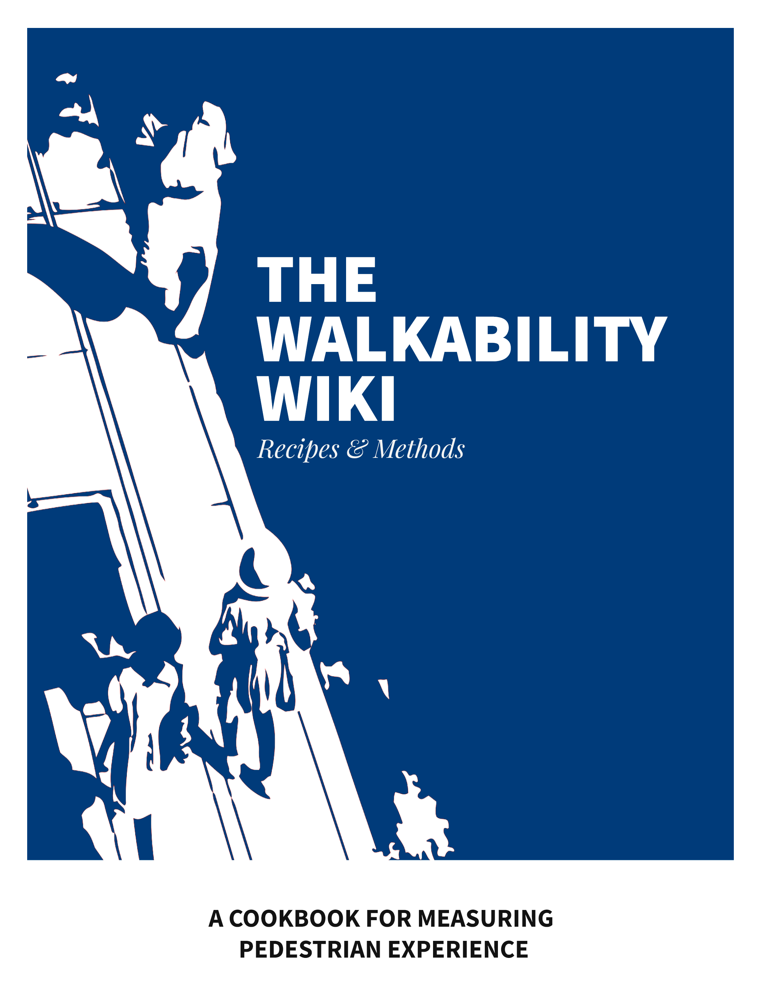

--- 
title: "The Walkability Wiki"
subtitle: "Methods for Measuring Pedestrian Experience"
author: "Aman Bhargava"
date: "`r Sys.Date()`"
knit: "bookdown::render_book"
site: bookdown::bookdown_site
output: bookdown::bs4_book
documentclass: book
bibliography: [book.bib]
biblio-style: apalike
link-citations: true
links-as-notes: true
colorlinks: true
github-repo: thedivtagguy/walkability-wiki
cover-image: static/cover.png
url: https://www.walkability.wiki/
description: "Quantitative & qualitative methods for measuring pedestrian experience."
---


```{r include=FALSE}
# automatically create a bib database for R packages
knitr::write_bib(c(
  .packages(), 'bookdown', 'knitr', 'rmarkdown', 'rmallet'
), 'packages.bib')

knitr::include_graphics(rep("static/cover.png"))


```

# Welcome to The Walkability Wiki {-}
<br>



<style>
.inline-figure {
    border: none !important;

  overflow-x: visible !important;
}
</style>

This is the [website](http://walkability.wiki/) for *The Walkability Wiki*, a crowd-sourced cookbook of qualitative & quantitative methods for measuring pedestrian experience! Visit the [GitHub repository for this site](https://github.com/thedivtagguy/walkability-wiki).


<a rel="license" href="http://creativecommons.org/licenses/by-nc/4.0/"></a><br />This work is licensed under a <a rel="license" href="http://creativecommons.org/licenses/by-nc/4.0/">Creative Commons Attribution-NonCommercial 4.0 International License</a>.
